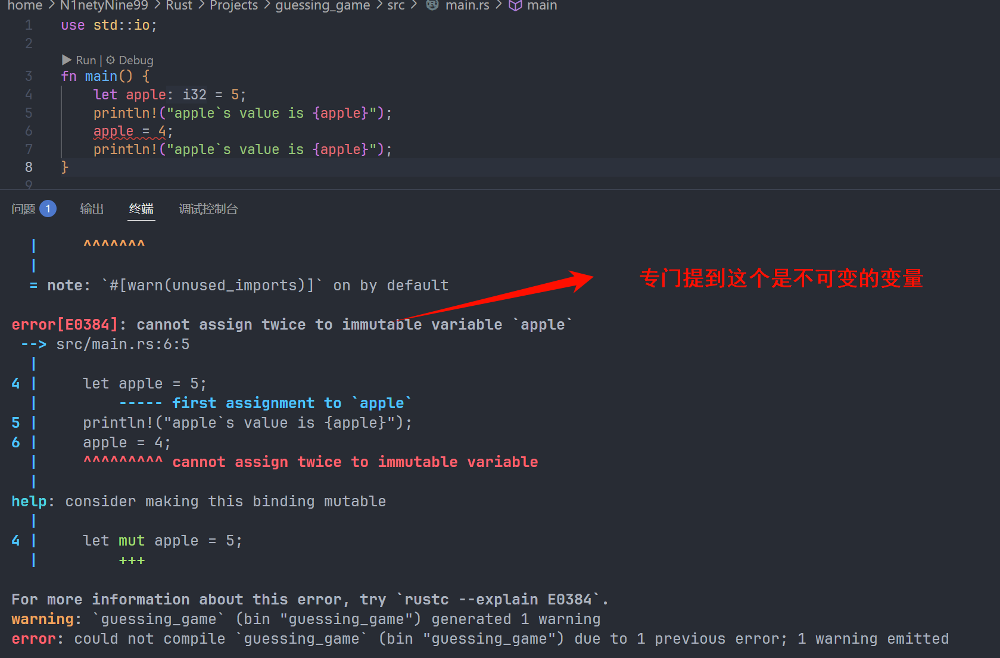
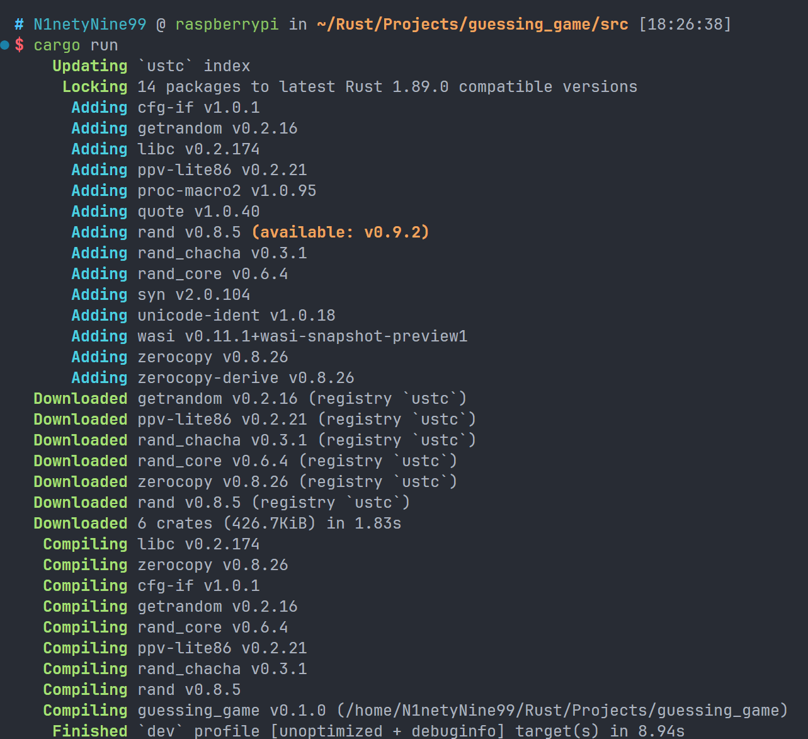
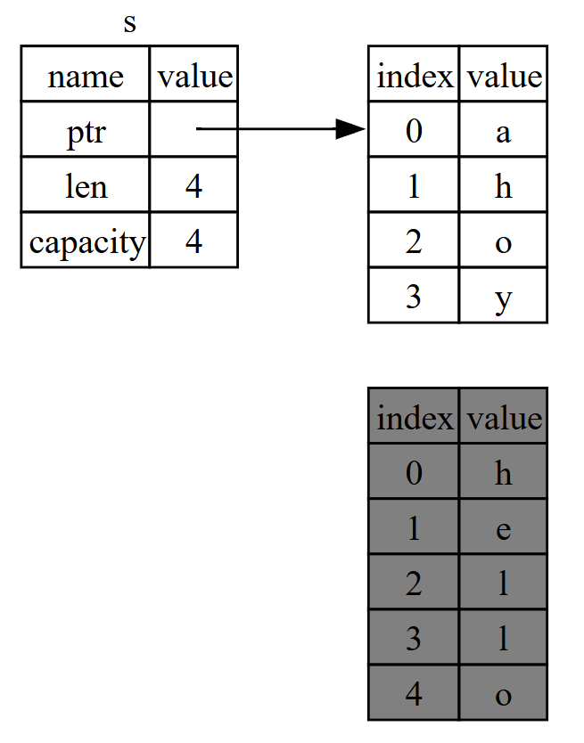
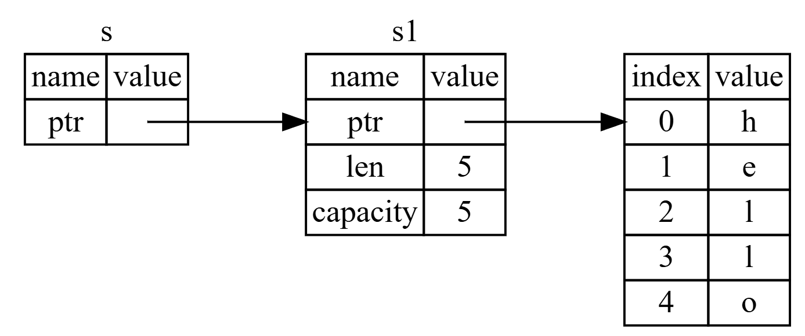
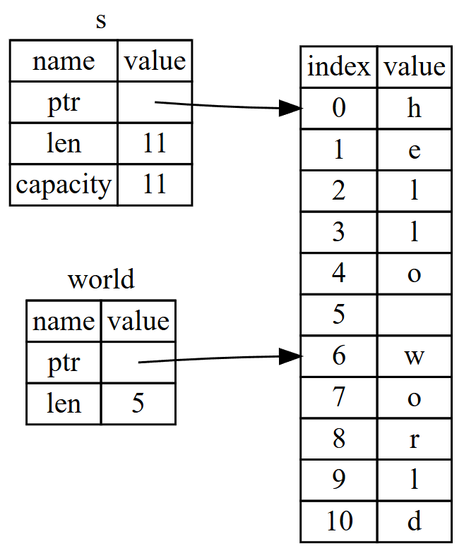
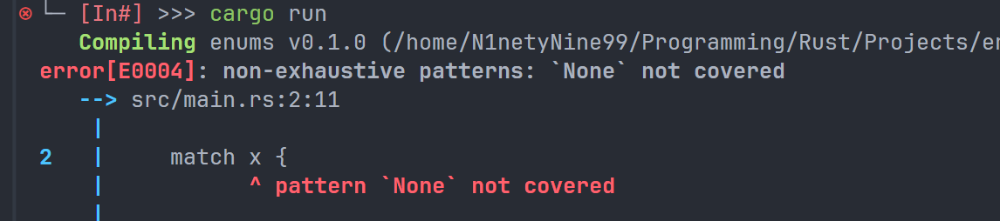
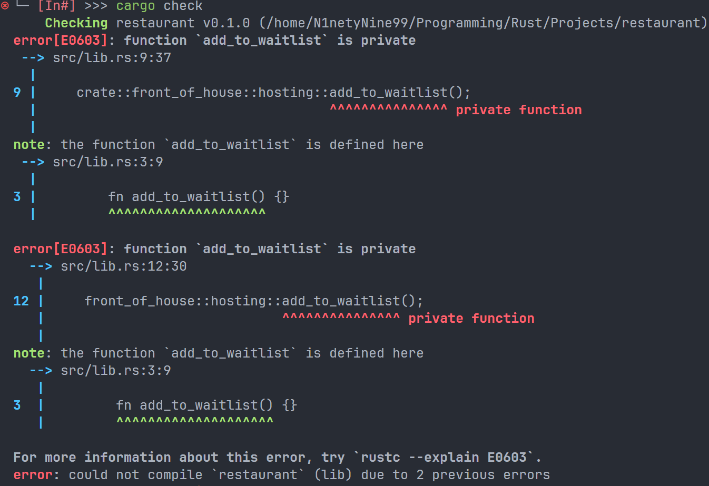

# Chapter 1: Cargo——Rust 的包管理器

Cargo 是 Rust 的一个强大的 **包管理器**，通过 cargo 可以快速构建一个结构完整的 Rust 项目，并且通过命令行来编译运行项目

## 1.cargo new

该指令用于创建一个完整的 Rust 项目。可加参数 " vsc ==" 来创建附加内容，默认创建了一个 git 存储库，但是我关掉了，具体关掉的方法如下: 

***

`在 Rust 中使用 ` cargo 创建新项目时，默认会初始化一个 Git 仓库。如果你希望 **不自动添加 Git 版本控制**，可以使用以下两种方法：

### 方法 1：使用 `--vcs none` 参数

在创建项目时，显式指定 **不初始化任何版本控制系统**：

bash

```
cargo new --vcs none my_project
```

这会跳过 Git 仓库的初始化。

### 方法 2：全局配置 Cargo 默认不初始化 Git

如果你希望所有新项目都默认不初始化 Git，可以修改 Cargo 的全局配置：

1. 打开或创建 Cargo 的配置文件 `~/.cargo/config.toml`（Linux/macOS）或 `%USERPROFILE%\.cargo\config.toml`（Windows）。

2. 添加以下内容：

   toml

   ```
   [cargo-new]
   vcs = "none"
   ```

这样之后所有 `cargo new` 命令都会跳过版本控制系统的初始化。

### 补充说明

- 如果已经创建了项目，你可以直接删除项目根目录下的 `.git` 文件夹来移除 Git 跟踪。
- 支持的 `--vcs` 选项包括：`git`（默认）、`hg`（Mercurial）、`pijul` 或 `none`。

这种方法既简单又干净，适合不需要版本控制或打算使用其他版本控制系统（如 Mercurial 或 SVN）的情况。

***


## 2.cargo build

该指令用于 **编译并生成一个可执行的二进制文件**。注意与后文的 `cargo check` 区分。可以添加 `--release` 来让生成文件存放在 `targer/release` 中，而非默认的 `target/debug` 中。

---


## 3.cargo check

该指令用来编译当前的工程，但注意，`cargo check` **并不会** 和 `cargo build` 一样生成一个可执行的二进制文件，所以耗时会大大快于后者，通常用于代码工程编写中途来 **检测当前有无显著语法错误**。

---


## 4.cargo run

**编译并且运行**。


---
# Chapter 2: 猜数游戏

*程序将生成一个介于 1 到 100 之间的随机整数。然后它会提示玩家输入猜测。输入猜测后，程序会指示猜测是太低还是太高。如果猜对，游戏将打印一条祝贺消息并退出。*

## 2.1 使用标准输入输出流

想要实现一个猜数游戏，首先能够进行标准的输入输出，所以就要引入 Rust 官方的 **标准输入输出流** `use std::io;`。其作用类似于 C 语言中的 `#include <stdio.h>`，其中 "std" 表示 "standard library"，即标准库的意思，而 "io" 就是输入输出模块的意思。

正常情况下，Rust 的标准库中存在很多模块，称之为 **`prelude`**，具体的所有内容可以通过 [Rust 标准库]([Hello, Cargo! - The Rust Programming Language](https://doc.Rust-lang.org/book/ch01-03-hello-cargo.html) "Rust 标准库")中查看。

------


## 2.2.fn main()

在 Rust 中，关键字 **`fn`** 表示声明一个函数，`()` 中填入函数的入参，和 C 语言一样，Rust 总是从 **main 函数** 中作为入口进入。

------


## 2.3.println!()

作为一个输出语句，Rust 标准的输出语句是 `println`，没有 `!`, 这个感叹号的意思是这是一个 **宏(marco)**，而非一个函数。而 `println!` 的标准占位符是 `{}`，具体用法后文再提。

------


## 2.4.let

在 Rust 中，**`let`** 用来声明一个变量，比如 `let apple = 5;` 在这个语句中，我们声明了一个变量名为 `apple`，其值为 5 的一个变量。在 Rust 中，如果不做说明，则默认声明的变量是一个 **不可变的(immutable)**。意思就是，在我们声明了这个 `apple` 之后，是没有办法修改其值 5 的，编译器会报错，如下图所示：


我们现在删除修改其值的语句之后再次编译会发现就可以成功通过编译并且运行: 


如果所有的变量都是不可变的，那 Rust 也太鸡肋了，所以官方有一个关键字 **`mut`**，来声明这个变量是 **可变的(mutable)**，在声明变量的时候加上这个关键字就可以告知编译器，当前这个变量是一个可变的变量。如下图所示: 

------


## 2.5.String:: new()

```rust
use std::io; //意思是使用标准输入输出流 类似于C中的 #include <stdio.h>

fn main() {
    println!("Guess a Number Please!"); //Rust的println!会自带一个回车
    let mut guess = String::new(); //创建了一个字符串类型的变量，mut表示可变 new()表示创建了一个String的实例

    io::stdin().read_line(&mut guess).expect("Fail to readline");
    println!("You guessed:{guess}");
}

```


`let mut guess = String::new();` 创建了一个字符串类型的变量，其中 mut 表示可变，new()表示创建了一个 String 的实例。在 Rust 中，**`::`** 表示一个与前者关联的一个函数，在这里，`String` 是 Rust 标准库提供的一个字符串数据类型，`new()` 表示创建一个新的实例，是 `String` 所提供的一个 **关联函数(associated function)**，所谓关联函数，是一个类中的函数，可以理解为 `Python` 中一个 **类（class）** 中的一个 **方法（method）**。

------


## 2.6 读取用户输入

`  io::stdin().read_line(&mut guess).expect("Fail to readline");` 这条语句用来读取用户的终端输入。由于我们在第一行就显式的引入了标准输入输出，我们这里可以直接使用 `io::stdin()` 来使用 `stdin()` 这个方法。如果我们没有在第一行中显式的导入标准输入输出，我们同样可以直接调用 `stdin()` 但是需要说明来源，如 `stdio::io::stdin`。

在 `io::stdin()` 中，`stdin()` 会返回一个 [`std::io::Stdin`](https://doc.Rust-lang.org/std/io/struct.Stdin.html) 的一个实例，该类型是作为一个获取用户终端输入的一个 **句柄（handle）**。

之后的 `.read_line(&mut guess)` 调用了 `read_line` 方法来获取用户的输入，并且传入了 `&mut guess` 来告诉 Rust 将读到的字符串放到 `guess` 变量中。`read_line` 会将用户在终端中输入的所有内容都变换成一个字符串来存储，存储方式是 **追加（append）**，而不是 **覆写（overwrite）**。

代码中的 `&`，表示是 **引用（reference）**，提供了一种让代码的多个部分都可以访问这一条数据，并且不需要多次复制这条数据的方法。本章中不做深究，在后续的章节中会详细讲解 Rust 的 `&`。目前我们只需要知道引用默认是不可变的，所以我们需要传入 `&mut guess` 作为参数而不是直接传入 `&guess`。

------


## 2.7 处理潜在的问题

可以注意到，在读取输入的过程中我们还有一句话，是 `.expect("Fail to readline")`。本小节我们将着重讨论这个语句。

如前文所提到的，`read_line` 方法会将用户的任何输入都读取到一个字符串中，但是它也会返回一个 **`Result`** 来表明语句的执行情况。这个 `Result` 是一个 **枚举值（enumeration）（也简写为 enum）**。用于进行 **错误处理** 的。详细内容将在后面仔细讲解如何通过这个值来在 Rust 中对代码进行错误处理。

`Result` 的值有两种，分别是 `Err` 和 `Ok`，前者表示语句执行出现错误，并且会包含一些调试信息，后者表示顺利执行。而 **`except`** 是 `Result` 类型的一种方法，如果 `Result` 的返回值为 `Err`，那么 `except` 就会终止程序，并且在终端中显示我们传入进去的字符串。如果 `Result` 的返回值是 `Ok`，在本条语句中，返回值将是用户输入的字节数目。如果不添加 `except`，项目依旧可以正常编译，但是编译器会向我们发送警告：

```rust
$ cargo build
   Compiling guessing_game v0.1.0 (file:///projects/guessing_game)
warning: unused `Result` that must be used
  --> src/main.rs:10:5
   |
10 |     io::stdin().read_line(&mut guess);
   |     ^^^^^^^^^^^^^^^^^^^^^^^^^^^^^
   |
   = note: this `Result` may be an `Err` variant, which should be handled
   = note: `#[warn(unused_must_use)]` on by default
help: use `let _ = ...` to ignore the resulting value
   |
10 |     let _ = io::stdin().read_line(&mut guess);
   |     +++++++

warning: `guessing_game` (bin "guessing_game") generated 1 warning
    Finished `dev` profile [unoptimized + debuginfo] target(s) in 0.59s

```


------


## 2.8 导入外部 crate

在使用 rand 生成随机数之前，我们首先需要修改 *Cargo.toml*，把 rand 添加到我们的 **依赖（dependencies）** 中：

其中格式为 "crate 名 + 版本号"（Rust 中的 crates 可以简单理解为外部库），**这里的 *0.8.5* 是 *^0.8.5* 的简写，意味着任何低于 *0.9* 但是高于等于 *0.8.5* 的版本**。

接下来不对代码做任何修改，直接编译运行，我们会发现，它在自己下载相关依赖并且重新编译： 

当我们包含外部依赖项时，Cargo 会从 *注册表* 中获取依赖项所需的所有内容的最新版本， *注册表* 是 [Crates.io](https://crates.io/) 中的数据副本。Crates.io 是 Rust 生态系统中的人们发布他们的开源 Rust 项目供其他人使用的地方。

Cargo 拥有一种机制，确保每次你或其他人构建代码时都能重新构建相同的工件：Cargo 将仅使用你指定的依赖版本，直到你明确表示更改。例如，假设下周 `rand` crate 发布了 0.8.6 版本，该版本包含一个重要的错误修复，但也包含一个会导致你的代码出错的回归问题。为了处理这种情况，Rust 在你第一次运行 `cargo build` 时会创建 *Cargo.lock* 文件，因此现在我们在 *guessing_game* 目录中有了这个文件。

当你第一次构建项目时，Cargo 会确定所有符合要求的依赖版本，并将这些版本写入 Cargo.lock 文件中。以后当你再次构建项目时，Cargo 会看到 *Cargo.lock* 文件存在，并使用该文件中指定的版本，而不是重新计算版本。这使得你可以自动获得可重复的构建结果。换句话说，由于 *Cargo.lock* 文件的存在，你的项目会一直保持在 0.8.5 版本，直到你显式地进行升级。因为 *Cargo.lock* 文件对于可重复构建非常重要，所以它通常会和其他代码一起被纳入源代码控制中。

当你需要更新一个 crates 时，Cargo 提供了 `update` 命令，该命令会忽略 *Cargo.lock* 文件，并找出所有符合 *Cargo.toml* 中你指定条件的最新版本。然后 Cargo 会将这些版本写入 *Cargo.lock* 文件。在这种情况下，Cargo 将只查找版本号大于 0.8.5 且小于 0.9.0 的版本。如果 `rand` crates 发布了两个新版本 0.8.6 和 0.9.0，当你运行 `cargo update` 时，你会看到以下内容:

```rust
$ cargo update
    Updating crates.io index
     Locking 1 package to latest Rust 1.85.0 compatible version
    Updating rand v0.8.5 -> v0.8.6 (available: v0.9.0)
```

------


## 2.9 生成随机数

```rust
use rand::Rng; //添加了rand库中的Rng模块
use std::io;

fn main() {
    let mut guess = String::new();
    let secret_number = rand::thread_rng().gen_range(1..=100); //生成一个1~100的随机数
    println!("The secre number is {secret_number}");
    println!("Guess a Number Please!");
    io::stdin().read_line(&mut guess).expect("Fail to readline");
    println!("You guessed:{guess}");
}
```


如上更新了代码，我们先是引用了 `rand` 库的 `Rng` 模块，里面定义了生成随机数的方法，之后使用不可变的变量获得了一个 1~100 的随机数。`rand::thread_rng` 是一个仅限于当前执行线程且由操作系统初始化的生成器，加上后文的 `gen_range` 就可以产生一个随机数，其中 `gen_range` 的入参是一个 **范围表达式**，用来指定生成随机数的范围。

> [!TIP]
>
> 你无法凭空知道该使用哪些特性（traits）、调用哪些方法和函数，因此每个 crate（Rust 库）都附带了说明文档。Cargo 还有一个便捷功能：运行 `cargo doc --open` 命令会在本地构建所有依赖项的文档，并在浏览器中打开。例如，如果你想了解 `rand` crate 的其他功能，只需运行 `cargo doc --open`，然后在左侧边栏点击 `rand` 即可查看其文档。


------


## 2.10 match——通过分支结构来比较随机数与猜测数

```rust
use rand::Rng;
use std::cmp::Ordering;
use std::io; //引入cmp库    

fn main() {
    let mut guess = String::new();
    let secret_number = rand::thread_rng().gen_range(1..=100); //生成1~100的随机数
    println!("Plz guess a int from 1 to 100");
    io::stdin().read_line(&mut guess).expect("Can`t read line"); //读取猜测数
    match guess.cmp(&secret_number) {
        //比较、并且输出对应调试信息
        Ordering::Equal => println!("u got right answer{secret_number}"),
        Ordering::Greater => println!("guess {guess} is bigger than secret number {secret_number}"),
        Ordering::Less => println!("guess {guess} is less than secret number {secret_number}"),
    }
}
```


首先我们先导入 `cmp` 库中的 `Ordering` 模块，`Ordering` 本质也是一个枚举，拥有 `Equal`, `Greater`, `Less` 三个值。**`match`** 在这里的作用是根据后面的 `Ordering` 的值来匹配执行不同的语句，类似与 C 语言中的 `switch case` 语句，它是 **顺序依次匹配**。而不同的返回值对应的执行语句则是通过 `=>` 来引出。我们通过 `.cmp` 方法来比较 `guess` 和 `secret_number` 的值, 并且返回对应的 `Ordering` 的枚举值。注意，`.cmp` 中应当使用 `&` 来引用，而不是直接通过传入变量名来比较！

接下来我们编译运行，会发现运行报错： 

报错的主要问题是 **类型不匹配（mismatch）**。Rust 作为一个强静态类型语言，具有一个 **数据类型推测功能**。我们的 `guess`，在最开始声明的时候就是 `String` 字符串类型，但是我们生成的随机数，由于我们没有显式的指定类型，编译器会自己猜测数据类型，通常会猜测是一个 **整型（integer）**，Rust 的几种数值类型中，有些可以在 1 到 100 之间取值： `i32` （32 位数值）、 `u32` （无符号 32 位数值）、 `i64` （64 位数值），以及其他类型。除非另有指定，Rust 默认使用 `i32` 类型。我们想要把一个字符串与整型比较，这显然是不符合常理的，所以编译器才会报错，说 *expected `&String`, found `&{integer}`*, 预期输入的是一个字符串，但是却发现输入的是一个整型。

想要能够正确识别，我们可以将 `guess` 从字符串转换为整型。代码如下:

```rust
use rand::Rng;
use std::cmp::Ordering;
use std::io;

fn main() {
    let mut guess = String::new();
    let secret_number = rand::thread_rng().gen_range(1..=100);
    println!("Plz guess a int from 1 to 100");
    io::stdin().read_line(&mut guess).expect("Can`t read line");

    let guess: u32 = guess
        .trim()
        .parse()
        .expect("Please type a number rather than ohter types!"); //类型转换

    match guess.cmp(&secret_number) {
        //比较、并且输出对应调试信息
        Ordering::Equal => println!("u got right answer{secret_number}"),
        Ordering::Greater => println!("guess {guess} is bigger than secret number {secret_number}"),
        Ordering::Less => println!("guess {guess} is less than secret number {secret_number}"),
    }
}
```


我们会惊奇的发现，明明 `guess` 这个变量在之前定义过了，这里怎么还可以再次定义，而且编译器还没有报错？！这是因为 Rust 中允许重复使用一个变量名，但是之后的变量会覆盖前面的变量值。在这里，我们后面的 `guess` 就成功用整型的数值覆盖了之前的 `guess` 的字符串类型的数值。这种特性可以让我们重复的使用一个变量名，而不是使用 `guess_str` 和 `guess_int` 来区分。眼下我们只需要知道，我们进行数据类型变换的时候通常会使用这个特性。

我们现在来看看我们的转换语，首先 `guess.trim()` 中的 `guess`，是最先开始的那个字符串，而其调用了 `trim()` 方法，该方法的作用是消除开头和结尾的任何空白，这是在将字符串转换为只能包含数值数据的 `u32` 之前必须做的。用户必须按下 enter 来触发 `read_line` 并输入他们的猜测，这会在字符串中添加一个换行符。例如，如果用户输入 5 并按下 enter ， `guess` 看起来是这样的： `5\n` 。 `\n` 代表 "换行" **（在 Windows 上，按下 enter 会导致回车和换行， `\r\n` ）**。 `trim` 方法会消除 `\n` 或 `\r\n` ，结果只剩下 `5` 。

接下里的 **`parse()`** 则是把字符串类型转换成别的数类型。使用的时候我们必须显式的告诉编译器我们期望转换的类型，通过赋值语句之前的 `:u32` 来告诉编译器我们想要的数据类型是一个无符号 32 位整型。同时这也意味着编译器会推断 `secret_number` 也是一个 `u32` 的数据类型，以此才方便两者比较。最后再加上 `except()` 来进行可能的错误处理。

> [!NOTE]
>
> `parse` 方法只适用于逻辑上可以转换为数字的字符，因此很容易导致错误。例如，如果字符串包含 `A👍%` ，则无法将其转换为数字。由于它可能会失败， `parse` 方法返回 `Result` 类型，就像 `read_line` 方法一样。我们将以相同的方式处理这个 `Result` ，再次使用 `expect` 方法。如果 `parse` 因为无法从字符串中创建数字而返回 `Err` ， `expect` 调用将崩溃游戏并打印我们给它的消息。如果 `parse` 成功将字符串转换为数字，它将返回 `Ok` 变体的 `Result` ，而 `expect` 将返回我们从 `Ok` 值中想要的数字。

接下来我们直接编译并且运行代码，会发现代码成功运行起来了：


但是有个显而易见的问题，不论我们猜测的正确与否，我们都只能猜测依次，我们预期的是，我们不停猜测，直到我们猜测的结果正确为止，这就涉及到了一个重要概念——**循环（loop）**！

---

## 2.11 通过循环实现多次猜测

```rust
use rand::Rng;
use std::cmp::Ordering;
use std::io;

fn main() {

    let secret_number = rand::thread_rng().gen_range(1..=100);
    println!("Plz guess a int from 1 to 100");
    loop {
        //Loop循环 死循环 需要手动退出
        let mut guess = String::new();
        io::stdin().read_line(&mut guess).expect("Can`t read line");
        let guess: u32 = guess
            .trim()
            .parse()
            .expect("Please type a number rather than ohter types!");

        match guess.cmp(&secret_number) {
            Ordering::Equal => println!("u got right answer{secret_number}"),
            Ordering::Greater =>println!("guess {guess} is bigger than secret number {secret_number}"),
            Ordering::Less => println!("guess {guess} is less than secret number {secret_number}"),
        }
    }
}
```


现在我们可以多次循环猜测，但是也出现了一个问题：**没有终止体条件！！** 所以我们要添加一个终止条件，即如果我们猜测的数刚好就是产生的数，则自动停止。

```rust
use rand::Rng;
use std::cmp::Ordering;
use std::io;

fn main() {
    let secret_number = rand::thread_rng().gen_range(1..=100);
    println!("Plz guess a int from 1 to 100");

    loop {
        //Loop循环

        let mut guess = String::new();
        io::stdin().read_line(&mut guess).expect("Can`t read line");

        let guess: u32 = match guess.trim().parse() {
            Ok(num) => num,//如果是Ok的话(num)会让num自动等于转换完成的值
            Err(_) => {
                println!("Please input number between 1 and 100");//Err的话()中是什么不重要 用_代替 表示捕获所有的错误值
                continue;
            }//使用match分支来代替简单的except
        };

        match guess.cmp(&secret_number) {
            Ordering::Greater => {
                println!("{guess} is too big")
            }
            Ordering::Less => println!("{guess} is too small"),
            Ordering::Equal => {
                println!("you got right answer:{secret_number}");
                break;
            } 
        }
    }
}

```


在这里，我们使用 **`match`** 分支来处理错误情况，上文提到过 `Result` 作为一个枚举值，有 `OK` 和 `Err` 两种情况。如果是 `Ok` 那么它会包含一个值，这个值就是我们预期想得到的一个类型转换后的值。如果是 `Err`，则 `Err(_)`。其中 **`_`** 是一个 *catch-all value*，代表着不论这里存储的是什么，我们都期望与我们的这个分支匹配。

---
# Chapter 3: 常见的编程概念

## 3.1 Rust 中特有概念

与其他编程语言不同，Rust 中有很多独有的概念，同时也是 **Rust 的最重要的特性**。

---


### 3.1.1.变量(*variable*)和可变性（*mutability*）

正如之前所提到的，**Rust 中的所有的变量默认是不可变的**。如果我们想要让这个变量可变，需要使用到关键字 `mut` 来显式声明这个变量是可变的。

---


### 3.1.2.常量(*constants*)

对于常量来说，我们是严令禁止 `mut` 声明的，因为常量本身的意义就在于不可变。声明一个常量我们使用的关键字是 **`const` 而不是 `let`**，并且 **常量必须显式的声明其数据类型**，而不是和普通变量一样可以让编译器自己推测。

---


### 3.1.3.变量遮蔽(*shadowing*)

在第二章中，我们使用了相同的变量名来处理数据类型变换的问题。在 Rust 中，我们通常说前一个变量被之后的变量给 **遮蔽了(*shadowed by*)**，遮蔽的不仅是值，还有可变/不可变的属性。但是 **变量遮蔽仅仅存在于后来的变量的作用域中**。

```rust
fn main() {
    let x = 5;          // 外部作用域 x = 5
    let x = x + 2;      // 遮蔽：x 重新绑定为 7（仍在外层作用域）
    println!("x = {x}"); // 输出: x = 7
    {
        let x = 9999;    // 内部作用域的新变量 x，遮蔽外层的 x
        println!("x = {x}"); // 输出: x = 9999
    }                   // 内部 x 离开作用域，被丢弃
    println!("x = {x}"); // 恢复外部作用域的 x，输出: x = 7
}
```

```
结果:
x`s value is 7
x`s value is 9999
x`s value is 7
```

在这个例子中，x 首先被声明为 5，紧接着就被 7（5 + 2）给遮蔽了，但是又在代码块中被 9999 给遮蔽，在 Rust 中，**一个大括号对就代表一个代码块**，其内部的变量的作用域只能作用域声明它的代码块中。所以当程序执行完第 7 行之后，值为 9999 的变量 x 会被销毁，所以第 9 行打印的 x 的值是之前的 x，即 7。

`mut` 和遮蔽的另一个区别在于，当我们再次使用 `let` 关键字时，我们实际上是在 **创建一个新的变量**，因此我们可以改变值的类型但重用相同的名称。例如，假设我们的程序要求用户输入一些空格字符来显示他们希望在文本之间有多少空格，然后我们想把输入存储为数字：

```rust
let spaces = "   ";
let spaces = spaces.len();
```

第一个 `spaces` 变量是字符串类型，第二个 `spaces` 变量是数字类型。因此，我们不必想出不同的名称，比如 `spaces_str` 和 `spaces_num` ；相反，我们可以重用更简单的 `spaces` 名称。然而，如果我们尝试像这样使用 `mut` ，我们会得到一个 **编译时错误**：

```rust
let mut spaces = "   ";
spaces = spaces.len();
```


这是因为我们在第一行已经声明了 `space` 变量为一个字符串，而 `len()` 方法返回值是当前字符串的长度，是一个整数。我们尝试把一个整数赋值给一个字符串，**这是 Rust 不允许的**，所以报错了。正确做法应该是和上文一样使用两次 `let`。

---


## 3.2 数据类型

**Rust 作为一个静态类型语言，在编译的时候必须知道所有的数据的类型**。一般来说，编译器可以通过我们给的赋值和使用来自己推断大多数的数据的类型。但是对于一些特殊情况，我们必须显式的声明数据类型，比如在声明一个常量的时候，比如我们在猜数游戏中的强制类型转换的时候。

```Rust
let guess: u32 = "42".parse().expect("Not a number!");
```

如果我们不添加 `:u32`，那么编译器会报错如下：

```
$ cargo build
   Compiling no_type_annotations v0.1.0 (file:///projects/no_type_annotations)
error[E0284]: type annotations needed
 --> src/main.rs:2:9
  |
2 |     let guess = "42".parse().expect("Not a number!");
  |         ^^^^^        ----- type must be known at this point
  |
  = note: cannot satisfy `<_ as FromStr>::Err == _`
help: consider giving `guess` an explicit type
  |
2 |     let guess: /* Type */ = "42".parse().expect("Not a number!");
  |              ++++++++++++

For more information about this error, try `Rustc --explain E0284`.
error: could not compile `no_type_annotations` (bin "no_type_annotations") due to 1 previous error

```

---

### 3.2.1 标量

Rust 中的四种常见的标量分别是 **整数（*integer*）、浮点数（*floating-point numbers*）、布尔值（*Booleans*）和字符（*characters*）**。

---

### 3.2.2 整型

整型分为 **有符号整型 `i` 和无符号整型 `u`**，具体内容如下表：

|   长度   | 有符号 | 无符号 |
| :------: | :----: | :----: |
|  8-bits  |   i8   |   u8   |
|  16-bit  |  i16   |  u16   |
|  32-bit  |  i32   |  u32   |
|  64-bit  |  i64   |  u64   |
| 128-bit  |  i128  |  u128  |
| 架构决定 | isize  | usize  |

每个变体都可以是有符号或无符号的，并且具有明确的大小。**有符号和无符号指的是该数字是否可能为负数**——换句话说，该数字是否需要带有符号（有符号）或是否永远为正数，因此可以不需要符号来表示（无符号）。这就像在纸上写数字一样：当符号重要时，数字会显示加号或减号；然而，当可以安全地假设数字为正数时，则不显示符号。有符号数字使用二进制补码表示法存储。

每个有符号变体可以存储从 −(2 ^n-1^ ) 到 2^n-1^-1 的数字，其中 n 是该变体使用的位数。因此一个 `i8` 可以存储从 −(2^7^ ) 到 2^7^ − 1 的数字，这等于 **−128 到 127**。无符号变体可以存储从 0 到 2^n^− 1 的数字，所以一个 `u8` 可以存储从 0 到 2^8^ − 1 的数字，这等于 **0 到 255**。

此外，**`isize` 和 `usize` 类型取决于你的程序运行在哪种计算机架构上**：如果你在 64 位架构上，它们是 64 位的；如果你在 32 位架构上，它们是 32 位的。

同时，你可以按照下表的所有方式书写整型。请注意，可以表示为多种数值类型的数字字面量允许使用 **类型后缀**，例如 `57u8` ，来指定类型。数字字面量也可以使用 **`_` 作为视觉分隔符**，以便更容易阅读数字，例如 `1_000` ，它将与你指定 `1000` 时具有相同的值。

|   进制   |    例子     |
| :------: | :---------: |
|  十进制  |   98_222    |
| 十六进制 |    0xff     |
|  八进制  |    0o77     |
|  二进制  | 0b1111_0000 |
|   字节   |    b’A’     |


> [!NOTE]
>
> 假设你有一个类型为 `u8` 的变量，它可以存储 0 到 255 之间的值。如果你尝试将变量更改为该范围之外的值，例如 256，就会发生整数溢出，这可能导致两种行为之一。在调试模式下编译时，Rust 会包含整数溢出的检查，如果发生这种行为，程序将在运行时崩溃。Rust 使用术语 panicking 来描述程序以错误退出。
> 	当你以带 `--release` 标志的发布模式编译时，Rust 不会包含导致恐慌的整数溢出检查。相反，如果发生溢出，Rust 会执行补码回绕。简而言之，超出类型所能持有的最大值的值会“回绕”到类型所能持有的最小值。对于 `u8` 类型，值 256 会变成 0，值 257 会变成 1，以此类推。程序不会恐慌，但变量的值可能并不是你期望的值。依赖整数溢出的回绕行为被认为是一种错误。

---

### 3.2.3 浮点数

Rust 中也有两种浮点数 **`f32`，`f64`**。分别代表双经度和单精度，分别占用 32 位和 64 位。**默认类型是 `f64`**，因为在现代 CPU 上，它的速度与 `f32` 大致相同，但能提供更高的精度。所有浮点数类型都是带符号的。

```rust
fn main() {
    let x = 2.0; // f64
    let y: f32 = 3.0; // f32
}
```

---

### 3.2.4 数值运算

```rust
fn main() {
    // 加法
    let sum = 5 + 10;//15
    // 减法
    let difference = 95.5 - 4.3;//91.2
    // 乘法
    let product = 4 * 30;//120
    // 除法
    let quotient = 56.7 / 32.2;//1.7608695652173913
    let truncated = -5 / 3; // -1
    // 取余
    let remainder = 43 % 5;//3
}
```

> [!CAUTION]
>
> `let value2 = 5.4 / -2;` 这样的语句会报错，因为浮点数类型只能和浮点数类型相除。同样，浮点数不能取余。

---

### 3.2.5 布尔值

和大多数其他编程语言一样，Rust 中的布尔类型有两个可能的值：**`true` 和 `false`**。布尔类型的大小为 **1 个字节**。在 Rust 中，使用 `bool` 来指定布尔类型。例如：

```rust
fn main() {
    let t = true;
    let f: bool = false; // 显式声明
}
```

----

### 3.2.6 字符类型

Rust 的 **`char` 类型是语言中最原始的字母类型**。这里有一些声明 `char` 值的例子：

```rust
fn main() {
    let c = 'z';
    let z: char = 'ℤ'; // 显式声明
    let heart_eyed_cat = '😻';
}
```

**请注意，我们使用单引号指定 `char` 字面量，而字符串字面量则使用双引号。Rust 的 `char` 类型占用四个字节，表示 Unicode 标量值，这意味着它不仅限于 ASCII 字符。带重音的字母；中、日、韩文字符；表情符号；以及零宽空格都是 Rust 中有效的 `char` 值。Unicode 标量值的范围从 `U+0000` 到 `U+D7FF` ，以及 `U+E000` 到 `U+10FFFF` 。然而，在 Unicode 中，“字符”并非一个真正存在的概念，因此你对“字符”的人类直觉可能与 Rust 中的 `char` 不一致。我们将在第 8 章的“使用字符串存储 UTF-8 编码文本”中详细讨论这一主题。**

---

### 3.2.6 复合类型

复合类型可以将多个值组合为一个类型。Rust 有两种原始复合类型：**元组和数组**。

---

#### 3.2.6.1 元组 *Tuple*

元组可以将不同类型的值存储在一个变量之中，但是 **一旦声明之后，就不能更改元组的长度**。

我们通过在括号内编写用逗号分隔的值列表来创建元组。元组中的每个位置都有一个类型，**元组中不同值的类型不必相同**。在这个示例中，我们添加了可选的类型注解：

```rust
let tup: (i32, f64, u8) = (500, 6.4, 1);
```

变量 `tup` 绑定到整个元组，因为元组被视为一个复合元素。要从元组中获取各个值，我们可以使用 **模式匹配来解构元组值**，如下所示：

```rust
fn main() {
    let tup = (500, 6.4, 1);
    let (x, y, z) = tup;
    println!("The value of y is: {y}");
}
```

上述代码首先创建了一个元组，并绑定在一个变量 `tup` 中，之后又使用 `let` 来让 `(x,y,z)` 分别获取 `tup` 对应位置的值。这个过程就叫 **"*解构（destructuring）*"**。

我们也可以通过 **`".`+索引值 " ** 来直接引用元组中的值，如下所示：

```rust
fn main() {
    let x: (i32, f64, u8) = (500, 6.4, 1);
    let five_hundred = x.0;//500
    let six_point_four = x.1;//6.4
    let one = x.2;//1
}
```

这个程序创建了元组 `x` ，然后使用各自的索引访问元组的每个元素。和大多数编程语言一样，**元组中的第一个索引是 0**。但是，我们 **不能通过 `.` 配合一个变量来动态的访问一个元素**：

```rust
fn main() {
    let index: i32 = 0;
    let x: (i32, f64, u8) = (500, 6.4, 1);
    let five_hundred = x.index;//这是不允许的！
}
```

**编译上面这段代码会如下报错:** 

这是因为如果是用一个变量动态的访问一个元组，很有可能，这个变量的面值超过了元组的元素数量，会造成类似数组越界的错误。**这是 Rust 所不希望看见的**。

没有任何值的元组有一个特殊的名称，称为 **`unit`**。这个值及其对应类型都写作 **`()`** ，表示一个空值或一个空的返回类型。如果表达式没有返回其他值，则会隐式返回 `unit` 值。

---


#### 3.2.6.2 数组 *Array*

数组也是一种常见的复合数据类型，但是与元组不同的是，**数组中的数据的类型必须是同一种**。与某些语言不同的是，**Rust 中的数组长度是固定的**。

我们通常使用 **`[]`** 来将一组数框起来作为数组。如下所示：

```rust
let a = [1, 2, 3, 4, 5];
```

和之前介绍的类型一样，**数组的声明会从“*栈（stack）*”中申请内存**，而不是“*堆（heap）*”中。而“*向量（vector）*”不同，它是分配在堆区的，所以它 **可以自由的增加或减少**。如果您不确定是否应该使用数组或向量，那么您很可能应该使用向量。我们将在后面的章节详细阐述这一点。

然而，当你知道元素数量不会改变时，数组更有用。例如，如果你在程序中使用月份的名称，你可能会使用数组而不是向量，因为你知道它总是包含 12 个元素：

```rust
let months = ["January", "February", "March", "April", "May", "June", "July",
              "August", "September", "October", "November", "December"];
```

可以使用方括号来编写数组的类型，**其中包含每个元素的类型、分号，然后是数组中的元素数量**，如下所示：

```rust
let a: [i32; 5] = [1, 2, 3, 4, 5];
```

在这里，`i32` 就是这个数组的数据类型。

同样，我们也可以指定数组的初始值。如下所示：

```rust
let a = [3; 5];
```

此处，我们就声明了一个叫做 `a` 的数组，有 5 个成员初始值都为 3。等同于 `let a = [3, 3, 3, 3, 3];`

**数组是一个已知大小且固定大小的内存块**，可以在栈上分配。你可以使用索引来访问数组的元素，就像这样：

```rust
fn main() {
    let a = [1, 2, 3, 4, 5];
    let first = a[0];
    let second = a[1];
}
```

在这个例子中，名为 `first` 的变量将获得值 `1` ，因为这是数组中索引 `[0]` 的值。名为 `second` 的变量将从数组中的索引 `[1]` 获得值 `2` 。

和其他语言一样，**数组会存在越界现象**，比如下面的代码：

```rust
use std::io;

fn main()
{
    let arry:[u32;5] = [0,1,2,3,4];
    println!("please input a index:");
    let mut index = String::new();

    io::stdin().read_line(&mut index).expect("Read Error");
    let index:usize = index.trim().parse().expect("Parse Error");
    let element = arry[index];
    println!("The value of the element at index {index} is: {element}");
}
```

如果我们输入的索引值超过了 4，那么就会看到如下报错： 

程序在使用索引操作时无效值导致运行时错误。程序退出并显示错误消息，未执行最后的 `println!` 语句。当你尝试使用索引访问元素时，**Rust 会检查你指定的索引是否小于数组长度。如果索引大于或等于长度，Rust 将发生 panic**。这个检查必须在运行时进行，特别是这种情况，因为编译器不可能知道用户在后期运行代码时会输入什么值。

这是 Rust 内存安全原则的一个实例。在许多低级语言中，这种检查不会进行，当你提供错误的索引时，可能会访问无效的内存。Rust 通过立即退出而不是允许内存访问并继续来保护你免受这种错误的影响。

---

## 3.3 函数(*Functions*)

函数在 Rust 代码中非常普遍。你已经见过语言中最重要之一的函数： **`main` 函数**，它是许多程序的入口点。你还见过 **`fn` 关键字**，它允许你声明新的函数。

在 Rust 中，多使用 **蛇形命名法** 来对一个函数命名。所谓蛇形命名法，就是将函数名按照 **"小写字母 + 下划线"** 的组合进行命名。如下面的两个例子：

```rust
fn main() {
    println!("Hello, world!");
    function();
}

fn function() {
    println!("function call");
}
```

和 C 语言一样，我们使用 **`{}`** 来将一个函数括起来，表示这个函数的作用域，来表明函数的开始和结束。

同时我们可以注意到，我们明明在 `main` 函数之后声明的这个 `function`，但是我们依旧可以在 `main` 函数中调用这个函数。因为在 Rust 中，**编译器并不像 C 语言的编译器一样那么严格要求函数的声明必须要在调用之前**；不论你在哪里定义了这个函数，你都可以调用。

---


### 3.3.1 参数(*parameters*)

上文我们定义的 `another_function`，没有入参。在 Rust 中，我们也可以定义拥有入参的函数。技术上，具体的值被称为 **实参（*arguments*）**，但在日常对话中，人们往往将 **参数（*parameter*）** 和实参这两个词混用，指代函数定义中的变量或调用函数时传入的具体值。

```rust
fn main() {
    println!("Hello, world!");
    function(10);
}

fn function(x:i32) {
    println!("x is {x}");
}
```

我们修改了我们的 `function`，给他添加了一个数据类型为 `i32` 的入参 `x`，其函数功能就是将它的值打印出来。

在定义函数的时候，我们 **必须显式的指定** 我们每一个入参的数据类型。同样我们也可以定义一个有多个入参的函数，如下：

```rust
fn main() {
    println!("Hello, world!");
    function(10,'h');
}

fn function(x:i32, y:char) {
    println!("x is {x},y is {y}");
}
```

```
结果：
Hello, world!
x is 10,y is h
```

如果我们想要入参是一个字符串而不是单纯是一个指针，我们首先想到的代码如下：

```rust
fn main() {
    println!("Hello, world!");
    function(10, "N1netyNine99");
}

fn function(x: i32, y: str) {
    println!("x is {x},y is {y}");
}
```

在这段代码中我们直接指定 `y` 的数据类型是 **`str`** 字符串型，然后在调用函数的时候传入我们想要的字符串即可，可是我们编译运行发现不能通过编译。编译器报错如下图：

我们查看编译器的第一个报错，它说 `function` 在 `y` 的位置预期得到的是一个 **`str`** 类型，但是我们传入的 `"N1netyNine99"` 确实一个 **`&str`** 类型。这让我很疑惑，但是我们按下不表，接着看下面的报错。后面两个报错的都是 `doesn't have a size known at compile-time`，意思是在编译的时候不知道大小。经过我的查询，Rust 作为一个严格的内存安全的语言，其不允许任何可能造成内存错误的事情发生，就比如我们想要传入一个不知道大小的数据。在 Rust 中，**`str` 和 `&str` 是两种不同的数据类型**；前者是一个抽象的数据类型，表示一段 `UTF-8` 字符串，它是动态大小类型(*DST*)，编译时不知道具体大小。而 **`&str` 它是对 `str` 的借用引用**，`&str` 本质是一个胖指针(*fat pointer*)，它包含了两个部分：一个指向实际字符串数据的内存地址的指针、字符串的字节长度；`&str` 的大小是固定的，在 64 位系统中总是 16 字节(8 字节指针 + 8 字节长度)。所以可以使用，因为编译器清楚的知道其大小。

> [!NOTE]
>
> 想象一下：
>
> - `str` 就像 "一本书的内容" - 你知道有内容，但不知道有多少页
> - `&str` 就像 "书签 + 页数标记" - 告诉你内容在哪里，有多少页

所以我们对代码修改一下:

```rust
fn main() {
    println!("Hello, world!");
    function(10, "N1netyNine99");
}

fn function(x: i32, y: &str) {//使用&str而非str
    println!("x is {x},y is {y}");
}

```

编译运行之后就发现可以正常运行了！

---

### 3.3.2 语句（*Statement*）和表达式（*Expression*）

**函数体由一系列可选以表达式结尾的语句组成**。到目前为止，我们讨论过的函数还没有包含结尾表达式，但你已经见过表达式作为语句的一部分。**由于 Rust 是一种基于表达式的语言**，理解这一点非常重要。其他语言没有这样的区别，所以让我们看看 **语句** 和 **表达式** 是什么，以及它们的差异如何影响函数体。

- **语句是执行某些操作，但是没有返回值。**
- **表达式是经过一些计算，然后返回一个值。**

```rust
fn main(){
    let y = 5;
}
```

比如上述的 **`let y = 5;` 就是一个语句**，它没有任何的返回值。所以下列的操作是明确禁止的：

```rust
fn main(){
    let y = (let x = 5);
}
```


编译器报错说 `error: expected expression, found ` let ` statement`，这也和我们上述的表述相同。**`let x = 5` 语句不返回值**，所以 `y` 没有可以绑定到的东西。这与 C 语言和 Ruby 等其他语言不同，在这些语言中，赋值会返回赋值的值。在这些语言中，你可以写 `x = y = 6` ，让 `x` 和 `y` 都具有值 `5 ；在 Rust 中则不是这种情况。

**在 Rust 中，使用 `{}` 可以创建一个表达式，表达式是有返回值的。**

```rust
fn main() {
    let x = {
        let y = 1;
        y + 1
    };
    println!("x is {x}");
}
```

在这个例子中，我们给 `x` 的赋值就是一个表达式，这个表达式的返回值就是第 4 行的 `y + 1`，由于我们在第三行定义了 `y` 是 1，那么这个表达式的返回值就是 `1 + 1` 即 2，所以我们打印出来的值就是 2。

**注意 `y + 1` 行末尾没有分号，这与你之前看到的绝大多数行不同。表达式不包括结束分号。如果你在表达式末尾添加分号，它会变成一个语句，并且不会返回值。** 在接下来探索函数返回值和表达式时，请记住这一点。

---


### 3.3.3 带返回值的函数

**函数可以向调用它们的代码返回值。我们不命名返回值，但必须在箭头（ `->` ）之后声明它们的类型。在 Rust 中，函数的返回值与函数体块中最后一条表达式的值是同义的。你可以使用 `return` 关键字并指定一个值来提前返回函数，但大多数函数会隐式地返回最后一条表达式。** 下面是一个返回值的函数示例：

```rust
fn five() -> i32 {
    5
}

fn main() {
    let x = five();
    println!("The value of x is: {x}");
}
```

运行这段代码，你会看见终端显示 `The value of x is: 5`，表明 5 已经正确返回到了调用它的主函数当中。我们也可以使用 **`return`** 来返回一个值或者表达式：

```rust
fn five() -> i32 {
    return 5;
}

fn main() {
    let x = five();
    println!("The value of x is: {x}");
}
```

其效果和上面的代码一样。

在上述的代码中，我们使用了一个无入参，返回值为 `i32` 的函数来对一个变量初始化了，同样的，我们可以通过使用一个带参数的函数来达到初始化一个变量的目的：

```rust
fn x_add_y(x: i32, y: i32) -> i32 {
    x + y
    //等价于return x + y;
}

fn main() {
    let x = x_add_y(1,2);
    println!("The value of x is: {x}");
}
```

此时我们 `x` 的值就是 3。但是我们对代码稍作修改：

```rust
fn x_add_y(x: i32, y: i32) -> i32 {
    x + y;//添加了;
}

fn main() {
    let x = x_add_y(1,2);
    println!("The value of x is: {x}");
}
```

编译后运行发现: 

这是因为，函数声明中显示说将会返回一个 `i32` 类型的值。但是我们的函数体内部，没有显式的返回值，第二行代码也只是简单的对 `x` 和 `y` 执行了一次加法，并且由于以 `;` 结尾，表明这是一个语句，没有返回值。那么函数的返回值便是 **`()`**，我们之前提到过，其数据类型是 **`unit`**，与我们的预取 `i32` 并不符合，所以编译器报错了。

---

## 3.4 注释

所有程序员都力求让他们的代码易于理解，但有时需要额外的解释。在这种情况下，程序员会在他们的源代码中留下注释，编译器会忽略这些注释，但阅读源代码的人可能会觉得有用。

这是一个简单的注释：

```rust
//我是一个注释
```

**在 Rust 中，惯用的注释风格以两个斜杠开始注释，注释内容持续到行尾。** 对于跨越多行的注释，你需要在每一行都包含 **`//`** ，像这样：

```rust
//我是注释1号
//我是注释2号
//我是注释3号
```

注释也可以放在包含代码的行末：

```rust
fn main() {
    let lucky_number = 7; //我是一个注释
}
```

> [!NOTE]
>
> 官方文档中没有提到，但是在我的开发环境中（vscode）确实是可以通过 **`/* */`** 来达到和 C 语言一样的注释风格。

---
## 3.5 控制流

能够在条件为 `true` 时运行某些代码，以及在条件为 `true` 时重复运行某些代码，是大多数编程语言中的基本构建块。让 Rust 代码执行流控制的最常见结构是 **`if` 表达式和循环**。

---


### 3.5.1 if 分支

一个 **`if` 表达式** 允许你根据条件分支你的代码。你提供一个条件，然后说明，"如果这个条件满足，运行这块代码。如果条件不满足，不要运行这块代码。"

所有 `if` 表达式都以关键词 **`if`** 开头，后面跟着一个条件。我们将要执行的代码块立即放在大括号内的条件后面。与 `if` 表达式中的条件关联的代码块有时被称为 **臂**，就像我们在第 2 章的 "比较猜测值与秘密数字" 部分讨论的 `match` 表达式中的臂一样。

我们也可以选择包含一个 **`else` 表达式**，以便在条件评估为 `false` 时给程序提供一个可执行的代码块。如果你不提供 `else` 表达式并且条件为 `false` ，程序将直接跳过 `if` 块并继续执行下一段代码。

```rust
use std::io;

fn main() {
    println!("Please input a number:");

    loop {
        let mut input = String::new();
        //要把创建变量放在循环里面
        //因为read_line只会在input变量中追加，而不是覆盖
        //所以如果把这句话放到loop中，只要第一次输入的是字符串
        //即使后面输入的是数字，也无法解析
        //因为之前的字符串还在变量中存储着的
        //放到循环内部每次循环开始都会自动清空变量
        io::stdin().read_line(&mut input).expect("Fail to Read!");

        let input: u32 = match input.trim().parse() {
            //强制类型转换的时候要指定数据类型！
            Ok(num) => num,
            Err(_) => {
                println!("Please input a number!");
                continue;
            }
        };

        if input < 5 {
            println!("number {input} is less than 5");
            break;
        } else if input == 5 {
            println!("number {input} is equal to 5");
            break;
        } else {
            println!("number {input} is gearter than 5");
            break;
        }
    }
}
```

例如这段代码，其功能就是从终端中读取用户输入的值来与 5 作比较，根据不同的比较结果来向终端中打印不同的语句。注意，我们这里使用了 **`loop` 和 `match`** 来处理如果用户输入的值不是一个数字的情况，顺道复习了一下第二章所学习到的内容。

在 Rust 中，**控制分支的条件必须是一个布尔值**。而不能像 C 语言一样使用一个整型来当作 `if` 的条件。例如下面的代码就是不合法的：

```Rust
fn main() {
    let number = 3;
    if number {
        println!("number was three");
    }
}
```

编译运行这段代码会发现编译器报错如下:


报错表明 Rust 期望一个 `bool` ，但得到的是一个整数。与 Ruby 和 JavaScript 等语言不同，**Rust 不会自动尝试将非布尔类型转换为布尔类型**。你必须明确指定，并且始终使用布尔值作为 `if` 的条件。例如，如果我们希望 `if` 代码块仅在数字不等于 `0` 时执行，我们可以将 `if` 表达式更改为以下内容：

```rust
fn main() {
    let number = 3;

    if number != 0 {
        println!("number was something other than zero");
    }
}
```

在 Rust 中，`if` 是一个表达式，这意味着我们可以在 `let` 语句的右侧使用它来给变量赋值，如下所示：

```rust
fn main() {
    let condition = true;
    let number = if condition { 5 } else { 6 };
    println!("The value of number is: {number}");
}
```

在这个例子中，`number` 变量将绑定到基于 `if` 表达式结果的值。运行此代码以查看会发生什么：

```
$ cargo run
   Compiling branches v0.1.0 (file:///projects/branches)
    Finished dev [unoptimized + debuginfo] target(s) in 0.30s
     Running `target/debug/branches`
The value of number is: 5
```

记住，**代码块的值是其最后一个表达式的值，数字本身也是表达式**。在这种情况下，整个 `if` 表达式的值取决于执行哪个代码块。这意味着 `if` 的每个分支的潜在返回值必须是相同的类型；在上面的例子中，`if` 分支和 `else` 分支的结果都是 `i32` 整数。如果类型不匹配，如下例所示，我们会得到一个错误：

```rust
fn main() {
    let condition = true;
    let number = if condition { 5 } else { "six" };
}
```

当我们尝试编译此代码时，我们会得到一个错误。`if` 和 `else` 分支具有不兼容的值类型，Rust 明确指出在程序中找到问题的位置：

```
$ cargo run
   Compiling branches v0.1.0 (file:///projects/branches)
error[E0308]: `if` and `else` have incompatible types
 --> src/main.rs:4:44
  |
4 |     let number = if condition { 5 } else { "six" };
  |                                 -          ^^^^^ expected integer, found `&str`
  |                                 |
  |                                 expected because of this

For more information about this error, try `rustc --explain E0308`.
error: could not compile `branches` due to previous error
```

`if` 代码块中的表达式计算为整数，而 `else` 代码块中的表达式计算为字符串。这不起作用，因为变量必须具有单一类型，并且 Rust 需要在编译时明确知道 `number` 变量的类型。**知道 `number` 的类型让编译器验证该类型在我们使用 `number` 的任何地方都有效**。如果 `number` 的类型只能在运行时确定，Rust 就无法做到这一点；如果编译器必须跟踪任何变量的多个假设类型，编译器会更复杂，对代码的保证会更少。

---

## 3.2 使用循环重复执行

多次执行一段代码通常很有用。对于这个任务，Rust 提供了几种循环，它们将运行循环体内的代码直到结束，然后立即从头开始。为了试验循环，让我们创建一个名为 loops 的新项目。

**Rust 有三种循环：`loop`、`while` 和 `for`。让我们尝试每一种。**

---

### 3.2.1 使用 `loop` 重复执行代码

`loop` 关键字告诉 Rust 一遍又一遍地执行一段代码，直到你明确告诉它停止。

作为示例，将 loops 目录中的 src/main.rs 文件更改为如下所示：

```rust
fn main() {
    loop {
        println!("again!");
    }
}
```

当我们运行这个程序时，我们会看到 `again!` 连续打印，直到我们手动停止程序。**大多数终端支持键盘快捷键 ctrl-c 来中断陷入连续循环的程序**。试一试：

```
$ cargo run
   Compiling loops v0.1.0 (file:///projects/loops)
    Finished dev [unoptimized + debuginfo] target(s) in 0.29s
     Running `target/debug/loops`
again!
again!
again!
again!
^Cagain!
```

符号 `^C` 表示你按下 ctrl-c 的位置。你可能会或可能不会在 `^C` 之后看到单词 `again!` 打印，这取决于代码在接收到中断信号时在循环中的位置。

幸运的是，Rust 还提供了一种使用代码跳出循环的方法。**你可以在循环内放置 `break` 关键字来告诉程序何时停止执行循环**。回想一下，我们在第 2 章的猜数游戏中的 "猜对后退出" 部分中这样做了，当用户通过猜对数字赢得游戏时退出程序。

你也可以在循环中使用 `continue`，它告诉程序跳过此循环迭代中的任何剩余代码并转到下一次迭代。

---

#### 3.2.1.1 从循环返回值

`loop` 的用途之一是重试你知道可能失败的操作，例如检查线程是否已完成其作业。你可能还需要将该操作的结果从循环传递到代码的其余部分。为此，**你可以在用于停止循环的 `break` 表达式之后添加你想要返回的值**；该值将从循环中返回，以便你可以使用它，如下所示：

```rust
fn main() {
    let mut counter = 0;
    let result = loop {
        counter += 1;
        if counter == 10 {
            break counter * 2;
        }
    };
    println!("The result is {result}");
}
```

在循环之前，我们声明一个名为 `counter` 的变量并将其初始化为 `0`。然后我们声明一个名为 `result` 的变量来保存从循环返回的值。在循环的每次迭代中，我们将 `1` 添加到 `counter` 变量，然后检查 `counter` 是否等于 `10`。当它等于时，我们使用 `break` 关键字和值 `counter * 2`。循环后，我们使用分号结束将值赋给 `result` 的语句。最后，我们打印 `result` 中的值，在这种情况下是 `20`。

---

#### 3.2.1.2 循环标签以消除多个循环之间的歧义

如果你在循环内有循环，**`break` 和 `continue` 适用于该点的最内层循环**。你可以选择在循环上指定循环标签，然后我们可以将其与 `break` 或 `continue` 一起使用，以指定这些关键字适用于标记的循环而不是最内层循环。循环标签必须以单引号开头。这是一个带有两个嵌套循环的示例：

```rust
fn main() {
    let mut count = 0;
    'counting_up: loop {
        println!("count = {count}");
        let mut remaining = 10;
        loop {
            println!("remaining = {remaining}");
            if remaining == 9 {
                break;
            }
            if count == 2 {
                break 'counting_up;
            }
            remaining -= 1;
        }
        count += 1;
    }
    println!("End count = {count}");
}
```

外层循环有标签 `'counting_up`，它将从 0 计数到 2。没有标签的内层循环从 10 倒数到 9。第一个没有指定标签的 `break` 将只退出内层循环。**`break 'counting_up;` 语句将退出外层循环**。此代码打印：

```
$ cargo run
   Compiling loops v0.1.0 (file:///projects/loops)
    Finished dev [unoptimized + debuginfo] target(s) in 0.58s
     Running `target/debug/loops`
count = 0
remaining = 10
remaining = 9
count = 1
remaining = 10
remaining = 9
count = 2
remaining = 10
End count = 2
```

---

### 3.2.2 使用 `while` 的条件循环

程序经常需要评估循环内的条件。当条件为 `true` 时，循环运行。当条件不再为 `true` 时，程序调用 `break`，停止循环。可以使用 `loop`、`if`、`else` 和 `break` 的组合来实现这样的行为；如果你愿意，你现在可以在程序中尝试这样做。然而，这种模式非常常见，以至于 Rust 为它提供了一个内置的语言构造，称为 `while` 循环。在下面的例子中，我们使用 `while` 循环程序三次，每次倒数，然后，循环后，打印一条消息并退出。

```rust
fn main() {
    let mut number = 3;
    while number != 0 {
        println!("{number}!");
        number -= 1;
    }
    println!("LIFTOFF!!!");
}
```

这种构造消除了使用 `loop`、`if`、`else` 和 `break` 时需要的大量嵌套，并且更清晰。当条件为 `true` 时，代码运行；否则，它退出循环。

---

### 3.2.3 使用 `for` 遍历集合

你可以使用 `while` 构造来循环遍历集合的元素，例如数组。例如，下面的循环打印数组 `a` 中的每个元素。

```rust
fn main() {
    let a = [10, 20, 30, 40, 50];
    let mut index = 0;
    while index < 5 {
        println!("the value is: {}", a[index]);
        index += 1;
    }
}
```

这里，代码计数遍历数组中的元素。它从索引 `0` 开始，然后循环直到它到达数组中的最终索引（即，当 `index < 5` 不再为 `true` 时）。运行此代码将打印数组中的每个元素：

```
$ cargo run
   Compiling loops v0.1.0 (file:///projects/loops)
    Finished dev [unoptimized + debuginfo] target(s) in 0.32s
     Running `target/debug/loops`
the value is: 10
the value is: 20
the value is: 30
the value is: 40
the value is: 50
```

数组中的所有五个元素都按预期出现在终端中。即使 `index` 在某个点将达到值 `5`，循环也会在尝试从数组中获取第六个值之前停止执行。

但是，这种方法容易出错；**如果索引值或测试条件不正确，我们可能会导致程序崩溃**。例如，如果你将 `a` 数组的定义更改为有四个元素，但忘记将条件更新为 `while index < 4`，代码将崩溃。它也很慢，因为编译器添加运行时代码以 **在循环的每次迭代中执行条件检查，以检查索引是否在数组的边界内**。

作为更简洁的替代方案，你可以使用 `for` 循环并对数组的每个项目执行一些代码。`for` 循环看起来像下面的代码：

```rust
fn main() {
    let a = [10, 20, 30, 40, 50];
    for element in a {
        println!("the value is: {element}");
    }
}
```

当我们运行此代码时，我们将看到与前面的例子相同的输出。更重要的是，我们现在提高了代码的安全性并消除了可能由于超出数组末尾或没有走得足够远而遗漏某些项目而导致的错误的可能性。

使用 `for` 循环，如果你更改了数组中值的数量，你不需要记住更改任何其他代码，就像你使用前面的方法一样。

`for` 循环的安全性和简洁性使它们成为 Rust 中最常用的循环构造。即使在你想要运行一些代码一定次数的情况下，就像前面使用 `while` 循环的倒数示例一样，大多数 Rustaceans 也会使用 `for` 循环。做到这一点的方法是使用 `Range`，**它是标准库提供的一种类型，它按顺序生成从一个数字开始到另一个数字结束之前的所有数字**。

这是使用 `for` 循环和我们尚未谈论的 `rev` 方法来反转范围的倒数的样子：

```rust
fn main() {
    for number in (1..4).rev() {
        println!("{number}!");
    }
    println!("LIFTOFF!!!");
}
```

这段代码更好一些，不是吗？

---

## 3.6 课后训练

### 3.6.1 编写一个华氏度和摄氏度相互转换的程序

```rust
use std::io;

fn temprature_f_c_convert(temp: f32, f_c: char) -> f32 {
    let mut temp_res = f32::default(); //默认值 f32不是一个动态数据类型 所以没有String那样的new()方法
    match f_c {
        'C' => temp_res = 9f32 * (temp / 5f32) + 32f32,//摄氏度转华氏度
        'F' => temp_res = 5f32 * (temp - 32f32) / 9f32,//华氏度转摄氏度
        _ => temp_res = temp, //错误处理 类似于default
    }
    return temp_res;
}

fn main() {
    let mut temp_now = String::new(); //当前温度
    let mut temp_f_c = String::new(); //当前温度类型

    //使用loop循环中断来赋值
    let temp_f_c: char = loop {
        let mut temp_f_c = String::new(); //当前温度类型
        println!("Please input what kind of unit of your temprature(C or F):");
        io::stdin().read_line(&mut temp_f_c).expect("Fail to Read");
        match temp_f_c.trim().parse::<char>() {
            //::<x>是让parse方法转换成x类型
            Ok(c) => {
                if c == 'C' || c == 'F' {
                    break c;
                } else {
                    println!("please input F or C!");
                }
            }
            Err(_) => println!("invalid input, please try again."),
        }
    };

    let temp_now = loop {
        let mut temp_now = String::new(); //当前温度
        println!("Please input temp value you want to convert:");
        io::stdin().read_line(&mut temp_now).expect("Fail to Read");
        match temp_now.trim().parse::<f32>() {
            Ok(value) => break value,
            Err(_) => println!("invalid input, please try again."),
        }
    };

    println!("your input:{temp_now} with unit {temp_f_c}");
    println!("start convert ...");
    let temp_after = temprature_f_c_convert(temp_now, temp_f_c);
    let temp_f_c_after = match temp_f_c {
        'C' => 'F',
        'F' => 'C',
        _ => 'C', //错误处理 类似于default 这是必须的！
    };
    println!("convert finished!");
    println!("{temp_now} {temp_f_c} => {temp_after} {temp_f_c_after}");
}

```

---

### 3.6.2 生成第 n 个斐波那契数

```rust
use std::io;

//斐波那契数:从第二项开始，每一项都是前两项的和
fn fibonacci(n: u64) -> u64 {
    if n == 0 || n == 1 {
        return n;
    }
    let mut now_value: u64 = 1; //n = 2的时候
    let mut last_value: u64 = 0; //上一次的值
    for i in (2..n + 1) {
        //左开右闭 第n项的条件是n+1
        let next_value = now_value + last_value; //新值 = 当前值+上一次值
        last_value = now_value; //更新上一项的值
        now_value = next_value; //更新当前值
    }
    return now_value;
}

fn main() {
    let n = loop {
        let mut n = String::new();
        println!("Please input n:");
        io::stdin().read_line(&mut n).expect("Fail to Read");

        match n.trim().parse::<u64>() {
            Ok(num) => break num,
            Err(_) => println!("n must be a int!"),
        }
    };
    let fibo = fibonacci(n);
    println!("when n={n},the fibonaci number is {fibo}");
}
```


---
# Chapter 4: 理解所有权

## 4.1 什么是所有权？

**所有权** 是一套管理 Rust 程序如何管理内存的规则。所有程序都必须在运行时管理它们使用计算机内存的方式。有些语言有垃圾回收机制，会定期在程序运行时查找不再使用的内存；在其他语言中，程序员必须显式地分配和释放内存。Rust 采用第三种方法：通过一套编译器会进行检查的所有权规则系统来管理内存。如果任何规则被违反，程序将无法编译。所有权的所有特性都不会在程序运行时减慢其速度。

由于所有权对许多程序员来说是一个新概念，确实需要一些时间来适应。好消息是，随着你对 Rust 和所有权系统规则的经验越来越丰富，你会发现自然而然地开发出安全且高效的代码变得越来越容易。坚持下去！

当你理解了所有权，你就有了理解使 Rust 独特的特性的坚实基础。在本章中，你将通过一些专注于一个非常常见的数据结构的示例来学习所有权：字符串。

### 4.1.1 栈（*Stack*）与堆（*Heap*）

许多编程语言不要求你经常考虑栈和堆。但在像 Rust 这样的系统编程语言中，值是在栈上还是在堆上会影响语言的行为以及你必须做出某些决定的原因。本章稍后将描述与栈和堆相关的所有权部分，所以这里有一个简要的解释作为准备。

> - **栈** 以严格的 **后进先出（LIFO）** 顺序存储数据。想象一叠盘子：新盘子只能放在顶部，取用时也只能从顶部拿取（不可从中间或底部操作）。数据的存入称为 **压栈（push）**，移除称为 **出栈（pop）**。所有存储在栈中的数据必须具有 **编译期已知的固定大小**，无法满足此条件的数据必须存放在堆中。
>
> - **堆** 的组织更为松散：在堆上存储数据时，需先申请特定大小的空间。内存分配器（allocator）会在堆中找到足够大的空闲区域，将其标记为已占用，并返回指向该位置的 **指针**（即内存地址），此过程称为 **堆分配（allocating）**。由于堆指针本身是固定大小的，它可以被存储在栈上，但访问实际数据时需通过指针跳转。类比餐厅等位：入场时告知人数，服务员会安排合适餐桌并引导入座；若有人迟到，只需根据桌号定位即可。

访问栈中的数据比访问堆中的数据更快，原因有二：

> 1. **速度**：压栈操作远快于堆分配，因为栈的写入位置永远在顶部（无需搜索空闲内存），而堆分配需先寻找足够空间并维护分配记录。
> 2. **访问效率**：访问堆数据通常更慢，因为需要通过指针间接寻址。现代处理器对连续内存访问（如栈）有优化，而随机跳转（如堆）会降低缓存命中率。延续餐厅类比：服务员若在 A、B 两桌间反复切换处理订单，效率必然低于集中处理完一桌再处理下一桌。

当你的代码调用一个函数时，传递给函数的值（包括可能指向堆上数据的指针）和函数的局部变量会被推送到栈上。当函数结束时，这些值会从栈中弹出。

跟踪代码的哪些部分正在使用堆上的哪些数据，最小化堆上的重复数据量，以及清理堆上未使用的数据以免空间不足，这些都是所有权要解决的问题。一旦你理解了所有权，你就不需要经常考虑栈和堆了，但知道管理堆数据是所有权存在的主要原因可以帮助解释为什么它会这样工作。

### 4.1.2 所有权规则

首先，让我们看看所有权规则。当我们通过示例来说明这些规则时，请记住这些规则：

- 在 Rust 中，每个值都有一个 **所有者**。
- 同一时间，一个值只能被一个所有者拥有。
- 当程序超出所有者的作用域，其所有的值会被舍弃。

### 4.1.3 变量作用域

现在我们已经过了基本的 Rust 语法，我们不会在示例中包含所有的 `fn main() {` 代码，所以如果你正在跟着做，请确保手动将以下示例放在 `main` 函数内。因此，我们的示例会更简洁一些，让我们专注于实际细节而不是样板代码。

作用域是指程序中某个项目有效的范围。以下是一个变量：

```rust
{
    let s = "hello";   // s 从这里开始有效

    // 使用 s 做一些事情
}                      // 这个作用域现在结束了，s 不再有效
```

变量 `s` 指向一个字符串字面量，其中字符串的值硬编码在程序的文本中。该变量从声明点开始直到当前作用域的末尾都有效。此时，作用域与变量有效性的关系与其他编程语言相似。现在我们将基于这一理解，引入 `String` 类型。

### 4.1.4 `String` 类型

为了说明所有权规则，我们需要一个比第三章 "数据类型" 部分所涵盖的 **更复杂的数据类型**。之前 **涵盖的类型是已知大小的，可以存储在栈上**，在其作用域结束时从栈中弹出，并且可以快速且简单地复制以创建一个新的独立实例，如果代码的其他部分需要在不同的作用域中使用相同的值。但我们想要查看存储在堆上的数据，并探索 Rust 何时清理这些数据，而 `String` 类型就是一个很好的例子。

我们已经见过字符串字面量，其中字符串值被植入到我们的程序中。字符串字面量很方便，但它们并不适用于我们可能想要使用文本的每种情况。一个原因是它们是不可变的。另一个原因是并非每个字符串值在我们编写代码时都能知道：例如，如果我们想要获取用户输入并将其存储起来怎么办？对于这些情况，Rust 有一种第二种字符串类型，即 `String`。**这种类型管理堆上分配的数据**，因此能够存储编译时我们不知道数量的文本。你可以使用 `from` 函数从一个字符串字面量创建一个 `String`，就像这样：

```rust
let s = String::from("hello");
```

双冒号 `::` 运算符允许我们在这个特定的 `from` 函数下命名 `String` 类型，而不是使用某种名称，如 `string_from`。我们将在第 5 章的 "方法语法" 部分和第 7 章的 "模块路径引用项目" 中更多地讨论这种语法。

很自然的我们就能想到，这个 `String` 和我们之前使用的 `String`，两者有何区别呢？

有一个很显著的区别就是，后者是可变的:

```rust
let mut s = String::from("hello");

s.push_str(", world!"); // push_str() 在字符串后追加字面量

println!("{s}"); // 这将打印 `hello, world!`
```

那么，这里有什么区别呢？为什么 `String` 可以被改变而字面量不行？区别在于这两种类型如何处理内存。

### 4.1.5 内存与分配

在字符串字面量的情况下，我们知道编译时的内容，因此文本直接硬编码到最终的可执行文件中。这就是为什么字符串字面量速度快且高效的原因。但这些特性只来自于字符串字面量的不可变性。不幸的是，**我们不能为每个在编译时大小未知且运行时大小可能会变化的文本块在二进制文件中放入一块内存**。

使用 `String` 类型，为了支持一个可变且可增长的文本，我们需要在堆上分配一段在编译时未知大小的内存来存储内容。这意味着：

- 内存必须在运行时从内存分配器请求。
- 我们需要一种方式在完成对 `String` 的使用后将这块内存返回给分配器。

第一部分是由我们完成的：当我们调用 `String::from` 时，它会 **向堆申请内存**。这在编程语言中几乎是通用的。

然而，第二部分是不同的。在具有垃圾收集器（GC）的语言中，垃圾收集器会跟踪并清理不再使用的内存，我们不需要考虑这些。在大多数没有垃圾收集器的语言中，我们需要自己识别不再使用的内存，并调用代码显式地释放它，就像我们请求内存时所做的那样。正确地做到这一点历来是一个困难的编程问题。如果我们忘记了，我们会浪费内存。如果我们过早地释放，会导致变量无效。如果我们释放两次，这也是一种错误。我们需要一对一地配对 `allocate` 和 `free`。

Rust 采取了不同的路径：**内存会在拥有它的变量超出作用域时自动返回**。比如下列代码:

```rust
{
    let s = String::from("hello"); // s 从这里开始有效

    // 使用 s 做一些事情
}                                  // 这个作用域现在结束了，s 不再有效
```

有一个自然的时机可以将 `String` 所需的内存返回给分配器：当 `s` 超出作用域时。当一个变量超出作用域时，Rust 会为我们调用一个特殊函数。**这个函数叫做 `drop`，作者可以在 `drop` 中放入返回内存的代码。Rust 会在闭大括号时自动调用 `drop`**。

这种模式对 Rust 代码的编写方式产生了深远的影响。现在看来可能很简单，但在更复杂的情况下，当我们希望多个变量使用我们在堆上分配的数据时，代码的行为可能会出乎意料。我们现在就来探讨一些这种情况。

### 4.1.6 变量与数据交互的方式：移动

多个变量可能会在程序中通过不同的方式相互影响。比如下列的例子

```rust
let x = 5;
let y = x;
```

显而易见的，我们先定义了一个变量 `x` 让它的值变成了 5，然后又让一个变量 `y` 与 `x` 也就是 5 绑定。这样的话 `x` 和 `y` 的值都是 5。并且由于 5 是一个整型，其大小固定且已知，这两个 5 都会入栈。

但是如果是 `String` 类型，情况就有所不同了：

```rust
let s1 = String::from("hello");
let s2 = s1;
```

这看起来非常相似，所以我们可能会假设它的工作方式是相同的：也就是说，第三行会复制 `s1` 中的值并将其绑定到 `s2`。但这并不是实际发生的真实情况。

看看下图，了解 `String` 在底层发生了什么。`String` 由三部分组成，如图左侧所示：一个指向存放字符串内容的内存的指针、一个长度和一个容量。这组数据存储在栈上。右侧是堆上存放内容的内存。



长度是指 `String` 的内容目前使用的内存大小（以字节为单位）。容量是指 `String` 从分配器那里获得的内存总大小（以字节为单位）。长度和容量之间的差异很重要，但在当前上下文中并不重要，因此暂时可以忽略容量。

当我们把 `s1` 赋值给 `s2` 时，`String` 数据会被复制，这意味着我们复制了栈上的指针、长度和容量。我们不会复制指针所指向的堆上的数据。


之前，我们说过当变量超出作用域时，Rust 会自动调用 `drop` 函数并清理该变量的堆内存。但上图显示两个数据指针都指向相同的位置。这是一个问题：当 `s2` 和 `s1` 超出作用域时，它们都会尝试释放同一块内存。这被称为 **双重释放错误**，也是我们之前提到的内存安全漏洞之一。重复释放内存会导致内存损坏，这可能会引发安全漏洞。

为确保内存安全，在行 `let s2 = s1;` 之后，Rust 将 `s1` 视为不再有效。因此，当 `s1` 超出作用域时，Rust 无需释放任何内容。看看在 `s2` 创建后尝试使用 `s1` 会发生什么；它将无法工作：

```rust
let s1 = String::from("hello");
let s2 = s1;

println!("{s1}, world!");
```

你会得到类似这样的错误，因为 Rust 阻止你使用失效的引用：


如果你在其他语言中听说过浅拷贝和深拷贝这两个术语，那么复制指针、长度和容量而不复制数据的概念听起来可能就像是在进行浅拷贝。但由于 Rust 也会使第一个变量失效，所以它不是被称为浅拷贝，而是被称为 **移动**。在这个例子中，我们会说 `s1` 被移动到了 `s2`。

这样就解决了我们的问题！当只有 `s2` 有效时，当它超出作用域时，它将单独释放内存，我们就完成了。

此外，还有一个由此暗示的设计选择：Rust 永远不会自动创建数据的 "深度" 副本。因此，任何自动复制都可以被认为是运行时性能上成本不高的。

### 4.1.6.1 变量重新赋值时的内存管理

对于作用域、所有权以及通过 `drop` 函数释放内存之间的关系，情况也正好相反。当你给一个现有变量赋予一个全新的值时，Rust 会立即调用 `drop` 并释放原始值的内存。例如，考虑以下代码：

```rust
let mut s = String::from("hello");
s = String::from("ahoy");
println!("{s}, world!");
```

我们最初声明一个变量 `s` 并将其绑定到值为 `"hello"` 的 `String`。然后我们立即创建一个新的 `String`，其值为 `"ahoy"`，并将其赋给 `s`。此时，没有任何东西再引用堆上的原始值了。


因此原始字符串立即超出作用域。Rust 会运行 `drop` 函数处理它，并且内存会立即释放。当我们最后打印这个值时，它将是 `"ahoy, world!"`。

---

### 4.1.7 克隆（*Clone*）

如果我们想要深度复制 `String` 的堆数据，而不仅仅是栈数据，我们可以使用一个常见的方法——**`clone`**。我们将在第 5 章讨论方法语法，但由于方法在许多编程语言中都是常见特性，你可能之前已经见过它们了。

这里是一个 `clone` 方法使用的示例：

```rust
fn main() {
    let s1 = String::from("hello");
    let s2 = s1.clone();

    println!("s1 = {s1}, s2 = {s2}");//打印 s1 = hello, s2 = hello
}
```

这种方式运行得很好，其中堆数据确实被复制了。

### 4.1.8 仅栈数据（*Stack-Only Data*）: 复制(*Copy*)

还有一个我们还没讨论过的细节。这段使用整数的代码，是有效且可以运行的：

```rust
fn main() {
    let x = 5;
    let y = x;

    println!("x = {x}, y = {y}");
}
```

但这段代码似乎与我们刚刚学到的知识相矛盾：我们没有调用 `clone`，但 `x` 仍然有效，并且没有被移动到 `y`。

原因是像整数这样在编译时具有已知大小的类型完全存储在栈上，因此实际值的副本可以快速创建。这意味着在我们创建变量 `y` 之后，没有理由阻止 `x` 保持有效。换句话说，在这里深拷贝和浅拷贝没有区别，调用 `clone` 不会与通常的浅拷贝产生任何不同，因此我们可以省略它。

Rust 有一种特殊的特性叫做 **`Copy trait`**，我们可以将它用于存储在栈上的类型（比如整数）。如果一个类型实现了 `Copy trait`，那么使用该类型的变量在赋值给其他变量时不会发生移动（*move*），而是进行简单的复制（*copy*），因此原变量在赋值后仍然有效。

如果某个类型或其任何部分实现了 `Drop trait`，Rust 将不允许我们为该类型添加 `Copy` 注解。当一个类型需要在值离开作用域时执行特殊操作时，如果我们为其添加 `Copy` 注解，就会导致编译时错误。

那么哪些类型实现了 `Copy trait` 呢？你可以查看具体类型的文档来确认，但一般来说，任何简单的标量值集合都可以实现 `Copy`，而需要分配内存或是某种资源的形式的类型则不能实现 `Copy`。以下是一些实现了 `Copy trait` 的类型：

- 所有整数类型，例如 `u32`。
- 布尔类型 `bool`，其值为 `true` 和 `false`。
- 所有浮点数类型，例如 `f64`。
- 字符类型 `char`。
- 元组（`tuple`），当且仅当其包含的所有类型都实现了 `Copy` 时。例如，`(i32, i32)` 实现了 Copy，但 `(i32, String)` 则没有。

---

### 4.1.9 函数与所有权

将值传递给函数的机制与将值赋给变量的机制相似。将变量传递给函数会移动或复制，就像赋值一样。比如下列代码：

```rust
fn main() {
    let s = String::from("N1netyNine99");  // `s` 进入作用域，它是一个 `String`（堆分配数据，没有 `Copy` trait）
    take_ownership(s);  // `s` 被**移动（move）**到 `take_ownership` 函数中，`s` 在 `main` 中不再有效
    // println!("{s}");  // ❌ 这里不能再使用 `s`，因为它已经被移动（所有权转移）

    let x = 9999;  // `x` 进入作用域，它是一个 `i32`（栈数据，实现了 `Copy` trait）
    only_copy(x);  // `x` 被**复制（copy）**到 `only_copy` 函数中，`x` 在 `main` 中仍然有效
    println!("{x}");  // ✅ 可以继续使用 `x`，因为 `i32` 是 `Copy` 类型
}

fn take_ownership(a_str: String) {  // `a_str` 进入作用域（所有权从 `main` 转移到这里）
    println!("{a_str}");
}  // 函数结束，`a_str` 被 `Drop`，内存被释放

fn only_copy(a_int: i32) {  // `a_int` 进入作用域（`i32` 是 `Copy`，所以这里是一个副本）
    println!("{a_int}");
}  // 函数结束，`a_int` 被丢弃（但 `main` 中的 `x` 不受影响）
```

如果我们尝试在调用 `takes_ownership` 之后使用 `s`，Rust 会抛出一个编译时错误。这些静态检查可以保护我们免犯错误。尝试向 `main` 添加代码，使用 `s` 和 `x`，看看你可以在哪里使用它们，以及所有权规则如何阻止你这样做。

---

### 4.1.10 返回值和作用域

返回值也可以转移所有权。如下所示的代码：

```rust
fn main() {
    let s1 = give_ownership();  // `give_ownership` 返回 `String`，所有权转移给 `s1`
    let s2 = String::from("九千九百九十九");  // `s2` 进入作用域，拥有该 `String` 的所有权
    let s3 = transfer_ownership(s2);  // `s2` 的所有权被移动到 `transfer_ownership`，然后返回值所有权转移给 `s3`
    
    println!("{s1}");  // ✅ `s1` 仍然有效，可以打印
    // println!("{s2}");  // ❌ `s2` 的所有权已被转移，不能再使用
    println!("{s3}");  // ✅ `s3` 现在拥有所有权，可以打印
}

// 该函数返回一个 `String`，所有权会转移给调用者
fn give_ownership() -> String {
    let temp = String::from("N1netyNine99");  // `temp` 进入作用域，拥有该 `String` 的所有权
    temp  // `temp` 的所有权被返回（移动），`temp` 本身被移出作用域但数据所有权交给调用者
}  // `temp` 的作用域结束，但由于所有权已转移，不会触发 `Drop`

// 该函数接收一个 `String` 并返回它，所有权会转移给调用者
fn transfer_ownership(s: String) -> String {  // `s` 进入作用域，所有权从调用者转移到这里
    s  // `s` 的所有权被返回（移动），`s` 本身被移出作用域但数据所有权交给调用者
}  // `s` 的作用域结束，但由于所有权已转移，不会触发 `Drop`
```

变量的所有权每次都遵循同样的模式：将值赋给另一个变量会移动它。当包含堆上数据的变量超出作用域时，如果没有将数据所有权移动到另一个变量，值将会被 `drop` 清理。

虽然这样可行，但每次函数获取所有权然后再返回所有权有点繁琐。如果我们想让一个函数使用某个值但不获取其所有权怎么办？如果我们要再次使用传递进来的任何内容，不仅需要将其传递回去，还需要处理函数体中可能要返回的任何数据，这确实很烦人。

Rust 确实允许我们使用元组返回多个值：

```rust
fn main() {
    // 创建一个 String 类型变量 s1，拥有 "hello" 的所有权
    let s1 = String::from("hello");

    // 调用 calculate_length 函数，传入 s1
    // 函数返回一个元组，包含原字符串和其长度
    // 这里发生了所有权的转移和返回：
    // 1. s1 的所有权被移动到 calculate_length 函数中
    // 2. 函数处理完后，又将 String 的所有权通过返回值转移回 s2
    let (s2, len) = calculate_length(s1);

    // 可以正常使用 s2，因为所有权已经通过返回值转移回来了
    println!("The length of '{s2}' is {len}.");
    // 注意：这里不能再使用 s1，因为它的所有权已经被转移
}

// 计算字符串长度的函数
// 参数：接收一个 String 类型（取得所有权）
// 返回值：返回一个包含 String 和其长度的元组
fn calculate_length(s: String) -> (String, usize) {
    // 获取字符串的长度（不涉及所有权变化）
    let length = s.len(); // len() 返回字符串的字节长度

    // 返回原字符串和其长度
    // 这里将 s 的所有权通过返回值转移出去
    (s, length)
}
// 函数结束时：
// - 不会调用 s 的 drop 方法，因为所有权已经通过返回值转移
// - length 是基本类型，直接拷贝返回
```

但这对于一个应该很常见的概念来说，仪式太多，工作也太繁琐。幸运的是，Rust 有一种使用值而不转移所有权的功能——**引用(*Reference*)**。

> [!TIP]
>
> 通过上述的这个例子，我们可以清除的知道一点：我们可以通过返回一个元组来让一个函数可以返回多个值。

---

## 4.2 引用(*References*)和借用(*Brorrowing*)模型

对于上面那个例子来说，我们必须将 `String` 返回给调用函数，这样我们才能在调用 `calculate_length` 之后仍然使用 `String` ，因为 `String` 已经被移动到 `calculate_length` 中了。相反，我们可以提供一个指向 `String` 值的 **引用**。**引用** 类似于指针，它是一个地址，我们可以通过这个地址来访问存储在该地址的数据；这些数据由其他某个变量拥有。与指针不同，**引用** 保证在其生命周期内始终指向特定类型的有效值。

以下是定义和使用一个参数为对象引用而不是值所有权的 `calculate_length` 函数的方法：

```Rust
fn main() {
    let s1: String = String::from("hello");
    let length = calculate_length(&s1);

    println!("The length of '{s1}' is {length}.");
}

fn calculate_length(s: &String) -> usize {
    return s.len();
}
```

首先，请注意变量声明和函数返回值中的所有元组代码都不见了。其次，请注意我们将 `&s` 传递给 `calculate_length` ，在其定义中，我们使用 `&String` 而不是 `String` 。这些 `&` 代表 **引用**，它们允许你在不拥有值的情况下引用它。具体关系如下图所示：



> [!NOTE]
>
> 使用 `&` 进行引用的反操作是解引用，这通过解引用操作符 `*` 完成。

重新聚焦到上面的代码中，`&s1` 语法让我们能够创建一个 **引用**，它引用 `s1` 的值但并不拥有它。由于 **引用** 不拥有它，当 **引用** 不再被使用时，它指向的值不会被丢弃。

同样，函数的签名使用 `&` 来指示参数 `s` 的类型是指针。让我们添加一些解释性注释：

```Rust
fn calculate_length(s: &String) -> usize { // s是一个Sring的引用
    return s.len();
} // 在这里，s的作用域结束了，但是由于s只是引用了String，并不是拥有其所有权
  // 所以并不会触发`Drop`导致String被舍弃
```

变量 `s` 的有效范围与任何函数参数的有效范围相同，但当 `s` 停止使用时，引用所指向的值不会被丢弃，因为 `s` 没有所有权。当函数以引用作为参数而不是实际值时，我们不需要返回值来交还所有权，因为我们从未拥有过这些值。

我们称创建引用的行为为 **借用**(*Brorrowing*)。就像现实生活中一样，如果一个人拥有某物，你可以向他们借用。用完后，你必须归还。你并不拥有它。

接下来让我们看看如果我们尝试对一个我们借用来的值进行修改，会发生什么：

```Rust
fn main(){
    let mut s1 = String::from("Hello");
    change(&s1);
    println!("{s1}");
}

fn change(s:&String){
    s.push_str(",World");
}
```

在这个代码中，我们将 `s1` 的 `String` 借用给了函数 `change` 中的 `s`，并尝试在 `s` 的作用域中修改 `String`，但是编译后会发现如下报错： 

这是因为和变量默认的不可变一样，**引用** 默认也是不可变的。所以修改一个我们借用来的值，是不被允许的。

---

### 4.2.1 可变的引用(*mutable references*)

我们可以对上述代码稍作修改，让它按照我们的意愿运行：

```Rust
fn main(){
    let mut s1 = String::from("Hello");
    change(&mut s1);//加上mut
    println!("{s1}");
}

fn change(s:&mut String){//入参也改为mut String
    s.push_str(",World");
}
```

修改过后就可以正常编译运行，我们可以看见终端中正确的打印出来我们想要的 "Hello, World" 了。

我们只是将函数的入参改为预期接受一个 `&mut String` 类型，即一个 **可变的字符串类型**；同样的，我们也要在调用的时候传入对应的类型。

不过 **可变引用** 有一个巨大限制：**只能存在一个可变引用**。当我们将一个值通过 **可变引用** 借用给了一个变量 `a`，那么我们就不能在 `a` 的作用域内再次借给 `b`。比如下列的代码：

```Rust
fn main(){
    let mut s = String::from("N1netyNine99");
    let s1 = &mut s;//第一次 可变引用
    let s2 = &mut s;//在上一次可变引用为消除的情况下 再次引用，这是不允许的
    println!("s1:{s1} s2:{s2}");
}
```

其报错的代码如下：


报错中提到：我们不能在同一时间多次 **可变的借用** `s`。与之相对的，以下的代码都是是可以正常运行的：

```Rust
fn main() {
    let mut s = String::from("N1netyNine99");
    let s1 = &s;
    let s2 = &s;
    println!("s:{s} s1:{s1} s2:{s2}");//注意：println!本身也是一种不可变引用
}//多次借用都是不可变借用 可以运行

fn main() {
    let mut s = String::from("N1netyNine99");
    //let s2 = &mut s; 如果尝试把首次借用放到s1的作用域之前 也是不允许的
    {
        let s1 = &mut s; //进入s1的作用域 然后对s进行可变引用
        println!("s1:{s1}"); //println!本身也对s1进行了一次不可变引用
    } //退出s1的作用域 所有权不再被s1借用
    let s2 = &mut s; //将所有权可变借用给s2
    println!("s2:{s2}"); //println!本身也对s2进行了一次不可变引用
    println!("s:{s}"); //println!本身也对s进行了一次不可变引用
}
```

但是还有一种情况，我们自然而然的想到，我一个变量 **可变引用**，另一个变量 **不可变引用**，可否成功编译呢？如下列代码：

```Rust
fn main() {
    let mut s = String::from("N1netyNine99");
    let s1 = &mut s;//这里使用可变引用
    let s2 = &s;//这里使用不可变引用
    println!("s:{s} s1:{s1} s2:{s2}");//println!内部也是一个不可变引用
}
```

编译结果如下： 

报错说，我们不能同时有 **可变引用** 和 **不可变引用**。**不可变引用** 的用户不会期望值突然从他们下面改变！然而，允许多个 **不可变引用**，因为任何只是读取数据的人都没有能力影响其他人读取数据。

这种限制的好处是 Rust 可以在编译时防止 **数据竞争**。**数据竞争** 类似于竞态条件，当出现以下三种行为时会发生：两个或多个指针同时访问相同的数据、至少有一个指针正在写入数据、没有机制用于同步对数据的访问。**数据竞争** 会导致未定义行为，当你试图在运行时追踪它们时，诊断和修复它们可能很困难；Rust 通过拒绝编译存在 **数据竞争** 的代码来防止这个问题！

尽管 **借用错误** 有时令人沮丧，但请记住，这是 Rust 编译器在编译时（而非运行时）指出了一个潜在的 bug，并明确告诉你问题所在。这样你就不必去追踪为什么你的数据不是你预期的样子了。

---

### 4.2.2 悬垂引用(*Dangling References*)

在有指针语言中，很容易通过释放一些内存同时保留对该内存的指针，从而错误地创建 **悬垂指针**——一个引用了内存中可能已被分配给其他人的位置的指针。相比之下，在 Rust 中，编译器保证引用永远不会是 **悬垂引用**：如果你有一个指向某些数据的引用，编译器将确保这些数据不会在引用它们之前超出作用域。

让我们尝试创建一个 **悬垂引用**，看看 Rust 如何通过编译时错误来阻止它们：

```Rust
fn main() {
    let pointer_to_nothing = dangle();
}

fn dangle() -> &String {
    let s = String::from("hello"); //进入s的作用域
    return &s; //将s的引用返回给调用的变量
} //此时已经超出s的作用域，s将被编译器drop 所以返回给调用变量的是一个悬挂引用

```

编译报错的结果如下： 

这个错误信息指的是我们尚未讨论的一个特性：**生命周期**。我们将在第 10 章详细讨论 **生命周期**。但是，如果你忽略关于 **生命周期** 的部分，这条信息确实包含了导致这段代码成为问题的关键：

***this function's return type contains a borrowed value, but there is no value for it to be borrowed from***

因为 `s` 是在 `dangle` 内部创建的，当 `dangle` 的代码执行完毕时， `s` 会被释放。但我们试图返回它的引用。这意味着这个引用将指向一个无效的 `String` 。这不行！Rust 不会允许我们这样做。

解决方案是直接返回一个值，而不是其引用：

```Rust
fn main() {
    let value_of_string = dangle();
}

fn dangle() -> String {
    let s = String::from("hello"); 
    return s;//将s的所有权给予给调用这个函数的变量
}

```

这没有任何问题。**所有权** 被转移出去，没有任何内容被释放。

---

### 4.2.3 引用的规则

- **任何时间，只能有一个可变引用或者多个不可变引用，但是不能两者都有。**
- **引用必须始终有效，即不能出现悬挂引用。**

---

## 4.3 切片（*Slice*）


**切片** 让你能够引用集合中一个连续的元素序列，它是一种引用，因此不拥有所有权。

我们来看一个编程问题：编写一个函数，它接受一个以空格分隔的单词字符串，并返回第一个单词。如果字符串中没有空格，则整个字符串就是一个单词，函数应该返回整个字符串。

为了更好地理解 **切片** 的作用，我们先尝试不使用它来解决这个问题。

```Rust
fn first_word(s: &String) -> ?
```

`first_word` 函数接受一个 `&String` 类型的参数，这很好，因为我们不需要它的所有权。那么，我们该返回什么呢？我们没有一个直接的方式来描述字符串的一部分。一种方法是返回第一个单词末尾的索引，也就是空格的位置。

```rust
fn first_word(s: &String) -> usize {
    let bytes = s.as_bytes();

    for (i, &item) in bytes.iter().enumerate() {
        if item == b' ' { // `b' '` 是字节字面量，代表一个空格
            return i; // 找到空格，返回其索引
        }
    }
    return s.len(); // 没有找到空格，返回字符串的长度
}
```

为了逐个检查字符串中的字节，我们使用 `s.as_bytes()` 将 `String` 转换为字节数组。然后，我们用 `iter().enumerate()` 来遍历数组。

我们会在第 13 章更详细地学习 **迭代器**。现在你只需要知道，`iter` 方法会返回集合中的每一个元素，而 `enumerate` 则会把 `iter` 的结果包装成一个元组，其中第一个元素是索引，第二个是元素的引用。这比我们手动追踪索引要方便得多。

`enumerate` 返回元组，我们可以用 **模式**（*patterns*）来解构它。我们会在第 6 章详细讨论 **模式**。在 `for` 循环中，我们指定了一个 **模式**：`i` 用于索引，`&item` 用于单个字节。因为 `.iter().enumerate()` 返回的是元素的引用，所以我们在模式中也使用了 `&`。

在循环中，我们使用字节字面量 `b' '` 来查找空格。如果找到了，就返回索引；否则，返回字符串的长度。

------

现在我们有了第一个单词的索引，但这带来了一个新问题。这个 `usize` 类型的索引是独立于 `&String` 的，它的有效性无法得到保证。换句话说，它只是一个数字，但它所代表的上下文可能会发生改变。看下面这个例子：

```rust
fn main() {
    let mut s = String::from("hello world");

    let word = first_word(&s); // 函数会返回5

    s.clear(); // 这个方法会清空 s

    // 此时 word 的值仍然是5，但它已经毫无意义了，因为它指向的字符串已经被清空
}
```

这段代码可以正常编译。即使在调用 `s.clear()` 之后我们使用了 `word`，它也不会报错，因为 `word` 的值 `5` 和 `s` 的状态完全没有关联。如果我们尝试用 `word` 的值去提取 `s` 的第一个单词，就会出错，因为 `s` 的内容已经变了。

不得不时刻担心 `word` 中的索引与 `s` 中的数据不同步，这既繁琐又容易出错。如果我们再写一个 `second_word` 函数，情况会变得更糟：

```rust
fn second_word(s: &String) -> (usize, usize) {
```

现在我们需要跟踪一个起始索引和一个结束索引，这些值都是从特定数据计算出来的，但它们与原始数据又是独立的。我们有三组不相关的变量，必须确保它们始终保持同步。

幸运的是，Rust 提供了 **字符串切片**（*string slices*）来完美地解决这个问题。

​	

### 4.3.1 字符串切片(*string slice*)

**字符串切片** 是对 `String` 元素的一个连续序列的引用，看起来像这样：

```Rust
fn main() {
    let s = String::from("hello world");

    let hello = &s[0..5];
    let world = &s[6..11];
}
```

**切片** 不是对一整个字符串的引用，而是其的一部分。比如说 "hello" 在字符串中的切片就是从第 0 个字符到第 5 个字符，不包含第五个字符。所以它是 `&s[0..5]`。一个字符切片的格式就是你想要切片的字符串的引用加上 `[start_index..end_index]`，其中 `start_index` 是第一个字符的位置，而 `end_index` 是最后一个字符的后一个位置（因为 Rust 总是左开右闭）。在字符串切片的内部，存储着两个信息，第一是切片开始的位置，第二个是字符长度，通过 `end_index` 减去 `start_index` 得到。所以在 `let world = &s[6..11]` 之中的 `world`，就是一个包含一个指向 `s` 的第 6 个字符，并且长度为 5 的指针。具体如下图所示：



在 Rust 的 `..` 表达中，如果这个序列是从 0 开始的，那么 0 是可以省略，意味着下面两个表述是等价的：

```Rust
let s = String::from("hello");

let slice = &s[0..2];
let slice = &s[..2];
```

同样的，你可以两端都舍去来表达获取整个字符串的切片：

```Rust
let s = String::from("hello");

let len = s.len();

let slice = &s[0..len];
let slice = &s[..];
```

> [!NOTE]
>
> 字符串切片的范围索引必须出现在有效的 UTF-8 字符边界上。如果你试图在多字节字符的中间创建一个字符串切片，你的程序将会以错误退出。

有了以上的基础，我们来重新编写我们的 `find_first_word` 函数，我们可以通过返回一个 **字符串切片** 来找到第一个单词。其中 **字符串切片** 类型写做 `&str`：

```Rust
fn main() {
    let str = String::from("hello world");
    let first_word = find_first_word(&str);
    println!("\"{str}\"`s first word is \'{first_word}\'"); //使用反斜杠\来转译双引号
}

fn find_first_word(s: &String) -> &str {
    let temp = s.as_bytes();
    for (i, &iter) in temp.iter().enumerate() {
        if iter == b' ' {
            return &s[..i]; //找到空格就返回字符串切片
        }
    }
    return &s[..]; //未找到就返回整个字符串切片
}
```

现在当我们调用 `find_first_word` 时，我们会得到一个与字符串强相关的数据相关联的 **切片**。这个 **切片** 由指向切片起点的引用和切片中的元素数量组成。

同样，我们可以通过 **字符串切片** 来编写一个 `find_second_word` 函数：

```Rust
fn find_second_word(s: &String) -> &str {
    let temp = s.as_bytes();
    let mut first_letter = 0;
    for (i, &iter) in temp.iter().enumerate() {
        if iter == b' ' {
            if first_letter == 0 {
                first_letter = i + 1; //记录第一个空格的位置+1就是第二个单词的第一个字母
            } else {
                return &s[first_letter..i]; //找到第二个空格
            }
        }
    }
    return &s[..]; //未找到就返回整个字符串切片
}

```

我们现在拥有一个更简单的 API，因为编译器将确保 `String` 中的引用保持有效。还记得 之前程序中国的 bug 吗？当时我们得到了第一个单词的索引，但随后清除了字符串，导致索引无效？那段代码在逻辑上是不正确的，但并没有立即显示错误。如果我们继续尝试用清空后的字符串使用第一个单词的索引，问题会稍后显现。**切片** 使这个 bug 不可能发生，并让我们能更快地发现代码中的问题。使用 `find_first_word` 的 **切片** 版本会在编译时抛出错误：

```Rust
fn main() {
    let mut s = String::from("hello world");
    let word = find_first_word(&s);
    s.clear(); //这里会报错

    println!("the first word is: {word}");
}
```


回想 **借用规则**，如果我们对一个事物有 **不可变引用**，我们就不能同时获取一个 **可变引用**。因为 `clear` 需要截断 `String` ，它需要获取一个 **可变引用**。调用 `clear` 后的 `println!` 使用 `word` 中的引用，所以在那一点上 **不可变引用** 必须仍然有效。Rust 禁止 `clear` 中的 **可变引用** 和 `word` 中的 **不可变引用** 同时存在，编译会失败。Rust 不仅使我们的 API 更容易使用，还在编译时消除了整类错误！

回想我们之前讨论过 **字符串字面量** 存储在二进制文件中。现在我们已经了解了 **切片**，可以正确理解 **字符串字面量**：

```Rust
let s = "Hello, world!";
```

这里的类型是 `&str` : 它是一个指向二进制中特定位置的 **切片**。这也是为什么 **字符串字面量** 是不可变的； `&str` 是一个 **不可变引用**。

---


### 4.3.2 字符串切片作为函数入参

了解 **字符串切片** 之后，我们可以进一步修改我们的 `find_first_word` 函数。现在的函数声明可以是这样的：

```Rust
fn find_first_word(s:&str) -> &str{
```

更有经验的 Rust 使用者 会编写上述的函数，因为它允许我们使用同一个函数处理 `&String` 值和 `&str` 值：当我们想要处理 `&String` 的时候，只需要使用 `&s[..]` 即可，或者我们可以直接写 `&String`，因为两者是等价的：

```Rust
fn main() {
    let my_string = String::from("hello world");

    // `find_first_word` 可以处理String的部分切片
    let word = find_first_word(&my_string[0..6]);
    // 也可以处理整个String的切片
    let word = find_first_word(&my_string[..]);
    // 直接传递String的引用也可以，等价于整个String的切片
    let word = find_first_word(&my_string);

    let my_string_literal = "hello world";

    // `find_first_word` 同样可以处理字符串字面量的部分切片
    let word = find_first_word(&my_string_literal[0..6]);
    // 也可以处理整个字符串字面量的切片
    let word = find_first_word(&my_string_literal[..]);

    // 因为字符串字面量本身就是切片，
    // 所以也可以直接传递，不需要切片语法
    let word = find_first_word(my_string_literal);
}

fn find_first_word(s: &str) -> &str {
    // 将字符串转换为字节数组
    let bytes = s.as_bytes();

    // 遍历字节数组
    for (i, &item) in bytes.iter().enumerate() {
        // 如果遇到空格字节(b' ')，返回从开头到当前位置的切片
        if item == b' ' {
            return &s[0..i];
        }
    }

    // 没有找到空格，返回整个字符串切片
    return &s[..];
}
```

如果我们有一个 **字符串切片**，可以直接传递。如果我们有一个 `String` ，可以传递 `String` 的 **切片** 或 `String` 的引用。这种灵活性利用了 deref 强制转换，这一特性我们将在第 15 章的 "函数和方法中的隐式 deref 强制转换" 部分进行介绍。

---

### 4.3.3 其他切片

**字符串切片**，正如你所想象的那样，是专门针对字符串的。但还有一个更通用的 **切片** 类型。考虑这个数组：

```Rust
let a = [1,2,3,4,5];
```

就和我们引用字符串一样，我们可能想要引用数组的一部分。我们会这样做：

```Rust
let a = [1, 2, 3, 4, 5];
let slice = &a[1..3];
assert_eq!(slice, &[2, 3]);

```

这个 **切片** 的类型是 `&[i32]` 。它和 **字符串切片** 一样工作，通过存储对第一个元素的引用和长度。你会用这种类型的 **切片** 来处理各种其他集合。当我们在第 8 章讨论向量时，我们会详细讨论这些集合。

---
# Chapter 5：结构体(*Structs*)

*结构体是一种自定义数据类型，它允许你将多个相关的值组合在一起并命名，这些值共同构成一个有意义的组。如果你熟悉面向对象语言，结构体就像对象的数据属性。在本章中，我们将比较和对比元组和结构体，以扩展你已经掌握的知识，并展示何时使用结构体是组织数据更好的方式。*

## 5.1 定义和实例化结构体

与之前介绍过的元组很像，使用 **结构体** 可以让你把不同类型的变量聚集在一起。但是与元组不同的是，结构体要求你给每一个元素给一个命名，这个特性使得结构体可以更加灵活的引用元素，而不必像元组那样依照固定顺序。

定义一个结构体，我们使用关键字 `struct` 加上这个结构体的名称，并用大括号将里面不同类型的元素给括起来，之后每个元素都要求有一个名称，并且必须显式声明这个元素的数据类型。具体如下所示：

```rust
struct User {
    active: bool,
    username: String,
    email: String,
    sign_in_count: u64,
}
```

在定义了结构体之后，要使用它，我们通过为每个字段指定具体值来创建该结构体的 **实例**。我们通过声明结构体的名称，然后添加包含键值对的大括号来创建实例，其中键是字段的名称，值是我们想要存储在这些字段中的数据。我们不必按照在结构体中声明的顺序来指定字段。换句话说，结构体定义就像类型的通用模板，而实例用特定数据填充该模板来创建类型的值。如下所示：

```rust
fn main() {
    let user1 = User {
        active: true,
        username: String::from("someusername123"),
        email: String::from("someone@example.com"),
        sign_in_count: 1,
    };
}
```

和 C 语言一样，我们使用 `.` 来引出一个结构体成员：

```rust
fn main() {
    let mut user1 = User {
        active: true,
        username: String::from("someusername123"),
        email: String::from("someone@example.com"),
        sign_in_count: 1,
    };

    user1.email = String::from("anotheremail@example.com");
}
```

注意：在 Rust 中，我们只能控制整个结构体的可变性：我们不能要求某些部分是可变的，某些部分是不可变的，我们只能让整个实例是可变的或者不可变的。同样的，我们可以通过在函数中构建一个结构体然后返回出来：

```rust
fn build_user(email: String, username: String) -> User {
    User {
        active: true,
        username: username,
        email: email,
        sign_in_count: 1,
    }
}
```

给函数参数命名与结构体字段同名是合理的，但不得不重复 `email` 和 `username` 字段名和变量确实有点繁琐。如果结构体有更多字段，重复每个名称会更加令人烦恼。幸运的是，有一个方便的简写方式！

### 字段初始化简写语法

因为参数名与字段名都完全相同，我们可以使用 **字段初始化简写语法**（field init shorthand）来重写 `build_user`，这样其行为与之前完全相同，不过无需重复 `username` 和 `email` 了：

```rust
fn build_user(email: String, username: String) -> User {
    User {
        active: true,
        username,
        email,
        sign_in_count: 1,
    }
}
```

这里我们创建了一个新的 `User` 结构体实例，它有一个叫做 `username` 的字段。我们想要将 `username` 字段的值设置为函数参数 `username` 的值。因为 `username` 字段与 `username` 参数有着相同的名字，只需编写 `username` 而不是 `username: username`。

### 使用结构体更新语法从其他实例创建实例

使用旧实例的大部分值但改变其部分值来创建一个新的结构体实例通常是很有用的。这可以通过 **结构体更新语法**（struct update syntax）实现。

首先展示不使用更新语法时，如何在 `user2` 中创建一个新 `User` 实例。我们为 `email` 设置了新的值，其他值则使用了之前创建的 `user1` 中的同名值：

```rust
fn main() {
    // --snip--

    let user2 = User {
        active: user1.active,
        username: user1.username,
        email: String::from("another@example.com"),
        sign_in_count: user1.sign_in_count,
    };
}
```

使用结构体更新语法，我们可以通过更少的代码来达到相同的效果。`..` 语法指定了剩余未显式设置值的字段应有与给定实例对应字段相同的值：

```rust
fn main() {
    // --snip--

    let user2 = User {
        email: String::from("another@example.com"),
        ..user1
    };
}
```

上面的代码也会在 `user2` 中创建一个新实例，该实例有不同的 `email` 值，但其他字段与 `user1` 相同。`..user1` 必须放在最后，以指定其余的字段应从 `user1` 的相应字段中获取其值，但我们可以选择以任何顺序为任意数量的字段指定值，而不用考虑结构体定义中字段的顺序。

需要注意的是，结构体更新语法就像带有 `=` 的赋值，因为它移动了数据，就像我们在 "变量与数据交互的方式（一）：移动" 部分讲到的一样。在这个例子中，我们在创建 `user2` 后不能再使用 `user1`，因为 `user1` 的 `username` 字段中的 `String` 被移到 `user2` 中。如果我们给 `user2` 的 `email` 和 `username` 都赋予新的 `String` 值，从而只使用 `user1` 的 `active` 和 `sign_in_count` 值，那么 `user1` 在创建 `user2` 后仍然有效。`active` 和 `sign_in_count` 的类型是实现 `Copy` trait 的类型，所以我们在 "变量与数据交互的方式（二）：克隆" 部分讨论的行为同样适用。

---

### 5.1.2 元组结构体（*Tuple Struct*）

Rust 中也允许结构体像元组那样创建，我们称之为 **元组结构体**。元组结构体只有结构体名称提供的意义，但是没有与其元素关联的名称含义，因为它只提供了元素类型。当你想给整个元组命名，但是又想让他和其他元组成为不同的数据类型的时候，元组结构体十分好用；并且当你觉得常规结构体的结构体成员的命名过于复杂的时候，元组结构体也可以派上用场。

要定义一个元组结构体，以 `struct` 关键字开始，然后是结构体名称，接着是元组中的类型。例如，这里我们定义并使用了两个名为 `Color` 和 `Point` 的元组结构体：

```rust
struct Color(i32, i32, i32);
struct Point(i32, i32, i32);

fn main() {
    let black = Color(0, 0, 0);
    let origin = Point(0, 0, 0);
}
```

虽然从结构体成员类型看上去 `Color` 和 `Point` 是相同的，但是它们任然是不同数据类型。因此，`black` 和 `origin` 也是两个不同类型的变量，因为他们是不同类型的实例。并且，如果一个函数的入参要求的数据类型是 `Color`，那么我们便不能传入 `origin` 作为其参数，因为 `origin` 的数据类型是 `Point`。与元组相同的是，我们也可以对元组结构体进行解构：

```rust
let Point(x, y, z) = origin;
```

这样，我们就可以通过 `origin.x` 这样的方式引出结构体成员了。

---

### 5.1.3 单元结构体（*Unit-Like Struct*）——无结构体成员的结构体

Rust 中可以定义没有任何结构体成员的结构体，我们称之为 **单元结构体**，它与元组中的 `unit` 类型很像。当你需要在某个类型上实现一个 `trait`，但又不想在该类型中存储任何数据时，单元结构体就很有用。我们将在第 10 章讨论 `trait`。下面是一个声明并实例化名为 `AlwaysEqual` 的单元结构体的示例：

```rust
struct AlwaysEqual; 

fn main() {
    let subject = AlwaysEqual;
}
```

要定义 `AlwaysEqual`，我们使用 `struct` 关键字、结构体名称，然后加上一个分号。不需要大括号或圆括号！ 接着，我们可以用类似的方式在 `subject` 变量中获取 `AlwaysEqual` 的实例：直接使用定义的名字，不带任何大括号或圆括号。

假设之后我们要为这个类型实现某种行为，使得 `AlwaysEqual` 的每个实例总是等于其他任何类型的实例（可能是为了测试目的而设定的固定结果）。我们不需要任何数据来实现这种行为！ 在第 10 章，你将学习如何定义 trait 并在任何类型（包括单元结构体）上实现它们。

---

### 5.1.4 结构体的所有权

注意到在我们本章第一个例子的 `User` 结构体中，我们对其结构体成员的 `username` 和 `email` 都是使用的 `String` 类型，而不是一个 `&str` 类型。这是因为我们想要结构体拥有其所有成员的所有权，并且这些数据在该结构体的生命周期中始终有效。

当然，我们也可以让结构体成员的数据类型是被其他对象拥有的数据类型的引用，但是实现这个点要求了一个 Rust 的中的概念——**生命周期**(*lifetime*)。这是一个后续会讨论的特性，在这里我们只需要知道，生命周期确保结构体引用的数据在其存在期间始终有效。假设你尝试在结构体中存储一个未指定生命周期的引用，就像下面这样；这是行不通的：

```rust
struct User {
    active: bool,
    username: &str,
    email: &str,
    sign_in_count: u64,
}

fn main() {
    let user1 = User {
        active: true,
        username: "someusername123",
        email: "someone@example.com",
        sign_in_count: 1,
    };
}
```

你会得到如下的报错：


在第 10 章，我们将讨论如何修复这些错误，以便你可以在结构体中存储引用，但目前我们将使用类似于 `String` 的拥有类型来修复这些错误，而不是使用类似于 `&str` 的引用。

---

## 5.2 使用结构体的编程

要了解我们何时可能需要使用结构体，让我们编写一个计算矩形面积的程序。我们将从使用单个变量开始，然后重构程序，直到使用结构体为止。

让我们使用 Cargo 创建一个新的二进制项目，名为 rectangles，它将接收以像素为单位的矩形宽度和高度，并计算矩形的面积：

```rust
fn main() {
    let width = 30f64;
    let height = 40f64;
    println!("the area is {}", calculate_area(width, height));
}

fn calculate_area(width: f64, height: f64) -> f64 {
    width * height
}
```

编译结果如下：


这段代码通过调用 `calculate_area` 函数，使用每个维度来成功计算出矩形的面积，但我们还可以做更多来使这段代码更加清晰易读。

函数 `area` 本应计算一个矩形的面积，但我们编写的函数有两个参数，而且程序中没有任何地方明确说明这两个参数之间的关系。将宽度和高度组合在一起会使代码更易读、更易于管理。

### 5.2.2 使用元组重构

以下的程序使用的是 **元组** 来重构整个函数：

```rust
fn main() {
    let rect1 = (30f64,40f64);
    println!("the area is {}", calculate_area(rect1));
}

fn calculate_area(area:(f64,f64)) -> f64 {
    area.0 * area.1
}
```

在某种意义上，这个程序更好。元组让我们添加了一些结构，我们现在只传递一个参数。但在另一种意义上，这个版本更不清晰：元组不命名它们的元素，所以我们不得不索引到元组的各个部分，这使得我们的计算不那么明显。

将宽度和高度混淆对于面积计算来说无关紧要，但如果我们要在屏幕上绘制矩形，这就很重要了！我们需要记住 `width` 是元组的索引 `0` ，而 `height` 是元组的索引 `1` 。如果其他人要使用我们的代码，这会让他们更难弄清楚并记住。因为我们没有在我们的代码中传达数据的含义，所以现在更容易引入错误。

---

### 5.2.3 使用结构体重构：增加更多意义

我们使用 **结构体** 来重构这个程序，通过给结构体成员的命名来优化程序。我们将元组修改成结构体：

```rust
struct Rectangle {
    width: f64,
    height: f64,
}

fn main() {
    let rect1 = Rectangle {
        width: 30f64,
        height: 40f64,
    };

    println!("the area is {}",calculate_area(&rect1));
}

fn calculate_area(rect: &Rectangle) -> f64 {
    rect.height * rect.width
}
```

在这里我们定义了一个结构体 `Rectangle`，其结构体成员是宽度 `width`，高度 `height`，他们的数据类型都是 `f64`。然后函数 `calculate_area` 的入参也是修改为 `Rectangle` 的引用，因为我们不需要修改其内容，只是简单的对其成员做一个乘法。

现在，我们的长宽都是高度关联的，而不是像元组那样用 `0`、`1` 来表述。这对于清晰度来说是一个优势。

---

### 5.2.4 派生特性

在调试程序时，能够打印出 `Rectangle` 的实例并查看其所有字段的值会很有用。但是直接使用 `println!` 是不行的：

```rust
struct Rectangle {
    width: f64,
    height: f64,
}

fn main() {
    let rect1 = Rectangle {
        width: 30f64,
        height: 50f64,
    };

    println!("rect1 is {rect1}");
}
```

会得到如下报错：


`println!` 宏能够进行多种格式化操作，默认情况下，花括号会指示 `println!` 使用称为 `Display` 的格式化方式：这种输出形式是直接面向最终用户的。我们目前见过的原始类型都默认实现了 `Display`，因为你只会想用一种方式向用户展示 `1` 或其他原始类型的值。但对于结构体来说，`println!` 该如何格式化输出就不那么明确了，因为存在更多显示可能性：是否需要逗号？是否要打印花括号？所有字段都应该显示吗？由于这种不确定性，Rust 不会尝试猜测我们的意图，因此结构体没有提供默认的 `Display` 实现来配合 `println!` 和 `{}` 占位符使用。

让我们试试看！现在 `println!` 宏调用会写成这样：`println!("rect1 is {rect1:?}");`。在花括号内加上 `:?` 标识符是告诉 `println!` 我们要使用名为 **`Debug`** 的输出格式。`Debug` trait 能让我们以对开发者友好的方式打印结构体，这样在调试代码时就能查看它的值了：

```rust
struct Rectangle {
    width: f64,
    height: f64,
}

fn main() {
    let rect1 = Rectangle {
        width: 30f64,
        height: 50f64,
    };

    println!("rect1 is {rect1:?}");//使用了 :?
}
```

编译后依旧报错：


但是人性化的编译器提示我们：*add `#[derive(Debug)]` to `Rectangle` or manually `impl Debug for Rectangle`*。这是因为 Rust 本身不自带输出调试信息，我们需要手动显式的为我们的结构体开启这个功能——在结构体之前加上 **`#[derive(Debug)]`**：

```rust
#[derive(Debug)]//添加了这个
struct Rectangle {
    width: f64,
    height: f64,
}

fn main() {
    let rect1 = Rectangle {
        width: 30f64,
        height: 50f64,
    };

    println!("rect1 is {rect1:?}");
}
```

加上之后再次编译运行代码就会看到如下输出：


太好了！虽然输出不是最美观的，但它显示了该实例中所有字段的值，这在调试时肯定会有帮助。当我们的结构体更复杂时，有一个更易于阅读的输出会很有用；在这种情况下，我们可以在 `println!` 字符串中使用 `{:#?}` 而不是 `{:?}` 。在这个例子中，使用 `{:#?}` 风格将输出以下内容：


> [!NOTE]
>
> 如果有多个结构体需要使用这个派生功能，我们需要给每个你想要使用派生功能的结构体声明之前都加上 `#[derive(Debug)]`。

使用 `Debug` 格式打印出值的另一种方法是使用 **`dbg!` 宏**，该宏会获取表达式的所有权（与 `println!` 不同，`println!` 获取的是引用），打印出 `dbg!` 宏在代码中调用位置所在的文件和行号，以及该表达式计算出的结果值，并返回该值的所有权。

比如下列这个例子：

```rust
#[derive(Debug)]
struct Rectangle {
    width: f64,
    height: f64,
}

fn main() {
    let scale: f64 = 2f64;
    let rect1 = Rectangle {
        width: dbg!(30f64 * scale),//这里使用了 dbg! 返回表达式的所有权
        height: 50f64,
    };

    dbg!(&rect1);//这里使用了 dbg!
}
```

我们可以将 `dbg!` 宏包裹在表达式 `30f64 * scale` 外围，由于 `dbg!` 会返回该表达式的值的所有权（即不影响原值传递），因此 `width` 字段最终获得的值就和没有调用 `dbg!` 时完全一样。在接下来的调用中，我们不希望 `dbg!` 获取 `rect1` 的所有权，所以传入的是 `rect1` 的引用。以下是这个示例的输出结果：


从输出中可以看到，第一行内容来自 *src/main.rs* 第 10 行的调试输出，我们正在检查表达式 `30f64 * scale` 的计算过程，其结果值为 60.0（Rust 为整数/浮点数实现的 Debug 格式化输出会直接显示其数值）。*src/main.rs* 第 14 行的 `dbg! ` 调用输出了 `&rect1` 的值，也就是 `Rectangle ` 结构体的内容。这里的输出使用了 `Rectangle ` 类型提供的格式化调试显示方式。当你需要弄清楚代码的实际执行过程时，`dbg! ` 宏会非常有用！

除了 `Debug trait` 外，Rust 还提供了许多可以通过 **派生**（*derive*）属性来使用的 `trait`，它们能为我们的自定义类型添加实用功能。我们将在第 10 章探讨如何为这些 `trait ` 实现自定义行为，以及如何创建你自己的 `trait`。Rust 中除了派生外还有许多其他属性，更多信息请参阅《Rust 参考手册》中的 "属性" 章节。

我们当前的 `calculate_area` 函数功能非常特定化：它只能计算矩形的面积。如果能将这个行为与 `Rectangle ` 结构体更紧密地绑定会更好，因为这个函数无法适用于其他类型。接下来我们将探讨如何通过把 `calculate_area` 函数改造成 `Rectangle ` 类型的 **方法** 来继续重构这段代码。

---

## 5.3 方法(*Method*)

*方法和函数类似，都可以有入参、返回值，并且在内部也可以调用其他方法或者函数。但是与函数不同的是，* *方法* *是在结构体内部实现的，并且方法的第一个入参必须是 `self`，代表调用方法的结构体实例本身。*

---


### 5.3.1 定义一个方法

我们可以修改 `calculate_area`，让它成为一个 **方法**：

```rust
struct Rectangle {
    width: f64,
    height: f64,
}

impl Rectangle {
    fn calculate_area(&self) -> f64 {
        self.height * self.width
    }
}

fn main() {
    let rect1 = Rectangle {
        width: 30f64,
        height: 40f64,
    };

    println!("the area is {}", rect1.calculate_area());
}
```

在这里，我们使用 **`impl`**（*implementation*）为结构体添加关联方法。具体做法是：在 `impl` 关键字后指定目标结构体名称（本例中是 `Rectangle`），然后在 `{}` 代码块内定义方法。我们将原来的 `calculate_area` 函数移植到这个实现块中，并将第一个参数改为 `&self` - 这样就成功将函数转换为 `Rectangle` 结构体的 **方法**。调用时，和使用结构体字段一样，只需通过 `.` 运算符即可（例如 `rect.calculate_area()`），Rust 会自动将调用该方法的实例填入 `self` 参数。

在 `calculate_area` 方法的原型中，我们使用 **`&self`** 替代了 `rectangle: &Rectangle`。这里的 `&self` 实际上是 `self: &Self` 的简写形式。在 `impl` 代码块内部，**`Self`** 类型就是该实现块对应类型的别名（本例中即 `Rectangle`）。按照 Rust 的约定，方法的第一个参数必须是一个名为 `self` 的 `Self` 类型参数，因此 Rust 允许我们在第一个参数位置直接简写为 `self`。需要注意的是，我们仍然需要在简写的 `self` 前添加 `&` 符号（即 `&self`），这表明该方法 **不可变地借用** 了 `Self` 实例（与我们之前使用 `rectangle: &Rectangle` 的意图一致）。方法可以通过以下三种方式处理 `self` 参数：获取所有权（直接使用 `self`）、**不可变借用**（如本例的 `&self`）、或者 **可变借用**（`&mut self`）—— 这与处理其他常规参数的方式完全一致。

使用 **方法** 而非函数的主要原因，除了提供更简洁的方法调用语法（不必在每个方法签名中重复声明 `self` 的类型）外，更在于代码的组织性。通过将所有针对类型实例的操作集中定义在同一个 `impl` 代码块中，我们避免了让后续使用我们代码的开发者在库的不同位置四处寻找 `Rectangle` 的功能实现。

并且我们可以实现一个与结构体成员相同名字的 **方法**：

```rust
struct Rectangle {
    width: f64,
    height: f64,
}

impl Rectangle {
    fn width(&self)-> bool{
        self.width > 0.0
    }
}

fn main() {
    let rect1 = Rectangle {
        width: 30f64,
        height: 40f64,
    };

    println!("The rectangle has a nonzero width; it is {}", rect1.width);
}
```

运行结果如下：


在这个实现中，我们定义当实例的 `width ` 成员值大于 0 时，`width ` **方法** 返回 `true`，值小于等于 0 时返回 `false`：这种同名方法可以自由访问同名成员，实现任意逻辑。在 `main ` 函数中：

- 当使用 `rect1.width()` 带括号形式时，Rust 明确识别这是调用 `width ` **方法**
- 当使用 `rect1.width` 无括号形式时，Rust 则自动识别为访问 `width ` 成员

在 Rust 中，我们经常会（但并非总是）将 **方法** 命名为与字段同名，使其仅返回字段值而不进行其他操作。这类方法被称为 **getter 方法**。与其他语言不同，Rust 不会自动为结构体字段生成 getter，需要手动实现。这种设计主要有以下优势：

1. **访问控制：**

   - 可以将字段设为 **私有**(private)，同时将 getter 方法设为 **公开**(public)
   - 从而实现该字段的只读访问权限，作为类型公开 API 的一部分

2. **封装性**

   ```Rust
   pub struct Rectangle {
       width: u32,    // 私有字段
       height: u32,   // 私有字段
   }
   
   impl Rectangle {
       // 公开的 getter 方法
   pub fn width(&self) -> u32 {
       self.width
   }
   }
   ```

3. **设计灵活性**：

   - 即使后续修改内部数据结构，只要保持 getter 接口不变，就不会破坏外部代码
   - 可以在 getter 中添加简单的验证逻辑或计算

关于 **公有**(public)和 **私有**(private)的具体概念，以及如何将字段或方法指定为公有/私有，我们将在第 7 章详细讨论。这种显式的访问控制是 Rust 封装性的重要体现，也是其安全保证的基础之一。

> [!TIP]
>
> ### -> 操作符去哪了？
>
> 在 C 和 C++ 中，调用方法需要使用两个不同的操作符：
>
> - 直接调用对象方法时使用 `.`
> - 调用对象指针的方法时使用 `->`（需要先解引用指针）
>
> 换句话说，如果 `object` 是一个指针，`object->something()` 就类似于 `(*object).something()`。
>
> 而 Rust 没有与 `->` 等效的操作符，取而代之的是 Rust 的 **自动引用和解引用** 功能。**方法调用** 是 Rust 中少数几个具有这种行为的地方之一。
>
> ### 工作原理
>
> 当你使用 `object.something()` 调用 **方法** 时，Rust 会自动添加 `&`、`&mut` 或 `*` 以使 `object` 与方法签名匹配。也就是说，以下两种写法是等价的：
>
> ```rust
> p1.distance(&p2);
> (&p1).distance(&p2);
> ```
>
> 显然第一种写法更加简洁。这种 **自动引用** 行为之所以能工作，是因为 **方法** 有明确的接收者——即 `self` 的类型。根据接收者和方法名，Rust 可以明确判断方法是在：
>
> - 读取数据（`&self`）
> - 修改数据（`&mut self`）
> - 还是获取所有权（`self`）
>
> Rust 将 **方法** 接收者的 **借用** 隐式化，这一特性在实践中大大提升了 **所有权** 的易用性。

---

### 5.3.2 有多个入参的方法

现在，我们来实现另一个 **方法** `can_hold`，用于比较一个矩形是否能够容纳下另一个矩形，其本质就是比较两个矩形的面积：

```Rust
struct Rectangle {
    width: f64,
    height: f64,
}

impl Rectangle {
    fn calculate_area(&self) -> f64 {
        self.height * self.width
    }
    //判断是否能够容下的方法
    fn can_hold(&self, another_rect: &Rectangle) -> bool {
        self.calculate_area() >= another_rect.calculate_area()
    }
}

fn main() {
    let rect1 = Rectangle {
        width: 20f64,
        height: 30f64,
    };
    let rect2 = Rectangle {
        width: 30f64,
        height: 40f64,
    };
    let rect3 = Rectangle {
        width: 5f64,
        height: 10f64,
    };
    println!("Can rect1({}) hold rect2({})? {}",rect1.calculate_area(), rect2.calculate_area(),rect1.can_hold(&rect2));
    println!("Can rect1({}) hold rect3({})? {}",rect1.calculate_area(), rect3.calculate_area(),rect1.can_hold(&rect3));
}
```

输出结果如下：


我们知道要定义一个 **方法**，因此它应该位于 `impl Rectangle` 代码块中。这个方法将被命名为 `can_hold`，它会以 **不可变借用** 的形式接收另一个 `Rectangle` 作为参数。通过观察调用该方法的代码 `rect1.can_hold(&rect2)`，我们可以确定参数类型：这里传入了 `&rect2`，即对 `rect2` 实例的 **不可变借用**（`rect2` 是 `Rectangle` 的一个实例）。这样的设计是合理的，因为我们只需要读取 `rect2` 的数据（而不需要修改，否则就需要 **可变借用**），同时我们希望 `main` 函数能保留 `rect2` 的 **所有权** 以便在调用 `can_hold` 方法后继续使用它。

`can_hold` **方法** 的返回值将是一个布尔值，其实现逻辑会分别检查当前矩形实例（`self`）的宽度和高度是否大于另一个 `Rectangle` 的宽度和高度。

当然，Rust 并不要求我们将一个结构体的 **方法** 都写在一个 `impl` 代码块中，我们可以按照下面的形式将同一个结构体的不同方法都单独用一个代码块声明：

```Rust
impl Rectangle {
    fn area(&self) -> f64 {
        self.width * self.height
    }
}

impl Rectangle {
    fn can_hold(&self, other: &Rectangle) -> bool {
        self.width > other.width && self.height > other.height
    }
}

```

虽然这是可行的，但是我们仍然建议放在一起，因为这样集中化的处理会更有利于开发者管理结构体的 **方法**。

### 5.3.3 关联函数(*Associated Functions*)

所有在 `impl` 代码块中声明的函数都叫做 **关联函数**，但是不是所有的 **关联函数** 都是 **方法**。因为 **方法** 的第一个入参必须是 `self` 用来指定实例本身；但是我们依然可以定义一个入参不含有 `self` 的函数，因为他们并不需要操作具体的类型实例。我们之前已经使用过了像这样的函数 ：                `String` 类型中的 `String::from`。

在 Rust 中，不作为 **方法** 的 **关联函数** 常被用作 **构造器**，用于返回结构体的新实例。这类函数通常被命名为 `new`，但要注意 `new` 并非语言内置关键字，只是一个约定俗成的命名惯例。例如，我们可以为 `Rectangle` 实现一个名为 `square` 的 **关联函数**，它只需接收一个尺寸参数，并将该参数同时作为宽度和高度，从而更便捷地创建正方形矩形，而不需要重复指定相同的值两次：

```Rust
impl Rectangle {
    // 构造正方形的关联函数
    fn square(size: f64) -> Self {
        Self {
            width: size,
            height: size,
        }
    }
}

// 使用示例
let sq = Rectangle::square(10.0);  // 创建10x10的正方形
```

函数中的 **`Self`** 表示拥有这个 **关联函数** 的结构体的数据类型，在这个例子中就是 `Rectangle`。

调用 **关联函数** 和调用其 **方法** 的运算符也是不同的，调用 **方法** 的运算符在前文我们已经使用了很多次了，是 `.`；但是调用一个 **关联函数** 我们使用的运算符是 `::`，这类函数归属于结构体的 **命名空间**：Rust 中的 `::` 语法既用于 **关联函数**，也用于模块创建的 **命名空间**（我们将在第 7 章详细讨论模块系统）。

---
# Chapter 6：枚举（*Enums*）和类型匹配（*Pattern Matching*）

结构体让你能够将相关的字段和数据组合在一起，比如一个 `Rectangle` 及其 `width` 和 `height` ，而 **枚举** 则让你能够表示一个值是可能值集合中的一个。例如，我们可能想要表示 `Rectangle` 是一组可能形状中的一个，这组形状还包括 `Circle` 和 `Triangle` 。为此，Rust 允许我们将这些可能性编码为一个 **枚举**。

让我们来看一个我们可能需要在代码中表达的情况，并了解为什么在这种情况下 **枚举** 比结构体更有用和更合适。比如说我们需要处理 IP 地址。目前，IP 地址使用两种主要标准：版本四和版本六。由于这些是我们程序可能遇到的 IP 地址的唯一可能性，我们可以 **枚举** 所有可能的 **变体**，这也是 **枚举** 得名的由来。

任何 IP 地址要么是版本四的地址，要么是版本六的地址，但不能同时是两者。IP 地址的这种特性使得 **枚举** 数据结构非常合适，因为 **枚举值** 只能是它的某个 **变体**。版本四和版本六的 IP 地址本质上仍然是 IP 地址，所以在代码处理适用于任何类型 IP 地址的情况时，它们应该被视为同一类型。

根据上述例子，我们可以构建一个名为 `IpAddrVersion` 的一个 **枚举类型**：

```Rust
enum IpAddrVersion{
    V4,
    V6,
}
```

现在 `IpAddrVersino` 就是一个我们自定义的数据类型，我们可以在程序其他地方使用它！

## 6.1 枚举值

在定义 **枚举类型** 之后，我们可以按照下列的方式定义其实例：

```Rust
fn main(){
    let instance1 = IpAddrVersion::V4;
    let instance2 = IpAddrVersion::V6;
}
```

同样，我们也可以定义一个入参为 `IpAddrVersion` 类型的函数：

```Rust
fn func(IpKind:IpAddrVersion){}
```

使用 **枚举** 的优势很多。再深入思考一下我们的 IP 地址类型，目前我们没有存储实际 IP 地址数据的方式；我们只知道它的类型。鉴于你在第 5 章刚刚学习了结构体，你可能会想用结构体来解决这个问题：

```Rust
enum IpAddrVersion{
    V4,
    V6,
}

struct IpAddrKind{
    veriosn:IpAddrVersion,
    addr:String,
}

fn main(){
    let home = IpAddrKind{
        veriosn:IpAddrVersion::V4,
        addr:String::from("127.0.0.1")
    };
    
    let loopback = IpAddrKind{
        veriosn:IpAddrVersion::V6,
        addr:String::from("::1")
    };
}
```

但是，与 C 语言的 **枚举** 不同，Rust 的 **枚举** 更加强大，我们甚至不需要定义一个结构体，而是只用一个 **枚举类型** 就可以做到这点：

```Rust
enum IpAddrKind{
    V4(String),
    V6(String),
}

fn main(){
    let home = IpAddrKind::V4(String::from("127.0.0.1"));
    
    let loopback = IpAddrKind::V6(String::from("::1"));
}
```

在 Rust 中，**枚举变体** 是可以添加值的，所以不需要额外的结构体来达到目的。同时，我们每定义一个 **变体**，其本质都是使用了一个构造实例的函数。这里的 `IpAddrKind::V4` 本质是接收一个 `String` 类型的入参，然后返回一个 `IpAddrKind` 类型的变量的函数。

同时，**枚举** 中的所有成员的值不一定都要相同，我们可以给不同的 **枚举变体** 不同的值：

```Rust
enum IpAddrKind{
    V4(u8,u8,u8,u8),
    V6(String),
}

fn main(){
    let home = IpAddrKind::V4(127,0,0,1);
    
    let loopback = IpAddrKind::V6(String::from("::1"));
}
```

像这里我就让 `V4` 的值是 4 个 `u8` 类型的数据，而 `V6` 则是一个 `String` 类型的数据。

上述我们通过了多种方式来定义 IP 地址信息，说明在程序中定义一个 IP 地址信息是一个很普遍的需求，所以 Rust 的 **标准库** 已经帮我们定义好了相关的数据类型，以下则是相关定义：

```Rust
struct Ipv4Addr {
    // something
}

struct Ipv6Addr {
    // something
}

enum IpAddr {
    V4(Ipv4Addr),
    V6(Ipv6Addr),
}

```

可以看到，**标准库** 中是事先定义好了两个结构体来存储不同版本的 IP 地址信息，然后通过一个 **枚举值** 来集中起来。同时这个例子我们也可以清楚的看见：我们能给 **枚举值** 的值中不仅仅可以存储基本的数字类型和字符串类型，还可以是我们自定义的结构体类型，甚至是另一个 **枚举类型**！并且 **标准库** 中的数据类型不会比你将会遇见的类型复杂很多！

请注意，尽管 **标准库** 中包含 `IpAddr` 的定义，但由于我们没有将 **标准库** 的定义引入当前作用域，我们仍然可以创建和使用自己的定义而不会产生冲突。我们将在第 7 章中更详细地讨论如何将类型引入作用域。

接下来看下面这个例子：

```Rust
enum Message {
    Quit,
    Move { x: i32, y: i32 },
    Write(String),
    ChangeColor(i32, i32, i32),
}

```

这个 **枚举类型** 有四个成员：

- `Quit`：没有任何值
- `Move`：其有两个有名字的值
- `Write`：有一个无名的值
- `ChangeColor`：有三个无名的值

这样的定义有点类似于结构体：

```Rust
struct QuitMessage; // unit类型
struct MoveMessage {
    x: i32,
    y: i32,
}
struct WriteMessage(String); // 元组结构体
struct ChangeColorMessage(i32, i32, i32); // 元组结构体

```

但是与结构体不同的是，**枚举** 把所有的这些 **变体** 都归为一个数据类型。并且这样使用结构体定义不同的 **变体** 会让我们函数的入参成为一个大麻烦：我们很难处理入参都是不同的数据类型，在这点上，使用一个 **枚举值** 将会有很大的好处。

与结构体中的方法一样，我们可以使用 `impl` 关键字来为 **枚举** 定义其方法。比如下列我们就给 `Message` 定义了一个名为 `call` 的方法：

```Rust
impl Message {
    fn call(&self) {
        // something
    }
}

fn main(){
    let m = Message::Write(String::from("hello"));
    m.call();
}
```

方法体将使用 `self` 获取我们调用了方法的对象的值。在这个例子中，我们创建了一个名为 `m` 的变量，其值为 `Message::Write(String::from("hello"))` ，当 `m.call()` 运行时， `self` 将是 `call` 方法体中的值。

---

### 6.1.2 选项枚举（*Option*）

**`Option` 是标准库定义的一个枚举。它可以有一个值，也可以没有。例如，如果你请求一个非空列表中的第一个元素，你会得到一个值。如果你请求一个空列表中的第一个元素，你会什么也得不到：这意味着编译器可以检查你是否处理了所有应该处理的情形；这项功能可以防止在其他编程语言中极为常见的错误。**

**编程语言的设计常常被认为取决于包含哪些特性，但刻意排除的特性同样重要。Rust 就没有许多其他语言中常见的 `null` 功能。`Null` 是一个表示 "无值" 的值。在支持 `null` 的语言中，变量总是处于两种状态之一：`null` 或 非 `null`。**

**但是 `null` 会导致很多隐藏的问题：**

```java
String str = null;
int length = str.length(); // 抛出 NullPointerException
```

**开发者必须要手动检查一下当前的这个值是不是** 空值 **：`if(str != null)`，但是编译器通常不会强制要求你这么做，所以很容易遗漏。**

**因此，Rust 不提供 `null`，但是** 标准库 **提供了一种** 枚举值 **来表示一个值是否为** 空值 **。如下是** 标准库 **中 `Option<T>` 的定义：**

```Rust
enum Option<T> {
    None,
    Some(T),
}
```

**由于这个** 枚举 **过于常用，所以它被 `prelude` 包含，意味着我们不需要显式将其带入作用域。它的** 变体 **也直接被 `prelude` 包含，所以我们可以直接使用 `Some(T)` 和 `None` 而不必使用 `Option::` 的前缀。这种情况下，`Option<T>` 依旧是一种普通的** 枚举 **，并且 `Some(T)` 和 `None` 也依然是其** 变体 **。**

**其中 `<T>` 是我们还没学习过的语法。它是泛型类型(*generic*)参数，我们将在第 10 章更详细地介绍泛型。需要知道的是， `<T>` 表示 `Some` ** 枚举 **的 `Option` ** 变体 **可以容纳任意类型的单个数据，而每次用具体类型替换 `T` 时，都会使整体 `Option<T>` 类型变为不同的类型。以下是一些使用 `Option` 值来容纳数值类型和字符类型的示例：**

```rust
fn main() {
    let some_number = Some(5);
    let some_char = Some('e');
    let absent_number: Option<i32> = None;
}
```

**`some_number` 的类型是 `Option<i32>` 。 `some_char` 的类型是 `Option<char>` ，这是一个不同的类型。Rust 可以推断这些类型，因为我们已经在 `Some` ** 变体 **中指定了一个值。对于 `absent_number` ，Rust 要求我们标注整体的 `Option` 类型：编译器不能仅通过查看一个 `None` 值来推断对应的 `Some` ** 变体 **将持有哪种类型。在这里，我们告诉 Rust，我们希望 `absent_number` 是 `Option<i32>` 类型。**

**当我们拥有一个 `Some` 值时，我们知道存在一个值，并且该值被包含在 `Some` 中。当我们拥有一个 `None` 值时，从某种意义上说，它和 `null` 意思相同：我们没有有效的值。那么，拥有 `Option<T>` 比拥有 `null` 好在哪里呢？**

**简而言之，因为 `Option<T>` 和 `T` （其中 `T` 可以是任何类型）是不同的类型，编译器不会让我们将一个 `Option<T>` 值当作一个确定有效的值来使用。例如，这段代码不会编译，因为它试图将一个 `i8` 加到一个 `Option<i8>` 上：**

```rust
fn main() {
    let x: i8 = 5;
    let y: Option<i8> = Some(5);

    let sum = x + y;
}
```

**运行这段代码的报错如下：**


**换句话说，我们必须先将 `Option<T>` 转换成 `T` 类型，才能对其执行 `T` 类型的操作。这种设计从根本上解决了 `null` 最常见的陷阱——当某个值实际为 `null` 时，开发者却误以为它非空。**

**通过显式要求可能为空的值必须声明为 `Option<T>` 类型，Rust 帮助你避免错误假设值非空的情况，从而让你对代码更有信心。当你需要使用可能为空的值时，必须通过将该值的类型设为 `Option<T>` 来明确表明这一点。在使用这个值时，我们必须显式处理值为空的情况。而对于那些类型不是 `Option<T>` 的值，你可以安全地认为它们绝不会为空。这是 Rust 为了限制** 空值 **的普遍性并提高代码安全性而做出的深思熟虑的设计决策。**

**那么当你有一个 `Option<T>` 类型的值时，如何从 `Some` 变体中取出 `T` 值以便使用呢？`Option<T>` 枚举提供了大量适用于各种场景的方法，你可以在其 [文档]([Option in std::option - Rust](https://doc.rust-lang.org/std/option/enum.Option.html))中查阅。熟悉 `Option<T>` 的各种方法对你学习 Rust 将会非常有帮助。**

**通常来说，要使用一个 `Option<T>` 值，你需要编写能处理每种** 变体 **的代码。当值为 `Some(T)` 时执行某段代码（该代码可以使用内部的 T 值），而当值为 `None` 时则执行另一段代码（此时没有 T 值可用）。`match` 表达式正是用于处理** 枚举 **的控制流结构：它会根据** 枚举 **的具体** 变体 **执行不同的代码分支，且这些分支可以访问匹配值内部的数据。**

---

## 6.2 match——流控制结构

Rust 有一个极其强大的控制流结构叫 `match`，它允许你将值与一系列 **模式** 进行比较，然后根据匹配到的 **模式** 执行对应代码。**模式** 可以由字面值、变量名、通配符和其他多种内容构成；第 19 章会详细介绍所有不同的 **模式** 及其用途。`match` 的强大之处在于其 **模式** 的表现力，以及编译器会确保所有可能的情况都得到处理这一事实。

将 `match` 表达式想象成一个硬币分拣机：硬币沿着带有不同尺寸孔洞的轨道滑下，每个硬币会穿过它遇到的第一个能容纳它的孔洞。同样地，值会依次通过 `match` 中的每个 **模式**，当值在第一个匹配的 **模式** 中 "契合" 时，它就会进入相应的代码块，在执行过程中被使用。

说到硬币，让我们用 `match` 作为例子！我们可以编写一个函数，它接受一个未知的硬币，并以与计数机类似的方式确定它是哪种硬币，并返回其以分为单位的值：

```rust
enum Coin {
    Penny,   //1美分
    Nickel,  //5美分
    Dime,    //10美分
    Quarter, //25美分
}

fn value_in_cents(coin: Coin) -> f64 {
    match coin {
        Coin::Penny => 0.01,
        Coin::Nickel => 0.05,
        Coin::Dime => 0.1,
        Coin::Quarter => 0.25,
    }
}

fn main(){
    let temp = Coin::Penny;
    println!("is {}$",value_in_cents(temp));
}
```

**让我们拆解这个 `value_in_cents` 函数中的 `match` 表达式。首先我们列出 `match` 关键字，后跟一个表达式（本例中是 `coin` 值）。这看起来与 `if` 使用的条件表达式非常相似，但有个重要区别：`if` 的条件必须求值为布尔值，而这里的表达式可以是任何类型。本例中 `coin` 的类型是我们第一行定义的 `Coin` 枚举。**

**接下来是匹配分支（*arms*）。每个分支有两部分：一个模式和一些代码。第一个分支的模式是值 `Coin::Penny`，然后是用 `=>` 运算符分隔的模式和要运行的代码。这里的代码就是简单的值 `1`。每个分支之间用逗号分隔。**

**当 `match` 表达式执行时，它会按顺序将结果值与每个分支的模式进行比较。如果模式匹配值，则执行与该模式关联的代码。如果模式不匹配，则继续执行下一个分支，就像硬币分拣机一样。我们可以根据需要设置任意数量的分支：在示例中，我们的 `match` 有四个分支。**

**每个分支关联的代码都是一个表达式，匹配分支中表达式的返回值就是整个 `match` 表达式的返回值。**

**如果匹配分支的代码很短（如示例 6-3 中每个分支只是返回一个值），我们通常不使用大括号。如果想在匹配分支中运行多行代码，则必须使用大括号，此时分支后的逗号是可选的。例如，以下代码在每次用 `Coin::Penny` 调用方法时都会打印 "Lucky penny!"，但仍然会返回代码块的最后一个值 `1`：**

```rust
fn value_in_cents(coin: Coin) -> f64 {
    match coin {
        Coin::Penny => {
            println!("Lucky penny!");
            0.01
        }
        Coin::Nickel => 0.05,
        Coin::Dime =>0.1,
        Coin::Quarter => 0.25,
    }
}
```

---

### 6.2.2 绑定值的匹配值

**`match`** 匹配分支的另一个实用特性是：它们可以绑定到与 **模式** 匹配的值部分。这让我们能够从 **枚举变体** 中提取值。

举个例子，我们修改其中一个 **枚举变体**，使其内部包含数据。在 1999 年至 2008 年间，美国铸币局发行了背面印有 50 个州不同设计的 25 美分硬币。其他硬币没有这种特殊设计，只有 25 美分硬币有这个额外值。我们可以通过修改 `Quarter` **变体** 来包含一个内部的 `UsState` 值，如示例：

```rust
enum UsState {
    Alabama,
    Alaska,
    // ..
}

enum Coin {
    Penny,           //1美分
    Nickel,          //5美分
    Dime,            //10美分
    Quarter(UsState), //25美分
}
```

假设我们有个朋友正在收集全美 50 州的纪念币。当我们按硬币类型整理零钱时，还会特别报出每个 25 美分硬币对应的州名——这样如果遇到朋友尚未收藏的款式，他们就可以将其收入囊中。

在这段代码的 **`match`** 表达式中，我们为匹配 `Coin::Quarter` **变体** 的 **模式** 添加了一个名为 `state` 的变量。当匹配到 `Coin::Quarter` 时，`state` 变量会自动绑定到该硬币对应的州值。这样我们就可以在该分支的代码中使用这个 `state` 值，具体实现如下：

```rust
fn value_in_cents(coin: Coin) -> f64 {
    match coin {
        Coin::Penny => 0.01,
        Coin::Nickel => 0.05,
        Coin::Dime => 0.1,
        Coin::Quarter(state) =>{
            println!("State quarter from {state:?}!");
            0.25
        } 
    }
}
```

当我们调用 `value_in_cents(Coin::Quarter(UsState::Alaska))` 时，`coin` 的值会是 `Coin::Quarter(UsState::Alaska)`。当我们将这个值与每个匹配分支进行比较时，在到达 `Coin::Quarter(state)` 之前都不会匹配成功。此时，`state` 将会绑定到值 `UsState::Alaska`。接着我们就可以在 `println!` 表达式中使用这个绑定，从而从 `Quarter` 这个 **枚举变体** 中获取到内部的州值。

---

### 6.2.3 与 `Option<T>` 类型匹配

在上一节中，我们希望在使用 `Option<T>` 时从 `Some` 中获取 `T` 的值；我们也可以使用 **`match`** 处理 `Option<T>` ，就像我们处理 `Coin` **枚举** 一样！我们不再比较硬币，而是比较 `Option<T>` 的 **变体**，但 **`match`** 表达式的工作方式保持不变。

接下来我们写一个函数接收 `Option<i32>` 类型的值，如果有值，则在原来值的基础上加一，如果没有，就返回其本身回去。

```rust
fn plus_one(var: Option<i32>) -> Option<i32> {
    match var {
        None => None,
        Some(Num) => Some(Num + 1),
    }
}

fn main() {
    let five = Some(5);
    let six = plus_one(five);
    let none = plus_one(None);
}

```

当我们调用 `plus_one(five)` 的时候，`var` 的值就是 `Some(5)`，与 ` None => None,` 分支不匹配所以会直接跳过这个分支，去匹配下面的分支。之后发现与 `Some(Num) => Some(Num + 1),` 匹配，所以会执行该分支的代码。

将 **`match`** 和 **枚举** 结合使用在很多场景下都非常实用。你会在 Rust 代码中频繁看到这种 **模式**：对一个 **枚举** 进行 **`match`** 匹配，将变量绑定到内部数据，然后基于此执行相应代码。刚开始可能有点难以掌握，但一旦习惯后，你会希望所有语言都有这个特性。这一直是最受用户喜爱的功能之一。

**来看这下面的代码：**

```rust
fn plus_one(x: Option<i32>) -> Option<i32> {
    match x {
        Some(i) => Some(i + 1),
        //缺少None分支
    }
}

fn main() {
    
    let five = Some(5);
    let six = plus_one(five);
    let none = plus_one(None);
}
```

**编译运行会发现如下报错：**



我们没有处理 `None` 分支，存在潜在威胁，所以编译器向我们报错了。

Rust 的编译器知道我们没有覆盖所有可能的情况，甚至能精确指出我们遗漏了哪个 **模式**！Rust 中的匹配是 **穷尽式** 的：我们必须涵盖所有可能性，代码才能通过编译。特别是在处理 `Option<T>` 时，当 Rust 阻止我们忘记显式处理 `None` 的情况时，它实际上保护我们免于在可能为 null 的情况下错误假定值一定存在——从而彻底避免了 `null` 值匹配的情况。

---

### 6.2.4. 全模式匹配与 `_` 占位符

在使用 **枚举** 时，我们可以针对少数特定值执行特殊操作，而对其他所有值执行默认操作。假设我们正在实现一个游戏：如果你掷出 3 点，你的玩家不会移动，而是获得一顶新潮帽子；如果掷出 7 点，你的玩家会失去一顶潮帽；对于其他所有数值，你的玩家将在游戏板上移动相应数量的格子。以下是一个实现该逻辑的 **`match`** 示例（其中骰子结果是硬编码值而非随机数，其他逻辑用空函数表示，因为具体实现超出本例范围）：

```rust
fn add_fancy_hat() {}
fn remove_fancy_hat() {}
fn move_player(num_spaces: u8) {}

fn main() {
    let dice_roll = 9;
    match dice_roll {
        3 => add_fancy_hat(),
        7 => remove_fancy_hat(),
        other => move_player(other),
    }
}
```

对于前两个分支，其 **模式** 直接匹配字面值 3 和 7。最后一个分支覆盖所有其他可能的值，**模式** 为我们命名为 `other` 的变量。该分支运行的代码通过将变量传递给 `move_player` 函数来使用它。

这段代码能够编译通过，尽管我们并未列出所有可能的 `u8` 类型值，因为最后一个 **模式** 会匹配所有未被明确列出的值。这种 **通配模式**（*catch-all pattern*）确保了 **`match`** 表达式的 **穷尽性** 要求。需要注意的是，我们必须将 **通配分支** 放在最后，因为 **模式** 是按顺序匹配的。如果将 **通配分支** 放在前面，后面的分支就永远不会被执行——因此，如果在 **通配分支** 之后添加其他分支，Rust 会发出警告！

Rust 还提供了一种在需要 **通配匹配** 但又不使用该值时的特殊 **模式**：`_`。这个下划线 **模式** 会匹配任何值，但不会绑定到该值。这相当于告诉 Rust 我们不会使用这个值，因此 Rust 不会提示存在未使用的变量。

现在假设我们修改游戏规则：如果掷出的数字不是 3 或 7，就必须重新掷骰子。此时我们不再需要使用 **通配值**，因此可以将代码中的 `other` 变量改为 `_`：

```rust
fn add_fancy_hat() {}
fn remove_fancy_hat() {}
fn reroll() {}

fn main() {
    let dice_roll = 9;
    match dice_roll {
        3 => add_fancy_hat(),
        7 => remove_fancy_hat(),
        _ => reroll(),
    }
}
```

这个例子也达到了 **`match`** 的 **穷尽性** 要求，并且由于我们不需要使用这个值，我们使用 `_` 来避免编译器警告。

最后，我们将游戏规则再修改一次，以便如果你掷出的不是 3 或 7，你的回合中就不会发生任何其他事情。我们可以通过将 `unit` 类型作为与 `_` 分支对应的代码来表示这一点：

```rust
fn add_fancy_hat() {}
fn remove_fancy_hat() {}

fn main() {
    let dice_roll = 9;
    match dice_roll {
        3 => add_fancy_hat(),
        7 => remove_fancy_hat(),
        _ => (),
    }
}
```

这样，我们就告诉编译器我们不需要使用它的值，并且它对应的分支上不需要做任何操作。

---

## 6.3 使用 `if let` 和 `let else` 实现更简洁的流控制

**`if let`** 语法让你能将 `if` 和 `let` 结合成一种更简洁的方式来处理匹配某个 **模式** 而忽略其余部分的情况。如下列代码，它匹配 `config_max` 变量中的 `Option<u8>` 值，但只想在值是 `Some` **变体** 时执行代码。

```rust
fn main() {
    let config_max = Some(3u8);
    match config_max {
        Some(max) => println!("The maximum is configured to be {max}"),
        _ => (),
    }
}
```

如果值是 `Some` ，我们通过在分支中将值绑定到变量 `max` 来打印出 `Some` **变体** 中的值。我们不想对 `None` 值做任何操作。为了满足 **`match`** 表达式，我们必须在处理完一个 **变体** 后添加 `_ => ()` ，这很烦人，需要添加冗余代码。

对于这种情况，我们可以使用 **`if let`** 来简化这个流程：

```rust
fn main() {
    let config_max = Some(3u8);
    if let Some(max) = config_max {
        println!("The maximum is configured to be {max}");
    }
}
```

**`if let`** 的语法采用等号分隔的 **模式** 和表达式。它的工作方式与 **`match`** 相同：表达式会被传入 **`match`**，而 **模式** 则作为第一个匹配分支。在这个例子中，**模式** 是 `Some(max)`，`max` 会绑定到 `Some` 内部的值。然后我们就可以在 **`if let`** 代码块中使用 `max`，就像在对应的 **`match`** 分支中使用 `max` 一样。只有当值匹配该 **模式** 时，才会执行 **`if let`** 代码块中的代码。

使用 **`if let`** 意味着更少的代码、更少的缩进和更少的样板代码。但这样做的代价是失去了 **`match`** 强制执行的 **穷尽性检查**——这种检查能确保你不会遗漏处理任何情况。选择使用 **`match`** 还是 **`if let`** 取决于你当前的具体需求，以及为了代码简洁性而放弃 **穷尽性检查** 是否值得。

换句话说，你可以把 **`if let`** 看作是一种语法，它对应的是仅匹配单个 **模式** 并忽略其他所有值的 **`match`** 表达式。

我们还可以为 **`if let`** 添加一个 `else` 分支。这个 `else` 代码块的作用等同于与 **`if let`** + `else` 等价的 **`match`** 表达式中的 `_` 分支。回想一下之前的 `Coin` **枚举** 定义，其 `Quarter` **变体** 还包含一个 `UsState` 值。如果我们想在统计所有非 25 美分硬币的同时，还要报告 25 美分硬币所属的州，我们可以这样使用 **`match`** 表达式：

```rust
#[derive(Debug)]
enum UsState {
    Alabama,
    Alaska,
    // ...
}

enum Coin {
    Penny,
    Nickel,
    Dime,
    Quarter(UsState),
}

fn main() {
    let coin = Coin::Penny;
    let mut count = 0;
    match coin {
        Coin::Quarter(state) => println!("State quarter from {state:?}!"),
        _ => count += 1,
    }
}
```

或者我们可以使用 **`if let`** 和 `else` 来修改这个代码：

```rust
#[derive(Debug)]
enum UsState {
    Alabama,
    Alaska,
    // ...
}

enum Coin {
    Penny,
    Nickel,
    Dime,
    Quarter(UsState),
}

fn main() {
    let coin = Coin::Penny;
    let mut count = 0;
    if let Coin::Quarter(state) = coin {
        println!("State quarter from {state:?}!");
    } else {
        count += 1;
    }
}
```

常见的 **模式** 是：当值存在时执行某些计算，否则返回一个默认值。继续以带有 `UsState` 值的硬币为例，如果我们想根据硬币上刻印的州的历史年代说些有趣的话，可以给 `UsState` 添加一个 **方法** 来检查该州的 "年龄"，比如这样：

```rust
impl UsState {
    fn existed_in(&self, year: u16) -> bool {
        match self {
            UsState::Alabama => year >= 1819,
            UsState::Alaska => year >= 1959,
            // ...
        }
    }
}

```

通过在内部引入一个 `state` 变量结合 **`if let`** 语句去匹配硬币的类型：

```rust
fn describe_state_quarter(coin: Coin) -> Option<String> {
    if let Coin::Quarter(state) = coin {
        if state.existed_in(1900) {
            Some(format!("{state:?} is pretty old, for America!"))
        } else {
            Some(format!("{state:?} is relatively new."))
        }
    } else {
        None
    }
}

```

虽然这样能完成任务，但它把所有逻辑都塞进了 **`if let`** 语句的代码块里。如果要处理的逻辑更复杂，就很难一眼看出顶层分支之间的关系了。我们其实可以利用表达式会产生值这个特性——既可以通过 **`if let`** 获取州信息，也可以直接提前返回，如下所示（用 **`match`** 也能实现类似效果）：

```rust
fn describe_state_quarter(coin: Coin) -> Option<String> {
    let state = if let Coin::Quarter(state) = coin {
        state
    } else {
        return None;
    };

    if state.existed_in(1900) {
        Some(format!("{state:?} is pretty old, for America!"))
    } else {
        Some(format!("{state:?} is relatively new."))
    }
}

```

不过这种方式也有点让人头疼！**`if let`** 的一个分支会产生一个值，而另一个分支则会直接终止函数并返回。

为了让这种常见 **模式** 表达得更优雅，Rust 提供了 `let...else` 语法。`let...else` 的语法结构和 **`if let`** 非常相似：左侧是 **模式**，右侧是表达式。但不同之处在于它没有 `if` 分支，只有 `else` 分支。如果 **模式** 匹配成功，就会在当前作用域中绑定 **模式** 匹配的值；如果匹配失败，程序就会进入 `else` 分支，而该分支必须通过返回（或其他方式）终止当前控制流：

```rust
fn describe_state_quarter(coin: Coin) -> Option<String> {
    let Coin::Quarter(state) = coin else {
        return None;
    };

    if state.existed_in(1900) {
        Some(format!("{state:?} is pretty old, for America!"))
    } else {
        Some(format!("{state:?} is relatively new."))
    }
}

```

可以看到，这种方式让代码始终保持在函数的 "主逻辑路径" 上，不会像 **`if let`** 那样因为两个分支产生显著不同的控制流。

当你遇到用 **`match`** 表达会显得过于冗长的逻辑时，请记住你的 Rust 工具箱里还有 **`if let`** 和 `let...else` 这两个利器。

---
# Chapter 7 项目管理

随着程序规模的增长，代码组织会变得越来越重要。通过将相关功能分组并用清晰的特征分隔代码，你能更明确地找到实现特定功能的代码位置，以及修改功能行为的入口。

目前我们编写的程序都位于单个文件的单一 **模块** 中。当项目增长时，应当通过将代码拆分为多个 **模块**、再分散到多个文件中来组织代码结构。一个 **包**（*package*）可以包含多个二进制 **箱**（*crate*），以及可选的一个库 **箱**。当包继续扩展时，你可以将部分代码提取为独立的 **箱**，使其成为外部依赖项。本章将涵盖所有这些技术。对于由多个相互关联且协同演进的包组成的大型项目，Cargo 提供了 **工作区**（*workspace*）功能，我们将在第 14 章 " Cargo 工作区" 中讨论。

我们还将讨论封装实现细节——这能让你在更高层次复用代码：一旦实现了某个操作，其他代码只需通过公开接口调用，而无需了解内部实现逻辑。通过代码设计，你可以明确哪些部分是对外公开的，哪些是保留修改权的私有实现细节。这也是减少心智负担的重要方式。

另一个相关概念是 **作用域**（*scope*）：代码所处的嵌套上下文会定义一组 "在作用域内" 的名称。在编写、阅读和编译代码时，程序员和编译器都需要知道特定位置的名称是指变量、函数、结构体、枚举、模块、常量还是其他项，并理解其含义。你可以创建 **作用域** 并控制名称的可见性。同一 **作用域** 内不允许存在同名项，但可通过工具解决命名冲突。

Rust 提供了一系列管理代码组织的功能，包括控制细节的公开/私有性以及程序中各 **作用域** 的命名。这些功能被统称为 **模块系统**，主要包括：

- **包**（*Packages*）：Cargo 提供的构建、测试和共享 **箱** 的功能
- **箱**（*Crates*）：生成库或可执行文件的 **模块** 树
- **模块** 与 `use` 关键字：控制路径的组织、**作用域** 和私有性
- **路径**（*Paths*）：命名结构体、函数或 **模块** 等项的方式

本章将详解这些功能及其协作方式，并阐述如何利用它们管理 **作用域**。学完后，你将建立起对 **模块系统** 的完整认知，并能像专家一样驾驭 **作用域**！

---

## 7.1 模块(*Moudel*)

**模块化编程** 一直都是编程中很重要的概念，Rust 中使用了 `mod` 来定义一个外部可调用的 **模块**，我们可以使用 `pub` 关键字来让我们想要其他文件可调用的部分变为外部可调用；我们可以通过 `use` 来引用我们自己的 **模块** 或者其他人写好的 **模块**；使用一个 **模块** 内的接口要通过 **路径**(*path*)使用 `::` 来引出我们要使用的部分。

Rust 的 **模块系统** 通过 `mod` 和 `pub` 关键字实现了灵活的代码组织。根 **crate** 通常是 `main.rs`（二进制入口）或 `lib.rs`（库核心），但也可以通过 `src/bin/` 放置多个二进制 **crate**。对于复杂项目，建议在 `lib.rs` 中声明所有 **模块** 并通过单独文件实现具体逻辑，`main.rs` 仅作调用入口，这种分离提升了代码复用性和编译效率。

**模块** 声明方式有两种：在根文件中用 `mod name;` 声明并拆分到同名文件（如 `name.rs`），或直接用 `mod name { ... }` 内联实现。简单逻辑适合内联，复杂 **模块** 建议拆分为文件。跨 **模块** 访问需双重公开：既要用 `pub mod` 声明 **模块** 公开，又要用 `pub` 标记 **模块** 内需要暴露的项（函数/类型等），否则默认私有。例如 `pub mod utils` 配合 `pub fn helper()` 才能被其他文件通过 `crate::utils::helper` 调用。

`use` 关键字可简化长 **路径**，而文件 **模块** 的物理结构（如 `src/a/b.rs`）需与逻辑 **路径**（`crate::a::b`）匹配。这种设计既保证了代码组织的清晰度，又通过严格的可见性控制（`pub` 层级）维护了封装性，适应从脚本到大型项目的各种场景。

这里，我们创建了一个名为 `backyard` 的二进制 **crate**，以说明这些规则。**crate** 的目录，也名为 `backyard` ，包含这些文件和目录：

```rust
backyard
├── Cargo.lock
├── Cargo.toml
└── src
    ├── garden
    │   └── vegetables.rs
    ├── garden.rs
    └── main.rs

```

这个情况下的 **crate** 根文件是 *src/main.rs*，它包含：

```rust
use crate::garden::vegetables::Asparagus;

pub mod garden;

fn main() {
    let plant = Asparagus {};
    println!("I'm growing {plant:?}!");
}
```

`pub mod garden;` 告诉编译器要引入从 *src/garden.rs* 中找到的代码：

```rust
pub mod vegetables;
```

这里 `pub mod vegetables;` 又会让编译器去寻找 *src/garden/vegetables.rs* 中的代码，然后包含它：

```rust
#[derive(Debug)]
pub struct Asparagus {}
```

---


### 7.1.2 将相关的代码包含到一个模块中

**模块**(*moudel*)让我们很好的组织我们的代码，让代码可读性和复用性更好。并且 **模块** 让我们控制 **模块** 的隐私性，因为除非使用 `pub` 显式声明，一个 **模块** 默认是不可外部调用的；但是一旦使用了 `pub` 声明 **模块**，则该 **模块** 就是外部可调用的。

接下来我们来编写一个例子，我们会写一个提供餐厅各种功能的 **crate**；我们只攥写函数名，但是将函数内部空出来，因为具体实现与我们例子关系不大。

在餐饮行业，餐厅的某些区域被称为前厅，而另一些区域则被称为后厨。前厅是顾客所在的地方；这包括接待员安排顾客就座、服务员点单和收款，以及调酒师调制饮品。后厨是厨师和厨师在厨房工作、洗碗工清洁以及经理处理行政工作的地方。

要按这种方式组织我们的 **crates**，我们可以将它的函数组织成嵌套 **模块**。通过运行 `cargo new restaurant --lib` 创建一个名为 `restaurant` 的新库。

```rust
mod front_of_house{//前厅
    mod hosting{//接待
        fn add_to_waitlist(){}
        fn seat_at_table(){}
    }

    mod serving{//服务
        fn take_oder(){}
        fn serve_oder(){}
        fn take_payment(){}
    }
}
```

我们使用 `mod` 关键字定义 **模块**，后跟 **模块** 名称（本例中为 `front_of_house`）。**模块** 体则位于大括号内。**模块** 内部可以嵌套其他 **模块**，如本例中的 `hosting` 和 `serving` **模块**。**模块** 还能包含其他项的定义，例如结构体、枚举、常量、特征，以及函数。

通过 **模块系统**，我们可以将相关定义分组并标注其关联性。使用这些代码的程序员能够根据分组导航代码，而无需逐行阅读所有定义，从而更轻松地定位目标功能。需要新增功能时，程序员也能明确代码存放位置以保持程序结构清晰。

前文提到，`src/main.rs` 和 `src/lib.rs` 被称为 **crate** 根。其命名源于这两个文件的内容会构成名为 `crate` 的根 **模块**，位于 **crate** **模块** 层级结构的顶端（即 **模块树**(*moudel tree*)的根部）。

**模块树** 的分支就像下面这样：

```rust
crate
 └── front_of_house
     ├── hosting
     │   ├── add_to_waitlist
     │   └── seat_at_table
     └── serving
         ├── take_order
         ├── serve_order
         └── take_payment

```

该树状图展示了 **模块** 间的嵌套关系（例如 `hosting` 嵌套在 `front_of_house` 中），同时揭示了同级 **模块** 的关系——如 `hosting` 与 `serving` 就是定义在 `front_of_house` 下的同级 **模块**。当 **模块** A 包含于 **模块** B 时，我们称 **模块** A 是 **模块** B 的 **子模块**(*child moudel*)，**模块** B 则是 **模块** A 的 **父模块**(*parent moudel*)。值得注意的是，整个 **模块树** 都以隐式的 `crate` **模块** 作为根节点。

这种 **模块树** 结构会让人联想到计算机的文件系统目录树，这个类比非常贴切！正如用目录管理文件，我们用 **模块** 组织代码；而如同定位文件需要 **路径**，访问 **模块** 也需要明确的 **路径** 规则。

---

## 7.2 通过路径引用模块

在 Rust 中，我们需要通过 **路径** 来定位 **模块树** 中的特定项，就像在文件系统中使用 **路径** 导航一样。要调用某个函数，必须知道它的 **路径**。

**路径** 有两种形式：

- **绝对路径** 是从 **crate** 根开始的完整 **路径**。对于外部 **crate** 的代码，**绝对路径** 以 **crate** 名开头；对于当前 **crate** 的代码，则以字面量 crate 开头。
- **相对路径** 从当前 **模块** 开始，使用 `self`、`super` 或当前 **模块** 中的标识符。

无论是 **绝对路径** 还是 **相对路径**，后面都会跟着一个或多个由双冒号(`::`)分隔的标识符。

回到图例子，假设我们要调用 `add_to_waitlist` 函数。这就相当于问：`add_to_waitlist` 函数的 **路径** 是什么？

我们将展示两种从 **crate** 根定义的新函数 `eat_at_restaurant` 中调用 `add_to_waitlist` 函数的方法。这些 **路径** 本身是正确的，但还存在另一个问题会导致当前示例无法通过编译，我们稍后会解释原因。

`eat_at_restaurant` 函数是我们库 **crate** 公共 API 的一部分，因此我们用 `pub` 关键字标记它。在 "使用 `pub` 关键字暴露 **路径**" 一节中，我们将更详细地讨论 `pub`。在 *src/libr.rs* 中做如下修改（对 `mod` 做了一定简化）：	

```rust
mod front_of_house {
    mod hosting {
        fn add_to_waitlist() {}
    }
}

pub fn eat_at_restaurant() {
    // 绝对路径
    crate::front_of_house::hosting::add_to_waitlist();

    //相对路径
    front_of_house::hosting::add_to_waitlist();
}
```

在 `eat_at_restaurant` 函数中第一次调用 `add_to_waitlist` 时，我们使用了 **绝对路径**。由于 `add_to_waitlist` 与 `eat_at_restaurant` 定义在同一个 **crate** 中，因此可以使用 `crate` 关键字作为 **绝对路径** 的起点。我们依次包含各级 **模块**，最终定位到 `add_to_waitlist` 函数。这就像在具有相同结构的文件系统中指定 **路径** `/front_of_house/hosting/add_to_waitlist` 来执行程序一样——用 `crate` 从 **crate** 根目录开始，就如同在 shell 中使用 `/` 从文件系统根目录开始导航。

在 `eat_at_restaurant` 函数中第二次调用 `add_to_waitlist` 时，我们采用了 **相对路径** 的写法。这个 **路径** 以 `front_of_house` **模块** 名开头，该 **模块** 与 `eat_at_restaurant` 函数在 **模块树** 中属于同级关系。用文件系统来类比的话，这就相当于使用 `front_of_house/hosting/add_to_waitlist` 这样的 **相对路径**。以 **模块** 名称开头的 **路径** 表明这是一个相对于当前 **模块** 的 **路径**。

选择使用 **相对路径** 还是 **绝对路径** 需要根据项目实际情况来决定，这主要取决于被调用项的定义代码和调用代码是否经常需要同步移动。举个例子：

1. 如果我们将 `front_of_house` **模块** 和 `eat_at_restaurant` 函数一起移动到名为 `customer_experience` 的新 **模块** 中：
   - **绝对路径** 需要相应更新
   - 但 **相对路径** 仍然有效
2. 如果仅将 `eat_at_restaurant` 函数单独移动到 `dining` **模块**：
   - **绝对路径** 保持不变
   - 但 **相对路径** 需要调整

一般来说，我们更倾向于使用 **绝对路径**，因为在代码重构时，项的定义位置和调用位置往往需要独立调整。这就像在文件系统中使用 **绝对路径** 能更好地适应目录结构调整一样，能显著提升代码的可维护性。

我们编译上述代码会发现：


错误信息显示 `hosting` **模块** 是私有的。换句话说，虽然我们给出的 `hosting` **模块** 和 `add_to_waitlist` 函数的 **路径** 是正确的，但 Rust 不允许我们使用这些 **路径**，因为它无法访问私有部分。在 Rust 中，所有项（函数、方法、结构体、枚举、**模块** 和常量）默认对其 **父模块** 都是私有的。如果你想让某个项（比如函数或结构体）保持私有，只需将其放入 **模块** 中即可。

**父模块** 中的项不能使用 **子模块** 中的私有项，但 **子模块** 中的项可以使用其祖先 **模块** 中的项。这是因为 **子模块** 封装并隐藏了它们的实现细节，但 **子模块** 可以看到它们被定义的上下文环境。延续我们的比喻，可以将隐私规则想象成餐厅的后厨：对顾客来说后厨操作是私密的，但餐厅经理可以看到并操作整个餐厅的所有环节。

Rust 选择让 **模块系统** 以这种方式运作，是为了默认隐藏内部实现细节。这样你就能清楚地知道可以修改哪些内部代码而不会破坏外部代码。不过，Rust 也提供了通过 `pub` 关键字将 **子模块** 内部代码暴露给外部祖先 **模块** 的选项。

---

### 7.2.2 使用 `pub` 关键字暴露 **路径**

上面那个例子的解决方案就是给我们想要暴露的部分加上 **`pub` 关键字**：

```Rust
mod front_of_house {
    pub mod hosting {
        fn add_to_waitlist() {}
    }
}

pub fn eat_at_restaurant() {
    // 绝对路径
    crate::front_of_house::hosting::add_to_waitlist();

    // 相对路径
    front_of_house::hosting::add_to_waitlist();
}
```

**但是编译后发现依旧报错：**



编译错误现在指出 `add_to_waitlist` 函数是私有的。隐私规则不仅适用于 **模块**，还适用于结构体、枚举、函数和方法。

这是因为，虽然我们使用 **`pub` 关键字** 公开了 `hosting`，但是其内部的 `add_to_waitlist` 依旧是私有的。这就是我们前面提到的双重公开，我们想要调用 `add_to_waitlist`，必须也要在定义函数的时候加上 **`pub`**：

```Rust
mod front_of_house {
    pub mod hosting {
        pub fn add_to_waitlist() {}//加上 pub
    }
}

pub fn eat_at_restaurant() {
    // 绝对路径
    crate::front_of_house::hosting::add_to_waitlist();

    // 相对路径
    front_of_house::hosting::add_to_waitlist();
}
```

**再次编译就不会报错了。**

现在代码可以编译了！让我们看看 **绝对路径** 和 **相对路径**，并再次确认为什么添加 **`pub` 关键字** 能让我们在 `add_to_waitlist` 中使用这些 **路径**，同时遵守隐私规则。

在 **绝对路径** 的情况下，我们从 **`crate`**（也就是 **crate** 根）开始。**crate** 根中定义了 `front_of_house` **模块**。虽然 `front_of_house` **模块** 不是公共的，但因为 `eat_at_restaurant` 函数与 `front_of_house` 定义在同一个 **模块** 中（即它们都是 **crate** 根的子项），所以我们可以从 `eat_at_restaurant` 中引用 `front_of_house`。接下来是标记为 **`pub`** 的 `hosting` **模块**。我们可以访问 `hosting` 的 **父模块**，所以我们可以访问 `hosting`。最后，`add_to_waitlist` 函数被标记为 **`pub`**，我们可以访问其 **父模块**，所以这个函数调用是有效的！

在 **相对路径** 的情况下，除了第一步之外，逻辑与 **绝对路径** 相同：**路径** 不是从 **crate** 根开始，而是从 `front_of_house` 开始。`front_of_house` **模块** 与 `eat_at_restaurant` 在同一 **模块** 中定义，所以从定义 `eat_at_restaurant` 的 **模块** 开始的 **相对路径** 是有效的。然后，因为 `hosting` 和 `add_to_waitlist` 被标记为 **`pub`**，所以 **路径** 的其余部分也是有效的，因此这个函数调用也是有效的！

如果你打算把库 **crate** 分享给其他项目，那么公开的 API 就是你与使用者之间的 "契约"，决定了他们如何与你的代码交互。关于如何管理公共 API 的变更，让下游依赖更轻松，还有很多细节可说，但这超出了本书范围；如果想深入了解，请参考 [The Rust API Guidelines]([About - Rust API Guidelines](https://rust-lang.github.io/api-guidelines/))。

---


### 7.2.3 使用 `super` 的相对路径

我们可以用 `super` 开头构建 **相对路径**，使其从 **父模块** 而非当前 **模块** 或 **crate** 根开始查找。这种做法类似于文件系统里的 `..`，表示 "返回上一级目录"。借助 `super`，只要知道目标就在 **父模块** 里，我们就能直接引用；当该 **模块** 将来可能被移到 **模块树** 的其他位置时，这种写法也更容易整体搬迁。

以这个场景为例：主厨发现订单出错，亲自更正后把餐点端给顾客。`back_of_house` **模块** 里的 `fix_incorrect_order` 函数需要调用定义在 **父模块** 中的 `deliver_order`，于是 **路径** 以 `super` 开头，指向 **父模块** 的 `deliver_order`：

```Rust
fn deliver_order() {}

mod back_of_house {
    fn fix_incorrect_order() {
        cook_order();
        super::deliver_order(); //super会让模块可以访问到自己父级模块的内容
    }

    fn cook_order() {}
}

```

`fix_incorrect_order` 位于 `back_of_house` **模块**，因此用 `super` 可以跳到它的 **父模块**，也就是 **crate** 根。从那里再寻找 `deliver_order` 就能找到，调用成功！我们预期 `back_of_house` **模块** 与 `deliver_order` 函数之间的关系会保持稳定，未来若要重构 **模块树**，它们大概率会一起移动。因此选用 `super`，日后只需改动更少的地方即可。

---


### 7.2.4 在模块中定义公共的枚举和结构体

我们也可以把 **`pub`** 放在结构体和枚举的定义前，让它们成为公共类型，不过这里还有一些额外细节。如果给结构体整体加 **`pub`**，结构体本身对外可见，但它的成员默认仍然是私有的；你可以按需决定每个字段是否公开。

以下示例中，我们定义了一个公共的 `back_of_house::Breakfast`：其中的 `toast` 字段公开，`seasonal_fruit` 字段私有。这模拟了餐厅里顾客可以挑选配餐面包，而具体搭配哪种水果由厨师根据当季库存决定。水果变化太快，顾客既无法选择，也无法提前知道会拿到什么：

```Rust
mod back_of_house {
    pub struct Breakfast {
        pub toast: String,
        seasonal_fruit: String,
    }

    impl Breakfast {
        pub fn summer(toast: &str) -> Breakfast {
            Breakfast {
                toast: String::from(toast),
                seasonal_fruit: String::from("peaches"),
            }
        }
    }
}

pub fn eat_at_restaurant() {
    // 在夏天点一份黑麦吐司的早餐
    let mut meal = back_of_house::Breakfast::summer("Rye");
    // 改变主意，换成全麦吐司
    meal.toast = String::from("Wheat");
    println!("I'd like {} toast please", meal.toast);

    // 如果取消下面这行的注释，将无法编译：我们不能查看或修改随餐附赠的时令水果
    // 因为该成员现在是私有的
    // meal.seasonal_fruit = String::from("blueberries");
}
```

因为 `back_of_house::Breakfast` 中的 `toast` 字段是公有的，所以在 `eat_at_restaurant` 里可以用点号对它进行读写。注意，我们无法在 `eat_at_restaurant` 里使用 `seasonal_fruit` 字段，因为它是私有的。试着把修改 `seasonal_fruit` 字段值的那一行取消注释，看看会得到什么错误！

另外，由于 `back_of_house::Breakfast` 含有一个私有字段，该结构体必须提供一个公有的关联函数来构造 `Breakfast` 实例（这里我们把它命名为 `summer`）。如果没有这个函数，我们在 `eat_at_restaurant` 里就无法创建 `Breakfast` 的实例，因为无法在那里给私有的 `seasonal_fruit` 字段赋值。因为在没有 `Defualt`(之后了解)的情况下，我们必须显式指定每个结构体字段的值，但是我们又没办法访问 `seasonal_fruit`，所以需要一个函数来返回实例。

但是与结构体不同的是，我们如果适用一个 **`pub`** 来声明一个枚举值，那么它的所有字段都会变成公共的。

```Rust
mod back_of_house {
    pub enum Appetizer {
        Soup,
        Salad,
    }
}

pub fn eat_at_restaurant() {
    let order1 = back_of_house::Appetizer::Soup;
    let order2 = back_of_house::Appetizer::Salad;
}
```

由于我们把 `Appetizer` 枚举设为 **`pub`**，因此能在 `eat_at_restaurant` 中使用其 `Soup` 和 `Salad` 这两个变体。

通常，除非枚举的变体是公开的，否则枚举就没什么用；要是在每个变体前都写 **`pub`** 会很烦人，因此枚举变体默认就是公共的。结构体则不同，即使字段不公开也常有价值，所以结构体字段遵循 "默认私有" 这一普遍规则，除非显式标注 **`pub`**。

关于 **`pub`**，还有一种情况尚未提及，那就是模块系统的最后一个特性：**`use`** 关键字。我们先单独介绍 **`use`**，随后展示如何把它与 **`pub`** 结合使用。

---


## 7.3 使用 **`use`** 将 **路径** 引入 **作用域**

每次调用函数都要写出完整 **路径**，既麻烦又重复。在之前的示例中，无论我们选 **绝对路径** 还是 **相对路径**，只要想调用  `add_to_waitlist `，就必须连带写  `front_of_house:: hosting` 。幸运的是，可以用  **`use`** 关键字一次性创建 **路径** 的 "快捷方式"，之后在当前 **作用域** 里就能用更短的名字调用。
    

在下面的示例中，我们把  `crate::front_of_house::hosting`  **模块** 引入  `eat_at_restauran` t  函数的 **作用域**，于是只需写  `hosting::add_to_waitlist`  即可调用  `add_to_waitlist` 。

```Rust
mod front_of_house {
    pub mod hosting {
        pub fn add_to_waitlist() {}
    }
}

use crate::front_of_house::hosting;

pub fn eat_at_restaurant() {
    hosting::add_to_waitlist();
}
```

在当前 **作用域** 里写 **`use`** 和 **路径**，就像在文件系统里创建一条符号链接。把 `use crate::front_of_house::hosting;` 加进 **crate** 根后，`hosting` 就成了该 **作用域** 里的合法名字，仿佛 `hosting` **模块** 就定义在 **crate** 根一样。通过 **`use`** 引入的 **路径** 同样会检查可见性，与其他 **路径** 无异。

注意：**`use`** 只在它所出现的那一层 **作用域** 里建立快捷方式。下面把 `eat_at_restaurant` 函数移到一个新的 **子模块** `customer` 中，这就进入了与 **`use`** 语句不同的 **作用域**，因此函数体将无法通过编译。

```Rust
mod front_of_house {
    pub mod hosting {
        pub fn add_to_waitlist() {}
    }
}

use crate::front_of_house::hosting;

mod customer {// 使用了一个mod把函数调用包起来了，让use不再在函数调用中的作用域了
    pub fn eat_at_restaurant() {
        hosting::add_to_waitlist();
    }
}
```

编译后如下报错：


注意，编译器还会警告：这段 **`use`** 在它所在的 **作用域** 里并未被使用！解决办法有两种：把 `use crate::front_of_house::hosting;` 同样移到 `customer` **模块** 内部，或者在 **子模块** `customer` 里改用 `super::hosting` 来引用 **父模块** 中的这条快捷 **路径**。

---

### 7.3.2 创建符合自然语言习惯的 **`use`** **路径**

在上述的第一个例子中，我们不禁好奇，使用 **`use`** 的时候为什么不直接 `use crate::font_of_house::hosting::add_to_waitist`，而是只到 `hosting` 为止？正如下面的这个例子一样：

```Rust
mod front_of_house {
    pub mod hosting {
        pub fn add_to_waitlist() {}
    }
}

use crate::front_of_house::hosting::add_to_waitlist; //直接引用到最后的函数

pub fn eat_at_restaurant() {
    add_to_waitlist();
}

```

虽然这个例子也能完成任务，但示例之前那种方法才是用 **`use`** 引入函数的惯用写法：把函数的 **父模块** 引入 **作用域**，调用时仍需写出 **父模块** 前缀。这样既避免了重复完整 **路径**，又一眼就能看出函数并非本地定义。本例子的写法让人难以判断 `add_to_waitlist` 到底定义在哪。

另一方面，对于结构体、枚举等其他项，惯用法则是直接指定完整 **路径**。下面展示了在二进制 **crate** **作用域** 中以惯用方式引入标准库的 `HashMap` 结构体。

```Rust
use std::collections::HashMap;

fn main() {
    let mut map = HashMap::new();
    map.insert(1, 2);
}
```

这种写法并不是强制要求的，而是人们通俗约定的一种便于编写和阅读 Rust 代码的一种方式。而且这种编写方式可以避免有两个不同的 **模块** 拥有同样名称的一个方法或者内联函数：

```Rust
use std::fmt;
use std::io;

fn function1() -> fmt::Result {}

fn function2() -> io::Result<()> {}
```

比如这两个函数就是，他们都需要返回一个 `Result`，但是由于这两个 `Result` 的所属的 **父级模块** 不同，所以其实他们不是同一种类型，这样加上 **父级模块**，就能很好的规避这个问题。并且 Rust 也不允许这种多重定义的情况发生。

---


### 7.3.3 使用 **`as`** 关键字为 **模块** 取别名

刚刚说的这种使用完整 **路径** 而导致冲突的情况，我们可以使用 **`as`** 关键字来将其中一个 `Result` 命名成其他的：

```Rust
use std::fmt::Result;
use std::io::Result as IoResult;

fn function1() -> Result {}

fn function2() -> IoResult<()> {}
```

这样，我们就可以让编译器清楚的知道这两个是不同的类型。

---

### 7.3.4 **`pub use`** 重新导出 **模块**

当我们用 **`use`** 把某个名字导入 **作用域** 时，这个名字只在当前 **作用域** 内可见。如果想让外部代码也能像它在当前 **作用域** 定义一样地使用这个名字，可以把 **`pub`** 与 **`use`** 连用。这种写法称为 "重导出"（*re-export*）：既把条目引入当前 **作用域**，又让它可供其他 **模块** 再次导入：

```Rust
mod front_of_house {
    pub mod hosting {
        pub fn add_to_waitlist() {}
    }
}

pub use crate::front_of_house::hosting;

pub fn eat_at_restaurant() {
    hosting::add_to_waitlist();
}
```

在改动之前，外部代码若想调用 `add_to_waitlist` 函数，必须写 `restaurant::front_of_house::hosting::add_to_waitlist()`，并且还得把 `front_of_house` **模块** 标成 **`pub`**。现在，借助这条 **`pub use`** 从根 **模块** 重新导出了 `hosting`，外部代码就能直接用 `restaurant::hosting::add_to_waitlist()` 来调用。

重导出的意义在于：当代码的内部组织与使用者心目中的领域模型不一致时，可以用它做 "翻译"。以餐厅为例，餐厅员工会把空间划分为 "前厅" 和 "后厨"，但顾客并不会这么思考。通过 **`pub use`**，我们可以保留内部结构，同时向外暴露另一套更符合使用者直觉的 API。这样既方便库作者维护，又方便库用户调用。

---

### 7.3.5 使用外部库

在第二章中，我们编写一个猜数游戏的时候，使用了一个随机数库 `rand`，我们将它添加到我们的 *Cargo.toml* 中。这让 Cargo 知道我们这个项目有哪些依赖，并且它会从 [crate.io]([crates.io: Rust Package Registry](https://crates.io/))中下载这个库，并且让这个库在我们的项目中可以被使用。

然后，我们使用 **`use`** 关键字将 `rand` 库中的 `Rng` **模块** 带入到了我们的 **作用域** 中。社区为 Rust 提供了特别多的外部库，我们可以使用相同的方法来引入其他的库。

注意，标准库 `std` 其实也是一个外部的库，只是其与 Rust 一起分发，所以我们使用标准库的时候不需要在 *Cargo.toml* 中指定这个依赖，我们只需要在源文件中使用 **`use`** 来将其中我们想要使用的包给引入我们的 **作用域** 中即可；就比如如果我们想要使用标准库中的哈希——`HashMap` 时，我们只需要在程序中加上：

```Rust
use std::collections::HashMap// 从std开始的绝对路径
```

---

### 7.3.6 嵌套 **路径**(*Nested path*)

如果我们想要使用同一个库中的多个 **模块**，没一个 **模块** 都要使用一个 **`use`** 当然不太现实，就比如我们第二章的猜数游戏中使用标准库的两个 **模块** 的时候：

```Rust
use std::cmp::Ordering;
use std::io;
```

对于这种情况，我们建议使用嵌套 **路径** 来引入 **模块**：

```Rust
use std::{cmp::Ordering, io};
```

我们先使用 `::` 操作符将公共部分印出来，最后在 `{}` 之中分别引用各自需要的部分。这在大型项目中很有用处。我们可以在 **路径** 的任何级别使用嵌套 **路径**，这在组合两个共享子 **路径** 的 **`use`** 语句时非常有用。比如下个例子，我们使用两个 **`use`** 将标准库的 `std::io` 和 `std::io::Write` 引入 **作用域**：

```Rust
use std::io;
use std::io::Write;
```

这两个 **模块** 的共同 **路径** 都是 `std::io`，所以我们可以合并成下面这样：

```Rust
use std::io::{self, Write};
```

这里的 `self` 其实就是 `std::io` 本身，所以我们使用一个语句合并了两个语句。

---

### 7.3.7 通配符(*The Glob Operator*)

如果我们想要将一个 **模块** 的所有公共项给引入我们的项目，我们可以使用通配符 `*`：

```Rust
use std::collections::*;
```

这条 **`use`** 语句会把 `std::collections` 中定义的所有公共项一次性引入当前 **作用域**。使用通配符时必须小心！它会让 "当前 **作用域** 里到底有哪些名字、这些名字最初定义在哪" 变得难以判断。此外，一旦依赖项改变了其定义，你引入的内容也会随之变化；例如，升级依赖后，如果它新增了一个与你本地同名的定义，就可能导致编译错误。

通配符常见于测试场景，用来把待测 **模块** 里的所有内容一次性导入 `tests` **模块**；我们将在第 11 章中讨论这一点。通配符有时也会出现在 "prelude 模式" 中，如需了解该模式的详情，可查阅 [标准库文档]([std::prelude - Rust](https://doc.rust-lang.org/std/prelude/index.html#other-preludes))。

---

## 7.2 **模块** 化编程

目前为止，我们都在一个文件中定义不同的 **模块**，但是在大型项目中，我们通常将不同功能的 **模块** 分别放到单独的一个文件中。

就比如之前那个餐厅的例子，我们接下来会在不同文件中定义不同的 **模块**，而不是都放在根 **crate** 文件中。在这个例子中，根 **crate** 是 *src/lib.rs*，但是程序在根 **crate** 为 *src/main.rs* 的情况下也依旧可以运行。

首先，我们把 `front_of_house` **模块** 提取到单独的文件中。把原来 `front_of_house` **模块** 花括号里的代码全部删掉，只留下 `mod front_of_house;` 这条声明，使 `src/lib.rs` 变成示例所示的内容。注意这段代码还无法通过编译。

Filename: src/lib.rs

```Rust
mod front_of_house;

pub use crate::front_of_house::hosting;

pub fn eat_at_restaurant() {
    hosting::add_to_waitlist();
}
```

接下来，把原先放在花括号里的代码移到新建的 `src/front_of_house.rs` 文件中。编译器之所以会去这个文件里找 **模块** 内容，是因为它在 **crate** 根遇到了名为 `front_of_house` 的 **模块** 声明。

Filename: src/front_of_house.rs

```Rust
pub mod hosting {
    pub fn add_to_waitlist() {}
}
```

注意：在整个 **模块树** 里，只需用 `mod` 声明一次文件即可。一旦编译器通过这条 `mod` 语句知道该文件属于项目，并确定了它在 **模块树** 中的位置，项目中的其他文件就应该用 "**路径**" 来引用这段代码，**路径** 的起点是这条 `mod` 语句所在的位置，这在 7.2 一节已经讲过。换句话说，`mod` 并不像你在其他语言里见过的 "include" 操作那样简单地把文件内容原地插入。

接下来，我们把 `hosting` **模块** 也提取到独立文件。由于 `hosting` 是 `front_of_house` 的 **子模块**，而不是根 **模块** 的 **子模块**，步骤稍有不同。我们需要在 `src/front_of_house` 目录下为它新建文件，目录名与它在 **模块树** 中的祖先 **路径** 保持一致。

要开始移动 `hosting`，先把 `src/front_of_house.rs` 改成只保留对 `hosting` **模块** 的声明：

Filename: src/front_of_house.rs

```Rust
pub mod hosting;
```

然后我们创建 *src/front_of_house* 目录，和一个 *hosting.rs* 去包含 `hosting` **模块** 内的一些定义：

Filename: src/front_of_house/hosting.rs

```Rust
pub fn add_to_waitlist() {}
```

如果我们把 `hosting.rs` 直接放在 `src` 目录下，编译器就会认为它是 **crate** 根里声明的 `hosting` **模块**，而不是 `front_of_house` 的 **子模块**。编译器根据 **模块** 声明的位置去找对应文件，因此目录和文件结构必须与 **模块树** 完全一致。

我们已经把每个 **模块** 的代码移到了单独的文件里，**模块树** 本身保持不变。`eat_at_restaurant` 里的函数调用无需任何改动即可正常工作，尽管定义已分散在不同文件中。随着 **模块** 体积增大，这种 "按文件拆分" 的做法随时可用。

注意，`src/lib.rs` 中的 `pub use crate::front_of_house::hosting;` 语句并未改变；**`use`** 也不会影响哪些文件被编译。真正决定 **模块** 归属的是 `mod` 关键字：Rust 会去寻找与 **模块** 同名的文件，并把其内容当作该 **模块** 的代码。

Rust 的 **模块** 系统把 "声明位置 → 文件系统 **路径**" 做成了一条强规则：  

1. 你在哪一级写 `mod xxx;`，编译器就在同级目录找 `xxx.rs`，或在同名目录 `xxx/` 里找下一层 **子模块**。  
2. **路径** 必须层层对齐，不能错位；一旦声明了 **子模块**，**父模块** 就必须升级为目录。  
3. 你不想拆文件时，可以直接在任何一级用花括号 `mod xxx { ... }` 就地实现；只要后续不再新增 **子模块**，就无需改动目录。  

一句话："声明在哪，文件就在哪；有 **子模块** 就升目录，没 **子模块** 可留在花括号里。"


---
# Chapter 8 常见的集合(*Collections*)

Rust 的标准库包含一系列非常实用的数据结构，称为 **集合**。大多数其他数据类型只代表单个特定值，而 **集合** 可以包含多个值。与内建的数组和元组类型不同，这些 **集合** 指向的数据存储在 **堆** 上，这意味着数据量无须在编译时就确定，可以在程序运行时增长或缩减。每种 **集合** 都有不同的能力与开销，根据当前场景选择合适的 **集合** 是一项会随着时间而提升的技能。在本章中，我们将讨论 Rust 程序中非常常用的三种 **集合**：

- **向量**(*vector*)允许你存储可变数量的相邻值。
- **字符串**(*string*)是字符的 **集合**。我们之前提到过 `String ` 类型，但在本章中将深入探讨。
- **哈希映射**(*hash map*)允许你将值与特定键关联。它是更通用的数据结构——映射——的一种具体实现。

我们将讨论如何创建和更新 **向量**、**字符串** 和 **哈希映射**，以及它们各自的独特之处。

---

## 8.1 向量(*vector*)

**向量** 允许我们在一个数据结构中存储多个值，他们 **内存** 中的位置都是相邻的；并且 **向量** 只能存储一种 **数据类型** 的数据。我们用 `Vec<T>` 来表示。

---

### 8.1.2 创建一个向量

就如我们之前学到的，对于一个 **数据类型**，标准库中通常允许我们使用 `new` 方法来创建一个空的实例，所以我们使用以下的语句来创建一个空的 **向量** 实例：

```rust
let v:Vec<i32> = Vec::new(); 
```

注意到我们这里显式指定了 **向量** 的存储的 **数据类型**，这是由于我们目前还没有给 **向量** 中存储任何数据，所以编译器并不知道这里的 **数据类型**。这是因为 **向量** 中的 `<T>` 是一种 **泛型**(*generics*)，我们将在第十章具体讨论 **泛型**，我们现在只需要知道这是一种可以存储所有 **数据类型** 的一种表达。

但是更多时候我们在声明一个 **向量** 的时候都是使用了初始值的方式，这个时候编译器就可以推断 **数据类型**，所以我们就不需要显式指定 **数据类型**，我们将初始值放到 `[]` 中，我们使用 `vec![]` **宏** 来操作这个过程：

```rust
let v = vec![1,2,3];//编译器会推断 v:Vec<i32>
```

接下来我们来学习如何修改一个 **向量**。

---

### 8.1.3 向向量中增加数据

我们使用 `push` 方法来给一个已经创建的 **向量** 实例添加数据：

```rust
let mut v = Vec::new();

v.push(1);
v.push(2);
v.push(3);
```

我们需要在声明的时候加上 `mut`，意味着这个 **向量** 是可变的，并且由于 1，2，3 这些都是默认的 `i32`，所以编译器可以推断出 **数据类型**。

---

### 8.1.4 获取向量中的值

想要引用 **向量** 中的值，总共有两种方式，第一种是使用 **索引值** 或者使用 `get` 方法。比如下面这个例子，我们就使用这两种方法来获取，为了更清晰的展示，我们将显式的指定 **数据类型**：

```rust
fn main() {
    let v: Vec<i32> = vec![1, 2, 3, 4, 5];
    let third: &i32 = &v[2];// 直接使用索引值
    println!("The third element is {third}");

    let third: Option<&i32> = v.get(2);// 使用get方法
    match third {
        Some(Num) => println!("The third element is {Num}"),
        None => println!("The third element is none"),
    }
}
```

我们使用 **索引值** 2 来获取 **向量** 的第三个值，因为 **索引值** 总是从 0 开始的。我们使用 `&` 和 `[]` 来获取 **向量** 这个 **索引** 位置的值的 **引用**。当我们使用 `get` 方法的时候，会返回一个 `Option<T>` **数据类型**，所以我们要使用 `match` 来判断一下这个位置是不是有值。

使用 `get` 方法访问到 **向量** 范围之外的 **索引** 会返回一个 `None` 值，那如果我们直接使用 **索引值** 会发生什么呢？

```rust
fn main() {
    let v = vec![1, 2, 3, 4, 5];

    let does_not_exist = &v[100];
    let does_not_exist = v.get(100);
}
```

当我们运行这段代码时，第一个 `[]` 方法会导致程序崩溃，因为它 **引用** 了一个不存在的元素。这个方法最适合在你希望程序在尝试访问 **向量** 末尾之外的元素时崩溃时使用。

使用 `get` 方法就可以避免这个问题，但是我们需要在程序中加上处理 `Some(&element)` 或者 `None` 的逻辑。

当程序拥有一个有效 **引用** 时，**借用检查器** 会强制执行第 4 章中讲到的 **所有权** 与 **借用** 规则，以确保该 **引用** 以及任何指向 **向量** 内容的其他 **引用** 始终有效。回忆一下那条规则：在同一 **作用域** 内，不能同时存在 **可变引用** 和 **不可变引用**。这条规则同样适用于：我们先持有一个指向 **向量** 首元素的 **不可变引用**，然后又试图在 **向量** 末尾添加一个新元素。如果随后还在函数中再次使用该首元素的 **引用**，这段程序将无法通过编译。

```rust
fn main() {
    let mut v = vec![1, 2, 3, 4, 5];
    let first = &v[0];//如果注释这句话就可以顺利编译，因为push是一个可变引用
    v.push(6);
    println!("The first element is: {first}");
}
```

**编译后的结果是：**


示例的代码乍一看似乎应该能行：指向首元素的 **引用** 为什么要关心 **向量** 末尾的变化呢？这个错误源于 **向量** 的实现方式：由于 **向量** 把值连续地存放在 **内存** 里，当 **向量** 当前位置旁没有足够的空间时，再向末尾添加新元素就可能需要分配一块新 **内存**，并把旧元素整体复制过去。在这种情况下，原先指向首元素的 **引用** 就会指向已被释放的 **内存**。**借用** 规则正是为了防止程序陷入这种境地而设计的。

----

### 8.1.5 遍历向量中的值

和数组一样，我们可以使用 `for` 循环来遍历 **向量** 中的每一个值：

```rust
fn main() {
    let v = vec![1, 2, 3, 4, 5];

    for i in &v {
        println!("{i}");
    }
}
```

也可以在遍历中修改一个可变 **向量** 中的值：

```rust
fn main() {
    let mut v = vec![1, 2, 3, 4, 5];

    for i in &mut v {
        *i += 50;//* 是解引用
        println!("{i}");
    }
}
```

在修改 **向量** 中的值之前，我们要使用 `*` 来 **解引用** `i`，依次来把存储在 `i` 中的值给取出来，然后进行修改。

无论以不可变还是可变方式遍历 **向量**，由于 **借用检查器** 的规则，整个过程都是安全的。如果我们尝试在 for 循环体中插入或删除元素，就会得到 "**可变引用** 和 **不可变引用**" 共存的编译错误。`for ` 循环持有的对 **向量** 的 **引用** 会阻止同时修改整个 **向量**，因为 `for` 本质也是一个 **不可变引用**。

---

### 8.1.6 枚举与向量

由于 **向量** 只能存储一种类型的数据，我们可以将 **向量** 与 **枚举** 结合起来，通过 **枚举** 的值来让 **向量** 中可以存在不同的类型，但是由于 **枚举** 其实只是一种 **数据类型**，所以是可行的：

```rust
fn main() {
    enum SomeType {
        Int(i64),
        Float(f64),
        Text(String),
    }

    let v = vec![
        SomeType::Int(9999),
        SomeType::Float(1.23456),
        SomeType::Text(String::from("Hello Wolrd")),
    ]; 
}
```

**Rust 需要在编译时就知道向量中会存放哪些类型，以便精确计算在堆上为每个元素分配多少内存。我们还必须显式指定该向量允许存放的类型。如果 Rust 允许一个向量持有任意类型，那么其中某些类型可能会在向量元素的操作中引发错误。借助枚举与 `match` 表达式，Rust 会在编译期确保所有可能情况都被处理，这一点在第 6 章已有讨论。**

如果在编译时并不知道程序运行时会遇到哪些类型并把它们存入 **向量**，**枚举** 技巧就派不上用场。此时可以使用 **trait** 对象，我们将在第 18 章讨论这一机制。

既然我们已经探讨了使用 **向量** 的常见方法，请务必查阅标准库为 `Vec<T>` 定义的全部实用方法。例如，除了 `push` 之外，`pop` 方法可以移除并返回 **向量** 的最后一个元素。

---

### 8.1.7 释放一个向量就会释放向量中的所有的值

**当一个向量被释放时：**

```rust
fn main() {
    {
        let v = vec![1, 2, 3, 4];
        // ...
    } // <- 超出v的作用域，v会被释放
}
```

当我们 **向量** `v` 被释放掉的时候，`v` 中所有的值都会被释放掉，意味着这些值会被清空 **借用检查器** 确保：任何指向 **向量** 内部元素的 **引用**，只能在 **向量** 本身仍然有效的期间使用。

---

## 8.2 字符串（*String*）

### 8.2.1 字符串存储的时 *UTF-8* 编码的文本

我们在第 4 章已经谈到过 **字符串**，但现在需要更深入地探讨。Rust 初学者常在 **字符串** 上 "翻车"，原因大体有三：Rust 倾向于把潜在错误暴露出来；**字符串** 这种 **数据结构** 远比许多程序员想象的复杂；以及无处不在的 **UTF-8**。这些因素交织在一起，让从其他语言转过来的开发者感到棘手。

之所以把 **字符串** 放在 "**集合**" 这一章讨论，是因为 **字符串** 本质上是一个 **字节** 集合，并附带一些方法，使得这些 **字节** 被解释为文本时能提供有用的功能。本节将介绍 `String` 作为 **集合** 类型所共有的操作：创建、更新、读取。我们也会讨论 `String` 与其他 **集合** 的差异，尤其是 "按索引访问" 在 `String` 上为何因人类与计算机对 **字符串** 数据的不同理解而变得复杂。

首先，我们来明确 "**字符串**" 一词的含义。在 Rust 的核心语言中，只有一种 **字符串** 类型，即 **字符串** 切片 `str`，通常以借用的形式 `&str` 出现。第 4 章里讨论过，**字符串** 切片是对别处存储的某段 **UTF-8** 编码数据的 **引用**。例如，**字符串** 字面量就被存放在程序的二进制文件中，因而也是 **字符串** 切片。

`String` 类型则由 Rust 的标准库提供，而非直接内置在核心语言中。它是一种可增长、可变、拥有 **所有权** 的 **UTF-8** 编码 **字符串** 类型。当 Rustacean 提到 Rust 里的 "**字符串**" 时，可能指的是 `String`，也可能指的是 **字符串** 切片 `&str`，而仅仅是其中一种。尽管本节主要围绕 `String` 展开，但 `String` 与 `&str` 在标准库中都极为常用，并且二者均采用 **UTF-8** 编码。

---

### 8.2.2 创建一个 `String`

很多适用于 **向量** 的操作，同样也适用于 `String`，因为其实 `String` 其实也是一种存储 **字节** 的 **向量**，只是带有其特殊的限制和功能。因此，创建一个 `String` 我们可以使用 `new` 方法来创建一个空白的实例：

```rust
fn main(){
    let mut s = String::new();
}	
```

对于想要在创建的时候就赋予其一个初始值，我们可以使用 `to_string` 方法。这个方法适用于所有实现了 `Display` **特性** 的 **数据类型**；而 **字符串** 的面量就实现了这个 **特性**：

```rust
fn main() {
    let data = "initial contents";
    // 这里的data编译器会推断为 &`static str

    let s = data.to_string();

    // 该方法也可以直接对字符串面值实现:
    let s = "initial contents".to_string();
}
```

同样，我们也可以使用 `from` 语句来创建一个有初始化的实例：

```rust
fn main(){
    let s = String::from("Hello World");
}	
```

由于我们经常使用 **字符串**，所以 **字符串** 有许多的公用 API 操作。虽然有些 API 看上去都在做同一件事，但是他们都有自己独特的作用。不过我们上述两个例子中的 `to_string` 和 `from` 确实都只是为了让 `String` 实例有一个初始值，选择哪种方式只是个人风格的问题。

我们上文提到过，`String` 类型存储的是 **UTF-8** **数据类型**，所以我们可以存储任何正确的编码：

```rust
fn main() {
    let hello = String::from("السلام عليكم");
    let hello = String::from("Dobrý den");
    let hello = String::from("Hello");
    let hello = String::from("שלום");
    let hello = String::from("नमस्ते");
    let hello = String::from("こんにちは");
    let hello = String::from("안녕하세요");
    let hello = String::from("你好");
    let hello = String::from("Olá");
    let hello = String::from("Здравствуйте");
    let hello = String::from("Hola");
}
```

----

### 8.2.3 增加字符串

`String` 可以像 `Vec<T>` 一样增长和修改内容——只要你往里继续 `push` 数据。此外，你还可以方便地使用 `+` 运算符或 `format!` **宏** 来把多个 `String` 拼接在一起：

```rust
fn main() {
    let mut s1 = String::from("Hello");
    s1.push_str(", Rust");          // s1:Hello,Rust
    let s2 = String::from("!");	   //s2:!
    let s3 = s1 + &s2;             // s3: Hello,Rust!
    let s4 = format!("{} {}", s3, "2025"); // s4: Hello,Rust! 2025
    println!("{}", s4); // 输出: Hello, Rust! 2025
}
```

还有我们之前就使用过的 `push_str`，这个方法将一个 **字符串** 追加到目标 **字符串** 的后面，就如同上面的 `s1.push_str(", Rust");`，把 ", Rust" 追加到 `s1` 的后面。同样，我们也可以将另一个 **字符串** 变量的 **引用** 作为参数达到合并两个 **字符串** 的效果：

```rust
fn main() {
    let mut s1 = String::from("Hello");
    let s2 = String::from(", Rust");
    s1.push_str(&s2);
    println!("{s1}");//打印 Hello Rust
}
```

`String` 中也存在 `push` 方法，只不过他只是将一个字符追加到 **字符串** 的后面：	

```rust
fn main() {
    let mut s1 = String::from("Rus");
    s1.push('t'); //注意单个字符用单引号括起来
    println!("{s1}");// 打印Rust
}
```

想要使用 `push_str` 将一个 **字符串** 格式化追加到另一个 **字符串** 要这样：

```Rust
fn main(){
    let mut s = String::from("Old");
    let s2 = String::from("New");

    s.push_str(&format!("-123-{s2}"));

    println!("{s}");//打印 Old-123-New
}
```

这是因为 `push_str` 的入参必须是 `&str`，而我们使用格式化 **宏** 是返回 `String` 类型，所以需要加上 `&`，`format!` **宏** 接下里就会讲。

---

### 8.2.4 `+` 操作符和 `format!` 宏

刚刚只是简单引入了这两个概念，接下来是更细节的信息。

当我们想要连接两个 **字符串** 的时候，最常用的还是 `+` 操作：

```rust
fn main() {
    let s1 = String::from("Hello,");
    let s2 = String::from("World!");
    let s3 = s1 + &s2; //s1的值在这里被移动

    //println!("{s1}"); //这是不允许的，因为s1的值已经被移动了
    println!("{s3}");//打印 Hello,World!
}
```

至于我们为什么不能再 `+` 操作符之后使用 `s1` 是并且 `s2` 要使用 **引用** 是因为，当我们调用 `+` 的时候，其本质是调用了 `add` 方法，而该方法的原型是类似于下面这样：

```rust
fn add(self, s: &str) -> String {}
```

在标准库中，你会看到 `add` 的入参是 **泛型** 和关联类型。在这里，我们替换成了具体类型，这就是当我们用 `String` 值调用这个方法时发生的情况。

首先，`s2` 前面有一个 `&`，表示我们把第二个 **字符串** 的 **引用** 拼接到第一个 **字符串** 上。这是因为 `add` 函数的第二个参数 `s` 的类型限制：只能把 `&str` 追加到 `String`，而不能把两个 `String` 直接相加。但等一下，`&s2` 的类型是 `&String`，并不是 `add` 函数签名中要求的 `&str`，那示例 8-18 为什么还能编译通过呢？

原因是在调用 `add` 时，编译器会自动把 `&String` 强转（ *coerce* ）为 `&str`。具体做法是利用 "**解引用强制转换**"（*deref coercion*）：在这里，`&s2` 被转换成 `&s2[..]`。第 15 章我们会更详细地讨论 **解引用强制转换**。由于 `add` 并不会取得 `s` 参数的 **所有权**，所以操作完成后 `s2` 依旧是一个有效的 `String`。

其次，从函数签名可以看出，`add` 会取得 `self` 的 **所有权**，因为 `self` 前面没有 `&`。这意味着示例中的 `s1` 会被移动到 `add` 调用里，此后 `s1` 就不再有效。因此，尽管 `let s3 = s1 + &s2;` 看起来像是把两个 **字符串** 都复制一遍再生成一个新 **字符串**，实际上这条语句只拿走了 `s1` 的 **所有权**，把 `s2` 的内容复制追加进去，然后把结果的 **所有权** 返回给 `s3`。换句话说，表面上看似大量复制，实则不然，其内部实现比拷贝更高效。

当我们想要将多个 **字符串** 连接到一起，使用 `+` 就会显得很复杂：

```rust
fn main() {
    let s1 = String::from("tic");
    let s2 = String::from("tac");
    let s3 = String::from("toe");

    let s = s1 + "-" + &s2 + "-" + &s3;
}
```

现在，`s` 的值就是 `tic-tac-toe`，但是我们也说了，这是一个很复杂的操作，所以对于多 **字符串** 合并，我们使用的是 `format!` **宏**：

```rust
fn main() {
    let s1 = String::from("tic");
    let s2 = String::from("tac");
    let s3 = String::from("toe");

    let s = format!("{s1}-{s2}-{s3}");
}
```

**这段代码同样把 `s` 设为 `"tic-tac-toe"`。`format!` 宏的工作方式与 `println!` 类似，只是它不将结果输出到屏幕，而是返回一个包含内容的 `String`。使用 `format!` 的版本读起来要容易得多，而且 `format!` 宏生成的代码使用的是引用，因此这次调用不会夺取任何参数的所有权。**

---

### 8.2.5 `String` 中的索引

**在很多编程语言中，想要获取一个字符串中的某个具体的字符，通常就是使用该字符在这个字符串中的索引来引用。但是你想在 Rust 中这么干，是不行的：**

```rust
fn main() {
    let s1 = String::from("hi");
    let h = s1[0];
}
```

**编译这段代码，会发现如下报错：**


**这个报错告诉我们，Rust 中的字符串并不支持使用索引值来访问。但是为什么呢？为了回答这个问题，我们要先从字符串在内存中的存储说起。**

---

### 8.2.6 字符串的内部表示

**`String` 类型其实是包装在 `Vec<u8>` 上的一种结构，看看如下的 *UTF-8* 的字符串：**

```rust
fn main() {
    let hello = String::from("السلام عليكم");
    let hello = String::from("Dobrý den");
    let hello = String::from("Hello");
    let hello = String::from("שלום");
    let hello = String::from("नमस्ते");
    let hello = String::from("こんにちは");
    let hello = String::from("안녕하세요");
    let hello = String::from("你好");
    let hello = String::from("Olá");
    let hello = String::from("Здравствуйте");
    let hello = String::from("Hola");
}
```

**以 `let hello = String::from("Hola");` 为例，它的 `len` 是 4，意味着存储字符串“Hola”的向量占用 4 个字节。在 *UTF-8* 编码中，每一个字母都占用一个字节；然而，下一行可能会让你感到惊讶（请注意，这个字符串以大写的西里尔字母“*Ze*”开头，而不是数字 3）：**

```rust
let hello = String::from("Здравствуйте");
```

**如果你被问及字符串的长度，你可能会说 12。实际上，Rust 的答案是 24：这是编码“Здравствуйте”为 *UTF-8* 所需的字节数，因为该字符串中的每个 *Unicode* 标量值需要 2 个字节的存储空间。因此，字符串字节的索引并不总是与有效的 *Unicode* 标量值对应。为了说明这一点，参考以下无效的 Rust 代码：**

```rust
let hello = "Здравствуйте";
let answer = &hello[0];
```

**你已经知道，`answer` 不会是 “З”——这个单词的第一个字母。当用 UTF-8 编码时，“З” 的第一个字节是 208，第二个字节是 151，所以看起来 `answer` 似乎应该是 208；然而 208 并不是一个有效的独立字符。如果用户想获取这个字符串的第一个字母，返回 208 显然不是他们想要的结果。即使字符串里只包含拉丁字母，用户通常也不希望返回字节值：假如 `&"hi"[0]` 是合法代码并返回字节值，那会得到 104，而不是字符 `'h'`。**

**因此，Rust 的答案是：为了避免返回意外的值并在日后埋下难以察觉的 bug，这段代码根本不会被编译——在开发早期就把误解扼杀在摇篮里。**

---

### 8.2.7 字节(*Byte*)、标量值(*Scalar Value*)、字素簇(*Grapheme Clusters*)

**关于 UTF-8 的另一个要点是：从 Rust 的角度来看，字符串实际上有三种相关的观察方式——字节（bytes）、标量值（scalar values）以及字素簇（grapheme clusters，最接近我们日常所说的“字母”）。**

**以天城文书写的印地语单词 “नमस्ते” 为例，它在内存中存成一个 `u8` 向量，其字节序列如下：**

```
[224, 164, 168, 224, 164, 174, 224, 164, 184, 224, 165, 141, 224, 164, 164, 224, 165, 135]
```

**这 18 个字节就是计算机如何存储这个单词的形式。如果我们使用 *Unicode* 中标量值的视角，即 Rust 中的 `char` 类型，这些字节长这样：**

```rust
['न', 'म', 'स', '्', 'त', 'े']
```

**这里有六个 `char` 值，但第四个和第六个不是字母：它们是变音符号，单独使用没有意义。最后，如果我们把它们看作是字素簇，我们就会得到一个人会称之为构成印地语单词的四个字母的东西：**

```rust
["न", "म", "स्", "ते"]
```

**Rust 提供了多种方式来解释计算机实际存储的原始字符串数据，从而让每个程序都能根据自己的需求选择合适的解释，无论这些数据属于何种人类语言。**

**Rust 不允许我们用索引直接获取 `String` 中字符的最后一个原因是：索引操作通常被期望在常数时间 O(1) 内完成。然而对于 `String` 来说，这一点无法保证——为了确定给定索引处到底有多少个有效字符，Rust 必须从字符串开头一路遍历到该位置。**

---

### 8.2.8 切片字符串

**对字符串进行索引通常是个糟糕的主意，因为很难确定索引操作应该返回什么类型：字节值、单个字符、字素簇，还是字符串切片？因此，如果你真的需要用索引来创建字符串切片，Rust 要求你更明确一些。**

**与其用单个数字的 `[]` 索引，不如用 `[]` 配合一个区间来创建包含特定字节的字符串切片：**

```rust
fn main() {
    let hello = "Здравствуйте";

    let s = &hello[0..4];
}
```

**这里，`s` 就是一个字符串切片 `&str` 类型，它包含了 `hello` 的前四个字节存储的字符。之前我们说过，“Здравствуйте”中的每个字母都占用两个字节，所以 `s` 就是 `Зд`。**

**如果我们试图用类似 `&hello[0..1]` 的方式，只对某个字符的一部分字节进行切片，Rust 会在运行时直接 panic，效果就像在向量中用无效索引访问元素一样：**

```rust
fn main() {
    let hello = "Здравствуйте";

    let s = &hello[0..1];//由于每个字母占用两个字节，第一个索引值是无意义的
}

```

**编译结果如下：**


**但是如果我们换成下列的代码又会是可行的了：**

```rust
fn main() {
    let hello = "Hello";

    let s = &hello[0..1];
}
```

**这是因为“Hello”中每一个字母只占用一个字节，所以第一个索引值是有意义的，此时的 `s` 其实就是字母 h。**

---

### 8.2.9 遍历字符串的方法

**操作字符串片段的最佳方式是显式声明你到底想要“字符”还是“字节”。**

**若要获取单个 Unicode 标量值（`char`），请使用 `chars` 方法。对字符串 `"Зд"` 调用 `chars` 会将其拆成两个 `char`，随后即可遍历结果来逐元素访问：**

```rust
fn main() {
    for c in "Зд".chars() {
        println!("{c}");
    }
}

/*
打印：
З
д
*/
```

**相反，`bytes` 方法会返回原始的字节值：**

```rust
fn main() {
    for c in "Зд".bytes() {
        println!("{c}");
    }
}

/*
打印：
208
151
208
180
*/
```

**但务必记住：有效的 *Unicode* 标量值可能由不止一个字节组成。**

**如果想从字符串中提取字素簇（例如天城文书写的文本），情况会更复杂，因此标准库并未提供这一功能。若你需要这种能力，可在 crates.io 上找到相应的 crate。**

---

### 8.2.10 字符串并不简单

**总之，字符串确实复杂。不同语言在“如何把这种复杂性呈现给开发者”上做了不同取舍。Rust 选择把“正确处理 `String` 数据”设为所有程序的默认行为，这意味着开发者必须在一开始就认真考虑 UTF-8 数据的处理。这种权衡让 Rust 暴露出的字符串复杂度看起来比其他语言更高，但它能让你在后续开发生命周期中免于处理各种涉及非 ASCII 字符的错误。**

**好消息是，标准库基于 `String` 和 `&str` 提供了大量开箱即用的功能，帮助你正确应对这些棘手场景。别忘了去查阅文档，像 `contains`（在字符串中搜索）和 `replace`（用另一段字符串替换部分内容）等方法都非常有用。**

**接下来，让我们切换到不那么复杂的话题：哈希映射！**

---


## 8.3 哈希映射(*Hash Map*)

我们要介绍的最后一个常用 **集合** 是 **哈希映射**（*hash map*）。`HashMap<K, V>` 类型通过 **哈希函数** 把类型为 `K` 的 **键** 映射到类型为 `V` 的 **值**，并决定它们在 **内存** 中的存放位置。许多编程语言都支持这种 **数据结构**，只是名称各不相同，例如 *hash*、*map*、*object*、*hash table*、*dictionary* 或 *associative array* 等。

当你不想用 **向量** 那样的整数索引，而是想用任意类型的 **键** 来查询数据时，**哈希映射** 就非常有用。例如，在游戏中，你可以用 **哈希映射** 来记录各队得分：**键** 是队名，**值** 是该队的分数。给定队名即可快速查到对应分数。

本节仅介绍 **哈希映射** 的基本 API，但标准库在 `HashMap<K, V>` 上还提供了大量实用功能。一如既往，请查阅标准库文档获取更多信息。

---

### 8.3.2 创建一个哈希映射

我们使用 `new` 方法创建一个空的 **哈希映射**，使用 `insert` 方法来给一个已经存在的 **哈希映射** 添加元素。下面我们使用 **哈希映射** 来持续追踪两个队的得分，假设黄队初始分数为 50，蓝队的初始分数为 10：

```rust
fn main() {
    use std::collections::HashMap;

    let mut scores = HashMap::new();
    scores.insert(String::from("Blue"), 10);
    scores.insert(String::from("Yellow"), 50);
}

```

由于相比起 **向量** 和 **字符串**，**哈希映射** 使用的最少，所以它并不会自动被包含到我们的项目中。我们想要使用 **哈希映射** 首先需要使用 `use` 将 **哈希映射** 给带入我们的 **作用域**。并且标准库对于 **哈希映射** 的支持也比较少，就比如没有任何类似 `vec![]` 和 `format!` 的 **宏** 来处理 **哈希映射**。

和 **向量** 一样，**哈希映射** 也是在 **堆** 上存储。我们这个例子中，该哈希的 **键** 是 `String` 类型，**值** 是 `i32` 类型；和 **向量** 一样，在一个哈希中，所有的 **键值对** 的 **数据类型** 必须是一致的，也就是说 **键** 必须是同一种类型，**值** 也必须是同一种类型。

---

### 8.3.3 获取哈希中的值

我们可以使用 `get` 方法来获取一个哈希中的 **值**。

```rust
fn main() {
    use std::collections::HashMap;

    let mut scores = HashMap::new();

    scores.insert(String::from("Blue"), 10);
    scores.insert(String::from("Yellow"), 50);

    let team_name = String::from("Blue");
    let score = scores.get(&team_name).copied().unwrap_or(0);
}
```

这行代码中，`score` 最后会得到哈希中 **键** `Blue` 所对应的 **值**，也就是 10。`get` 方法返回的 **值** 是 `Option<&V>`，如果这个位置没有 **值**，就会返回 `None`。这里使用 `copied` 方法获得 `Option<i32>` 而不是 `Option<&i32>`，然后使用 `unwrap_or`：如果  `scores` 里没有这条 **键**，就把  `score` 设为 0。

> [!NOTE]
>
> `copied` 是定义在 `Option` 和 `Iterator` 上的适配器方法，用来把引用里的值复制一份，从而把 `Option<&T>`（或迭代器里的 `&T`）变成 `Option<T>`（或迭代器里的 `T`）。
>
> 1. 在 `Option` 上的签名
>
> ```rust
> impl<T> Option<&T> {
>     pub fn copied(self) -> Option<T>
>     where
>         T: Copy;
> }
> ```
>
> - 作用：把 `Option<&T>` 转成 `Option<T>`。  
> - 前提：`T` 必须实现 `Copy`（如 `i32`、`bool`、`char` 等简单类型）。
>
> 2. 典型用法
>
> ```rust
> use std::collections::HashMap;
> 
> let mut map = HashMap::new();
> map.insert("Blue", 10);
> 
> let score: i32 = map.get("Blue")      // Option<&i32>
>                    .copied()          // Option<i32>
>                    .unwrap_or(0);     // 没有就返回 0
> ```
>
> 如果不加 `.copied()`，`map.get("Blue")` 得到的是 `Option<&i32>`，直接 `unwrap_or(0)` 会因为类型不匹配而报错。
>
> 3. 与 `cloned` 的区别
> - `copied` 要求 `T: Copy`，只做按位复制，速度快。  
> - `cloned` 要求 `T: Clone`，会执行 `Clone::clone`，允许更复杂的复制逻辑。
>
> 简单类型优先用 `copied`；需要深拷贝或自定义复制逻辑时用 `cloned`。

---

### 8.3.4 哈希映射与所有权

对于实现了 `Copy` **特质** 的类型，比如 `i32` ，**值** 会被复制到 **哈希映射** 中。对于像 `String` 这样的拥有 **值**，**值** 会被移动，**哈希映射** 将成为这些 **值** 的拥有者：

```rust
fn main() {
    use std::collections::HashMap;

    let field_name = String::from("最喜欢的颜色");
    let field_value = String::from("蓝色");

    let stack_only_key = 10;
    let stack_only_value = 1;

    let mut map1 = HashMap::new();
    let mut map2 = HashMap::new();

    map1.insert(field_name, field_value);
    map2.insert(stack_only_key, stack_only_value);

    // println!("{field_name}:{field_value}"); //解除这段话的注释会报错
    println!("{stack_only_key}:{stack_only_value}")
}
```

如果解除注释之后再编译，会发现如下报错：


温习一下之前的关于仅 **栈** 数据(*stack-only data*)的内容，对于类似于 `i32` 这样的只存在于 **栈** 上的数据，是实现了 `copy trait` 的，意味着它可以在 **栈** 上快速创建副本，所以在值传递的时候是传递的副本，而不是 **所有权** 的转交，而像 **字符串** 这样比较复杂 **数据类型**，那么传递 **值** 就是通过 **所有权** 转交。所以我们这里 `field_name` 和 `field_value` 在传入给哈希之后，**所有权** 就哈希所有，我们在后面就不能调用它了。

如果我们向 **哈希映射** 中插入 **值** 的 **引用**，这些 **值** 不会被移动到 **哈希映射** 中。**引用** 指向的 **值** 必须至少在 **哈希映射** 有效期间保持有效。

---

### 8.3.5 更新哈希映射

虽然 **键值对** 可以一直增长，但是每个 **键** 只能有一个 **值**，但是同一个 **值** 可以有多个 **键**。例如，蓝队和黄队都可以在哈希表 `scores` 中存储 **值** `10`

当你想修改 **哈希映射** 中的数据时，必须决定 "**键** 已存在" 时的策略：

1. 直接覆盖旧 **值**——完全忽略旧 **值**，用新 **值** 替代。  
2. 保留旧 **值**——仅当 **键** 不存在时才插入新 **值**，已存在则保持原样。  
3. 合并更新——把旧 **值** 与新 **值** 按某种规则合并后再存回去。

接下来我们逐一演示这三种做法。

#### 8.3.5.1 覆写数据

当我们使用 `insert` 尝试在一个原有 **值** 的 **键** 中插入一个新 **值**，这个新 **值** 就会直接覆盖掉原来的 **值**：

```rust
fn main() {
    use std::collections::HashMap;

    let mut scores = HashMap::new();

    scores.insert(String::from("Blue"), 10);
    scores.insert(String::from("Blue"), 25);

    println!("{scores:?}");// 打印{"Blue": 25}
}
```

比如这里，虽然 `Blue` 插入了两次 **值**，但是他只会存储最新的 **值**，也就是 25。

#### 8.3.5.2 当一个键不存在的时候再添加新的键值对

一种常见需求是：先检查 **哈希映射** 中某个 **键** 是否已经存在 **值**，然后按以下规则处理——如果 **键** 已存在，保持原 **值** 不变；如果 **键** 不存在，则插入该 **键** 并设定对应 **值**。

**哈希映射** 为此提供了专门的 API：`entry`。它接收你想检查的 **键** 作为参数，返回一个名为 `Entry` 的 **枚举**，表示该 **键** 对应的 **值** 可能存在，也可能不存在。

假设我们想检查 Yellow 队对应的 **键** 是否已有 **值**：如果没有，就插入 **值** 50；对 Blue 队也做同样处理。

```rust
fn main() {
    use std::collections::HashMap;

    let mut scores = HashMap::new();

    scores.insert(String::from("Blue"), 10);

    scores.entry(String::from("Yellow")).or_insert(50);
    scores.entry(String::from("Blue")).or_insert(50);

    println!("{scores:?}");//打印 {"Yellow": 50, "Blue": 10}
}
```

`Entry` 类型中的 `or_insert` 的作用是，如果这个 **键** 有 **值**，则会返回这个 **值** 的 **可变引用**；如果没有，则会插入它接收的入参作为该 **键** 的 **值**，并且返回这个新 **值** 的 **可变引用**。

运行的代码将打印 `{"Yellow": 50, "Blue": 10}`。

第一次调用 `entry` 时，由于 `Yellow ` 队尚无对应 **值**，会把 **键** Yellow 连同 **值** 50 插入 **哈希映射**；

第二次调用 `entry` 时，`Blue ` 队已存在 **值** 10，因此 **哈希映射** 保持不变。

#### 8.3.5.3 基于旧值更新

**哈希映射** 的另一个常见用法是：先查某个 **键** 对应的 **值**，再基于旧 **值** 做更新。

示例的代码就展示了这种场景：统计一段文本里每个单词出现的次数。我们把单词作为 **键** 存入 **哈希映射**，每遇到一次就把 **值** 加 1；若首次遇到该单词，则先插入初始 **值** 0：

```rust
fn main() {
    use std::collections::HashMap;

    let text = "hello world wonderful world";

    let mut map = HashMap::new();

    for word in text.split_whitespace() {
        //将字符串通过空格分隔开
        //这里的每个word都是字符串切片类型 &str
        let count = map.entry(word).or_insert(0);
        *count += 1;
    }

    println!("{map:?}");
}
```

这段代码会打印出 `{"world": 2, "hello": 1, "wonderful": 1}`。你可能看到同样的 **键值对** 以不同顺序输出：回忆一下 "获取哈希中的值" 一节，遍历 **哈希映射** 的顺序是任意的。

`split_whitespace` 方法会返回一个 **迭代器**，按空白字符把 `text` 切分成多个子切片。`or_insert` 方法返回指定 **键** 所对应 **值** 的 **可变引用**（`&mut V`）。在这里，我们把该 **可变引用** 存进 `count` 变量，因此要想修改这个 **值**，必须先使用星号（`*`）对 `count` 进行 **解引用**。在 `for` 循环结束时，该 **可变引用** 离开 **作用域**，因此所有这些改动都是安全的，也符合 **借用规则**。

---

### 8.3.6 哈希函数	

默认情况下，`HashMap` 使用名为 *SipHash* 的 **哈希函数**，它能抵御针对 **哈希表** 的拒绝服务（DoS）攻击。这并不是最快的 **哈希算法**，但为换取更高的安全性而牺牲一些性能，这种权衡通常是值得的。

如果你在性能剖析中发现默认 **哈希函数** 过慢，可以通过指定另一个 `hasher`（实现 `BuildHasher` **trait** 的类型）来切换算法。第 10 章将介绍 `trait ` 及其实现方式。你不必从零自己实现 `hasher`；[crates.io](https://crates.io) 上已有许多社区共享的库，提供了多种常见 **哈希算法** 的现成 `hasher`。

---
## 8.4 课后训练

1. 给定一个整数列表，使用 **向量** 并返回中位数和众数：

```rust
use std::collections::HashMap;

fn main() {
    let v = vec![1, 2, 2, 3, 3, 3, 4, 4, 4, 4, 6, 6, 6, 6, 6, 6, 6, 6];
    let res = get_mid_mode(&v);

    println!("{res:?}");
}

fn get_mid_mode(list: &Vec<i32>) -> HashMap<String, i32> {
    let mut map = HashMap::new();
    let mut temp = HashMap::new();
    let mut max_times = 0;//最高出现次数
    let mut max_num = 0;//最高出现次数的数

    //统计所有数的出现次数
    for i in list {
        //注意， i其实是&i32类型
        let count = temp.entry(i.to_string()).or_insert(0);
        // 返回值是可变引用 所以修改这个值要使用解引用*
        *count += 1;

        if *count > max_times {
            max_times = *count; //基于 copy trait 这里是复制了一份 *count的值来存储
            max_num = *i; //同上
        }
    }

    //添加众数
    map.entry(String::from("Mode")).or_insert(max_num);

    let mid_count = list.len() / 2; //中值的索引值
    //添加中值到哈希中
    map.entry(String::from("Median")).or_insert(list[mid_count]);

    return map;
}
/*
打印：
{"Mode": 6, "Median": 4}
/*
```

2. 将 **字符串** 转换成 Pig Latin。每个单词的首个辅音被移到词尾并加上 ay，因此 first 变成 irst-fay。以元音开头的单词则在末尾加 hay（apple 变成 apple-hay）。

方式 1：只使用学过的知识

```Rust
//元音表
const VOWELS: [char; 10] = ['a', 'e', 'i', 'o', 'u', 'A', 'E', 'I', 'O', 'U'];

//判断是否是元音字母 a e i o u
fn is_vowels(ch: &char) -> bool {
    for i in &VOWELS {
        if i == ch {
            return true;
        }
    }
    return false;
}

fn pig_latin(word: &str) -> String {
    let word = word.trim(); // 去除前后空白

    if word.is_empty() {
        // 如果字符串为空 则返回空的字符串实例
        return String::new();
    }

    let mut count = 0; //迭代计数器
    let mut flag_vowels = bool::default(); //是否是元音标志位
    let mut res_str = String::new(); //返回结果字符串
    let mut first_letter = char::default(); //首字母

    for i in word.chars() {
        if count == 0 {
            if is_vowels(&i) {
                //是元音
                flag_vowels = true;
                break;
            } else {
                //是辅音
                flag_vowels = false;
                first_letter = i;
            }
        } else {
            if flag_vowels == false {
                res_str.push(i);
            }
        }
        count += 1;
    }
    if flag_vowels {
        //元音 结尾加上 -hay
        return format!("{word}-hay");
    } else {
        // 首字母不是元音 首个辅音移到末尾加上ay
        return format!("{res_str}-{first_letter}ay");
    }
}

fn main() {
    let s1 = String::from("apple");
    let s1s = pig_latin(&s1);

    let s2 = String::from("first");
    let s2s = pig_latin(&s2);

    println!("{s1} -> {s1s}\n{s2} -> {s2s}");
}
/*
打印:
apple -> apple-hay
first -> irst-fay
*/
```

方式 2：使用高级的方法

```Rust
//元音表
const VOWELS: [char; 10] = ['a', 'e', 'i', 'o', 'u', 'A', 'E', 'I', 'O', 'U'];

// 判断是否是元音字母 a e i o u
fn is_vowels(ch: &char) -> bool {
    for i in &VOWELS {
        if i == ch {
            return true;
        }
    }
    return false;
}

fn pig_latin(word: &str) -> String {
    let word = word.trim(); // 去除前后空白

    if word.is_empty() {
        // 如果字符串为空 则返回空的字符串实例
        return String::new();
    }
    let mut all_the_chars = word.chars(); //获取所有字符的迭代器

    if let Some(first_letter) = all_the_chars.next() {
        // next():获取迭代器中的下一个元素 这里即第一个元素
        // 此时all_the_chars就只包含除了第一个元素的所有元素
        if is_vowels(&first_letter) {
            // 首字母是元音 结尾加上 -hay即可
            return format!("{}-hay", word);
        } else {
            // 首字母不是元音 首个辅音移到末尾加上ay
            let reset_letters: String = all_the_chars.collect(); //收集除首字母的所有字母
            // collect()将迭代器转换成一个集合
            // 需要显式指定集合的数据类型
            return format!("{}-{}ay", reset_letters, first_letter);
        }
    }

    //未知错误 返回空的字符串
    return String::new();
}

fn main() {
    let s1 = String::from("apple");
    let s1s = pig_latin(&s1);

    let s2 = String::from("first");
    let s2s = pig_latin(&s2);

    println!("{s1} -> {s1s}\n{s2} -> {s2s}");// \n 是换行符
}
/*
打印:
apple -> apple-hay
first -> irst-fay
*/
```

3. 使用 **哈希映射** 和 **向量**，创建一个文本界面，让用户能够把员工姓名添加到公司的某个部门；例如，"Add Sally to Engineering" 或 "Add Amir to Sales"。然后允许用户按部门获取该部门所有人员的列表，或按部门获取全公司所有人员的列表，并按字母序排序。

```Rust
use std::collections::HashMap;
use std::io::{self, Write};//使用到了flush方法，需要Write模块

//将员工添加到某个部门
fn add_staff_to(map: &mut HashMap<String, Vec<String>>, satff: &str, dept: &str) {
    //entry 会返回键对应值的可变引用
    let v = map.entry(String::from(dept)).or_insert(Vec::new());
    (*v).push(String::from(satff));//解引用的优先级低，所以要用括号
    (*v).sort(); //排序
}

//展示某个部门的所有员工
fn show_all_staff_of(map: &mut HashMap<String, Vec<String>>, dept: &str) {
    let v = map.get(&String::from(dept));
    // 使用from 将&str -> String

    //没有这个部门
    if let None = v {
        println!("no this dept");
        return;
    } else {
        //有这个部门
        for i in v.unwrap() {
            //哈希中get得到的是 Option<T>
            //使用unwarp 方法可以解出 T
            //但是如果作用于None 会使程序panic
            println!("{i}");
        }
    }
}

//显示公司 所有部门 所有员工
fn show_all(map: &HashMap<String, Vec<String>>) {
    let mut dept: Vec<&String> = map.keys().collect();
    dept.sort();
    for i in dept {
        println!("{i}:");
        for j in map.get(&String::from(i)).unwrap() {
            println!("{j}");
        }
        println!("----------");
    }
}

fn main() {
    let mut company: HashMap<String, Vec<String>> = HashMap::new();

    loop {
        print!(">>>"); //不会自动换行
        io::stdout().flush().unwrap(); //让所有输出缓冲区的全部发送出去
        let mut input = String::new();
        io::stdin().read_line(&mut input).expect("Fail to Read");
        let cmd = input.trim();//除掉空格
        if cmd.eq_ignore_ascii_case("quit") {
            //eq_ignore_ascii_case 用于判断不论大小写两个字符串是否相等
            break;
        }

        let tokens: Vec<&str> = cmd.split_whitespace().collect();
        // split_whitespace 返回一个去除字符串中的空白的迭代器
        // collect将迭代器转换为一个集合
        // 最后 tokens 是由 collect 转换的集合创建的一个向量

        match tokens.as_slice() {
            //命令解析
            ["add", name, "to", dept] => {
                add_staff_to(&mut company, name, dept);
                println!("add {name} to {dept} Ok!");
            }
            ["ls", dept] => {
                println!("++++++++++");
                println!("staff list:");
                show_all_staff_of(&mut company, dept);
                println!("++++++++++");
            }
            ["lsall"] => {
                println!("\n++++++++++");
                show_all(&company);
                println!("++++++++++");
            }
            _ => println!("unkown cmd"),
        }
    }
}				
```

---

# Chapter 9 错误处理

在编程中遇到错误是很正常的，Rust 提供了很多种方式去处理错误。大多数情况，Rust 希望你能提 **前预知错误**，并且再编译前采取一些措施来正确的处理它；这让我们写的程序更加稳固。

Rust 将错误分成了两类：**可恢复（*recoverable* ）的错误**、**不可恢复（*unrecoverable* ）的错误**。可恢复的错误比如“*file not found* error”，我们通常的解决方案是像用户报告这个 **错误并且重试**。不可恢复的错误通常就是一些 bug，比如说数组越界访问，对于这种情况，我们通常希望是直 **接终止程序**。

大多数语言不会去区分这两种错误，他们通常使用一套机制来处理所有的错误——`exception`。相反，Rust 虽然不提供 `exception` 机制，但是为可恢复的错误提供了 `Result<T,E>`，对于不可恢复错误 `panic!` 宏会终止程序的运行。本章会先讨论 `panic!`，然后再讨论返回一个 `Result<T, E>` 类型的值。另外，处理一个错误是尝试去恢复它还是终止程序，这是一个值得考量的点。

----

## 9.1 不可恢复错误与 `panic!` 宏

有时候我们遇到了不可恢复的错误，并且对此无能为力。针对这种情况，Rust 提供了 `panic!` 宏。程序进入 `panic` 状态有两种可能：第一种就是程序的某些操作导致了 panic，比如说数组越界访问；第二种情况就是我们主动调用 `panic` 宏。默认情况下，程序进入 panic 的时候会打印一些调试信息。通过一个环境变量，我们可以让 Rust 展示 **发生 panic 的时候的调用栈**，让我们更快速的处理错误。

默认情况下，当程序进入 panic 状态时，Rust 程序会开始 ***unwinding***，它会返自己调用的所有栈，然后 **清除里面的数据**，最后再终止。当然，这是一个很耗时的工作，所以 Rust 也允许我们 ***aborting***，即 **直接终止程序，不去清理调用的栈**。这种情况下，清理栈的工作就交给了操作系统，如果我们想要获得一个 **极小占用的二进制可执行文件**，我们就可以再 ***Cargo.toml*** 中的 `[profile]` 片段中加上 `panic = 'abort'`；如果只是想要再 `release` 版本中这样做，就可以像下面一样操作：

```toml
[profile.release]
panic = 'abort'
```

当我们编写如下一个自己手动触发 panic 的程序：

```rust
fn main() {
    panic!("crash and burn");
}
```

编译结果如下：


调用 `panic!` 宏导致输出了两行包含我们的错误信息的消息和具体发生 panic 的位置。***src\main.rs:2:5:*** 意味 panic 发生于第 2 行的第 5 个字，紧接着就是我们想要输出的错误信息：`crash and burn`。

有时候可能是由我们自己的程序调用的 `panic!` 宏，有时候也有可能是别人写的库函数，我们调用这个库函数，由这个库函数调用了 `panic!` 宏；这样我们就可以根据提示的信息去查看具体问题出在哪里。

我们可以通过查看 `panic!` 的 **回溯（*back-trace*）** 来查看具体是哪部分代码出了问题。要想具体理解回溯的概念，我们可以先看看库函数的 `panic!` 发生时候的信息：

```rust
fn main() {
    let v = vec![1, 2, 3];

    v[99];
}
```

编译执行这段代码，会发现输出如下结果：


这是一个很明显的数组越界操作，理论上说 `[]` 会返回向量在该索引处的值，但是由于发生了 panic，所以并不会返回任何值。

在 C 语言中，数组越界是个未定义行为。你会得到在这个位置的内存上存储的值，但绝对不是你想要的值。这就叫做“缓冲区越界”（*bufffer overread*），并且会导致内存漏洞。Rust 为了避免这一点，所以会组织你执行这段程序。

错误信息中的 `note` 告诉我们，我们可以设置环境变量 `RUST_BACKTRACE` 去回溯查看由什么造成了这个错误。所谓回溯，所有造成这个错误的函数列表。查看回溯的方法就是，从头开始看，直到看到你自己编写的文件为止，而这个位置就是发生错误的具体位置。这个位置之前的所有是你的程序已经调用的代码，之后的位置是所有调用了你的代码的代码。这些位置可能包含标准库或者任何 **你添加的 crate 中的函数**。接下来尝试把环境变量 `RUST_BACKTRACE` 设置成 **任意非 0 值**，执行 `RUST_BACKTRACE=1 cargo run`，你可以看见如下报错：

会发现比之前的输出多了很多，根据我们项目的依赖和配置不同，可能由不同的输出。但是使用回溯之前，一定要保证调试符号开启。**在我们使用 `cargo build` 或者 `cargp run` 不加上 `–-release` 参数的时候，调试符号是默认开启的**。

在示例的输出中，回溯第 6 行指向了我们项目中导致问题的那一行：`src/main.rs` 的第 4 行。如果我们不想让程序 panic，就应该从回溯信息里第一条提到我们自己文件的位置开始调查。我们故意写了会触发 panic 的代码，解决的办法就是不要请求超出向量索引范围的元素。将来当你的代码 panic 时，你需要弄清代码在用什么值执行什么操作导致了 panic，并决定代码应当如何处理这些情况。

稍后本章的一节中，我们会再讨论 `panic!` 以及何时应或不应使用 `panic!` 来处理错误。接下来，我们先看看如何用 `Result` 从错误中恢复。

---

## 9.2 可恢复错误与 `Result`

多数情况下，一个错误可能并没有严重到需要终止程序的地步。一些函数执行失败的原因可能我们很好处理；比如说我们有一个尝试打开某个文件的函数执行错误了，我们的处理方式应该是 **重新打开或者尝试创建一个文件**，而不是直接终止程序。

在第二章中我们就有接触到 `Result` 枚举，它的定义如下：

```Rust
enum Result<T, E> {
    Ok(T),
    Err(E),
}
```

`T` 和 `E` 是泛型；其中 `T` 代表 **执行成功时将要返回的值的数据类型**，通过 `Ok` 将值返回出去。`E` 代表 **执行错误的时候将要返回的值**，通过 `Err` 返回。正是因为泛型，所以它的适用性特别强，几乎适用于所有执行成功和执行失败的值不同的情况。

接下来我们试着调用一个返回值为 `Result` 类型的函数，因为其有可能执行失败：

```Rust
use std::fs::File;

fn main() {
    let greeting_file_result = File::open("hello.txt");
}
```

`File::open` 的返回类型是 `Result<T, E>`。这里的泛型参数 `T ` 已由 `File::open` 的实现指定为 成功值 的类型，即 `std::fs::File`，它是一个文件句柄；而 `E ` 被指定为 错误值 的类型，即 `std::io::Erro` r。

这个返回类型意味着 调用 `File::open` 可能会成功并返回一个 **可用于读写操作的文件句柄**，但也有 可能失败：例如，文件可能不存在，或者我们没有访问该文件的权限。`File::open` 需要有一种方式告诉我们它是否成功，**同时返回文件句柄或错误信息**——这正是 `Result` 枚举 所传达的信息。

当 `File::open` 成功时，变量 `greeting_file_result` 中的值将是 **`Ok ` 的一个实例，其中包含一个文件句柄**；而当调用失败时，`greeting_file_result` 中的值将是 **`Err ` 的一个实例，其中包含有关所发生错误类型的更多信息**。

我们需要在实例的代码基础上增加逻辑，以便根据 `File::open` 返回的值采取不同的操作。

下面使用基础工具——我们在第 6 章讨论过的 `match ` 表达式——来处理 `Result ` 的一种办法。

```Rust
use std::fs::File;

fn main() {
    let greeting_file_result = File::open("hello.txt");

    let greeting_file = match greeting_file_result {
        Ok(file) => file,
        Err(error) => panic!("Problem opening the file: {error:?}"),
    };
}
```

与 `Option` 不同，`Result` 是 **默认被集成到 Rust 中的**，所以我们不不需要使用 `Result::` 来引出这个枚举值。

当枚举值为 `Ok`，我们就返回其内部包含的 `file` 变量。之后我们想要操作这个文件，我们就可以使用这个 `file` **作为文件的句柄**；如果枚举值是 `Err`，我们就手动让程序进入 panic；如果我们没有 *hello.txt* 文件，则会看到下面的输出：


---

### 9.2.1 匹配不同类型的错误

刚刚举得例子中不论函数为什么执行失败，都会 panic。但是多数情况下，我们想要的是针对不同情况的错误进行不同的处理，而不是一棒子打死。比如说如果是因为文件不存在而错误，我们可能会想去创建一个文件，并且返回这个新文件的句柄；如果是因为我们没权限去处理这个文件，我们可能就选择执行 `panic!` 宏。

```Rust
use std::fs::File;
use std::io::ErrorKind;

fn main() {
    let greeting_file_result = File::open("hello.txt");

    let greeting_file = match greeting_file_result {
        Ok(file) => file,
        Err(error) => match error.kind() {
            //未找到文件 尝试创建一个文件
            ErrorKind::NotFound =>match File::create("hello.txt"){
                Ok(fc) => fc,//创建成功，返回新文件的句柄
                Err(e) => panic!("Problem creating the file: {e:?}")
            }
            _ => {
                //通配符 其余错误情况全部直接输出 error 的错误信息
                panic!("Problem opening the file: {error:?}");
            }
        }
    };
}
```

> [!TIP]
>
> **处理 `Result<T,E>` 的其他方法：**
>
> 上述我们处理 `Result` 就是简单粗暴的堆砌 `match` 表达式，虽然很有用，但是也让整个程序不易读。在 13 章中，我们将介绍一种新的方式——闭包（*closures*）。将他与 `Result<T,E>` 中的其他定义的方法结合在一起，会比使用 `match` 更加简洁；比如下列程序就使用闭包达到了和上述程序一样的效果，而且更易读：
>
> ```Rust
> use std::fs::File;
> use std::io::ErrorKind;
> 
> fn main() {
>     let greeting_file = File::open("hello.txt").unwrap_or_else(|error| {
>         if error.kind() == ErrorKind::NotFound {
>             File::create("hello.txt").unwrap_or_else(|error| {
>                 panic!("Problem creating the file: {error:?}");
>             })
>         } else {
>             panic!("Problem opening the file: {error:?}");
>         }
>     });
> }
> ```

----

### 9.2.2 处理错误的快捷方式——`unwarp` 和 `expect`

我们还有一种更快捷的方式去处理错误，`Reuslt<T,E>` 提供了多种方法来帮组我们完成这种复杂的匹配工作。`unwarp` 就像我们上面写的 `match` 一样的工作方式，**如果结果是 `Ok`，那么 `unwarp` 就会返回 `Ok` 中包含的值，如果结果是 `Err` 则会调用 `panic!`**。下面是一个使用例子：

```Rust
use std::fs::File;

fn main() {
    let greeting_file = File::open("hello.txt").unwrap();
}
```

如果我们在没有 *hello.txt* 文件的情况下运行这段代码，我们会看见 `panic!` 的如下输出：


与 `unwarp` 相似，我们使用 `expect` 的时候，在其入参填入 panic 时候的报错信息。使用 `expect` 让我们更好传达我们的意图，在回溯的时候更快捷方便的处理我们的错误。其语法如下：

```Rust
use std::fs::File;

fn main() {
    let greeting_file = File::open("hello.txt")
        .expect("hello.txt should be included in this project");
}
```

与 `unwarp` 的用法一样，执行成功就返回文件的句柄，执行失败就 `panic!`，**只不过这里的信息是我们自己填入的信息**。

将上述代码编译之后输出如下：


可以看到，我们自己编写的错误信息 "*hello.txt should be included in this project*" 也在终端中输出了。

---

### 9.2.3 传播错误(*Propagating Errors*)

当一个函数调用出现错误，除了函数自己处理这个错误之外，我们还可以通过 `Result` 将错误值返回给调用这个函数的代码，让代码的灵活性更高，这就被称作传播错误。传播错误让代码拥有更多控制权，因为代码中可能包含更多的信息和对错误的处理逻辑。

比如下面这个例子，尝试从文件中读取一个用户名。如果文件不存在或者没有权限访问这个文件，函数机会将错误返回给调用这个函数的代码中：

```Rust
use std::fs::File;
use std::io::{self, Read};

fn read_username_from_file() -> Result<String, io::Error> {
    let username_file_result = File::open("hello.txt");

    let mut username_file = match username_file_result {
        Ok(file) => file,
        Err(e) => return Err(e),
    };

    let mut username = String::new();

    match username_file.read_to_string(&mut username) {
        Ok(_) => Ok(username),
        Err(e) => Err(e),
    }
}
```

这段函数其实可以用 更简短 的方式编写，但为了让读者充分理解错误处理，我们先手动一步步实现；最后，我们再展示简写形式。

首先，看函数的返回类型：

`Result<String, io::Error>`

这意味着函数返回一个 `Result<T, E>`，其中 **泛型参数 `T `被具体类型 `String `取代**，而 泛型参数 `E `被具体类型 `io:: Error` 取代。

- **如果函数 成功，调用方会收到一个 `Ok`，里面装着 从文件读到的用户名（String）。**  
- **如果函数 失败，调用方会收到一个 `Err`，里面装着 `io::Error`，提供 更详细的错误信息。**

之所以选择 `io::Error` 作为返回类型，是因为函数体内 可能失败的两个操作——`File::open` 和 `read_to_string`——恰好都返回 `io::Error`。

函数体首先调用 `File::open`，然后用 `match`处理 `Result`：  
- 若 `File::open` 成功，模式变量 `file` 中的文件**句柄会被赋给可变变量** `username_file`，函数继续执行。  
- 若 `File::open` 失败，我们不再调用 `panic!`，而是使用 `return` 提前返回，把 `File::open` 产生的错误值（模式变量 `e`）原样返回给调用方。

若 `username_file` 里已拿到文件句柄，函数接着新建一个 `String` 变量 `username`，并在 `username_file` 上调用 `read_to_string`，把文件内容读到 `username` 中。

`read_to_string` 同样返回 `Result`，因为它也可能失败，即使之前 `File::open` 已成功。

因此，我们需要再写一个 `match`：  
- 若 `read_to_string` 成功，函数成功结束，我们将 `username` 用 `Ok` 包装后返回。  
- 若 `read_to_string` 失败，我们以同样方式返回错误值。不过，此时 无需显式写 `return`，因为这是函数的 最后一个表达式。

调用方拿到结果后，再决定如何处理：  
- 若收到 `Ok`，就取出用户名。  
- 若收到 `Err`，可以 `panic!` 崩溃，也可以用默认用户名，或从别的途径查找用户名。

**由于我们无法预知调用方的意图，我们把成功或失败的信息全部向上传播，让调用方自行处理**。

**这种 错误传播模式 在 Rust 中非常常见，因此 Rust 提供了 `?` 运算符 来简化它。**

---

### 9.2.4 使用`?`操作符简化错误传播

下面这个函数和上面的实例的功能相同，但是区别是使用了`?`来让函数更简洁：

```Rust
use std::fs::File;
use std::io::{self, Read};

fn read_username_from_file() -> Result<String, io::Error> {
    let mut username_file = File::open("hello.txt")?;
    let mut username = String::new();
    username_file.read_to_string(&mut username)?;
    Ok(username)
}
```

这里在`Result`之后的`?`是和上面的`match`表达式相同的工作方式。如果`Result`的值是`Ok`，那么`Ok`存储的值就会从表达式中返回出来。如果是`Err`，这个错误就会直接让整个函数`return`，将错误返回给函数调用的代码中。

`match `表达式与 `? `运算符之间有一个区别：**被 `? `运算符作用的错误值会经过标准库中 `From trait` 定义的 `from `函数**，**该函数用于将一种类型的值转换成另一种类型**。当 `? `运算符调用 `from `函数时，所接收到的**错误类型会被转换成当前函数返回类型中定义的错误类型**。这在函数需要返回一种错误类型来代表所有可能的失败方式时非常有用，即使各个部分可能因不同原因失败。

例如，我们可以把 `read_username_from_file `函数的返回类型改为一个我们自定义的错误类型 `OurError`。如果我们同时为 `OurError `实现 `impl From<>`，**使其能够从 `io::Error` 构造一个 `OurError `实例**，那么 `read_username_from_file `函数体中的 `?`运算符就会调用 `from `完成错误类型的转换，而无需再添加额外代码。

在实例的上下文中，`File::open` 调用末尾的 `? `会将 `Ok `内部的值返回给变量 `username_file`；如果发生错误，`? `运算符会提前返回整个函数，并将任何 `Err `值交给调用方。`read_to_string `调用末尾的 ? 同理。

`? `运算符消除了大量样板代码，让该函数的实现更简单。我们甚至可以在 `? `之后立即链式调用方法，进一步缩短代码，如下所示所示：

```Rust
use std::fs::File;
use std::io::{self, Read};

fn read_username_from_file() -> Result<String, io::Error> {
    let mut username = String::new();

    File::open("hello.txt")?.read_to_string(&mut username)?;

    Ok(username)
}
```

我们把创建新 `String` 的语句提前到了函数开头，这部分没有变。

与之前不同的是，我们不再创建变量 `username_file`，而是直接把 `read_to_string` 调用链式地跟在 `File::open("hello.txt")?` 的结果后面。

`read_to_string` 调用末尾仍然有一个 `?`，并且当 `File::open` 和 `read_to_string` 都成功时，**我们仍然返回包含 `username` 的 `Ok`；如果发生错误，则返回对应的 `Err`。**

下面展示了利用 `fs::read_to_string` 把代码进一步缩短的方法：

```Rust
use std::fs;
use std::io;

fn read_username_from_file() -> Result<String, io::Error> {
    fs::read_to_string("hello.txt")
}

```

将文件读入字符串是**一种相当常见的操作**，因此标准库提供了方便的 `fs::read_to_string` 函数，该函数打开文件，创建一个新的 `String` ，读取文件内容，将内容放入该 `String` ，然后返回它。当然，使用 `fs::read_to_string` 并没有给我们机会解释所有的错误处理，所以我们先用了更冗长的处理方式。

---

### 9.2.5 `?`适用于什么地方

`? `运算符只能用于返回类型与 `? `所作用的值相兼容的函数中。这是因为 `? `运**算符被定义为提前从函数中返回一个值**，其方式与我们在定义的 `match `表达式相同。在之前的例子中，`match` 使用的是一个 `Result `值，而提前返回的分支返回的是 `Err(e)`。因此函数的返回类型必须是 `Result`，才能与此返回值兼容。

让我们看看如果在 `main `函数中使用 `? `运算符，而 `main `的返回类型与我们对其使用 `? `的值类型不兼容时，会得到怎样的错误：

```Rust
use std::fs::File;

fn main() {
    let greeting_file = File::open("hello.txt")?;
}
```

编译报错如下：


可以看到提示我们说，`?`只能被用在返回`Result`或者`Optiont`或者其他实现了`FromResidual`的数据类型。但是我们的`main`函数没有返回值，或者说是返回一个`()`；这与`?`的要求是不符合的。所以会报错。

要修复这个错误，你有两种选择。**第一种选择是将函数的返回类型改为与 `? `运算符所作用的值相兼容的类型**，只要没有任何限制阻止你这么做即可。第二种选择是使用 `match `或 `Result<T, E>` 的某个方法来以合适的方式处理 `Result<T, E>`。

错误信息还提到，`? `也可以用于 `Option `值。与在 `Result `上使用 `? `类似，你只能在返回类型为 `Option `的函数中对 `Option `使用 `?`。当 `? `作用于 `Option `时，其行为与作用于 `Result<T, E>` 时类似：**如果值是 `None`，则在该点提前返回 `None`；如果值是 `Some`，则获取 `Some `中的值作为表达式的结果，函数继续执行**。下面给出了一个示例函数，该函数在给定文本中查找第一行的最后一个字符：

```Rust
fn last_char_of_first_line(text: &str) -> Option<char> {
    text.lines().next()?.chars().last()
}
```

该函数返回 `Option<char>`，因为那里可能有一个字符，也可能没有。**这段代码接受一个字符串切片参数 `text`，并对其调用 `lines` 方法，该方法返回一个遍历字符串中各行的迭代器**。由于本函数想检查第一行，于是对迭代器调用 `next` 以获取第一个值。**如果 `text` 是空字符串，这次 `next` 调用将返回 `None`，此时我们使用 `?` 停止并从 `last_char_of_first_line` 返回 `None`。**如果 `text` 不是空字符串，`next` 会返回一个 `Some`，其中包含 `text` 第一行的字符串切片。

`?` 提取出该字符串切片，然后我们可以对其调用 `chars` 以获得字符迭代器。**我们关心第一行的最后一个字符，于是调用 `last` 返回迭代器中的最后一项**。由于第一行也可能是空字符串（例如 `text` 以空行开头但后续行有字符，如 `"\nhi"`），因此 `last` 返回 `Option`。然而，如果第一行确实有最后一个字符，它将以 `Some` 变体返回。中间的 `?` 运算符让我们能用简洁的方式表达这一逻辑，从而在一行内实现该函数。若不能对 `Option` 使用 `?`，我们就得用更多方法调用或 `match` 表达式来实现此逻辑。

**请注意，你可以在返回 `Result` 的函数中对 `Result` 使用 `?`，也可以在返回 `Option` 的函数中对 `Option` 使用 `?`，但不能混用。`?` 运算符不会自动将 `Result` 转换为 `Option` 或反之；在这些情况下，可以使用 `Result` 上的 `ok` 方法或 `Option` 上的 `ok_or` 等方法显式完成转换。**

到目前为止，我们使用的所有 `main` 函数都返回 `()`。`main` 函数很特殊，因为它是可执行程序的入口和出口，为了保证程序行为符合预期，其返回类型受到限制。

幸运的是，`main` 也可以返回 `Result<(), E>`；我们将 `main` 的返回类型改为 `Result<(), Box<dyn Error>>`，并在末尾添加了返回值 `Ok(())`，现在这段代码就能编译通过了：

```Rust
use std::error::Error;
use std::fs::File;

fn main() -> Result<(), Box<dyn Error>> {
    let greeting_file = File::open("hello.txt")?;

    Ok(())
}
```

**`Box<dyn Error>` 类型是一种 trait 对象**，我们将在第 18 章中讨论。目前，你可以把 `Box<dyn Error>` **理解为“任何种类的错误”**。在返回 `Box<dyn Error>` 作为错误类型的 `main` 函数中，对 `Result` 值使用 `?` 是被允许的，因为它允许任何 `Err` 值被提前返回。尽管这个 `main` 函数体目前只会返回 `std::io::Error` 类型的错误，**但通过指定 `Box<dyn Error>`，即使以后在 `main` 函数体中添加了返回其他错误的代码，此签名仍将保持正确**。

当 `main` 函数返回 `Result<(), E>` 时，**可执行文件会在 `main` 返回 `Ok(())` 时以 0 退出**，**在返回 `Err` 时以非零值退出**。用 C 语言编写的可执行文件在退出时会返回整数：成功退出的程序返回整数 0，出错的程序返回非零整数。**为了与此约定兼容，Rust 的可执行文件也会返回整数。**

`main` 函数可以返回任何实现了 `std::process::Termination` trait 的类型，该 trait 包含一个返回 `ExitCode` 的 `report` 函数。如需了解如何为你自己的类型实现 `Termination` trait，请查阅标准库文档。

既然我们已经讨论了调用 `panic!` 或返回 `Result` 的细节，让我们回到如何决定在何种情况下使用哪一种更合适的话题。

---

## 9.3 是否使用`panic!`

那么，你该如何决定何时调用 `panic!`，何时返回 `Result` 呢？当代码触发 `panic!` 时，就无法再恢复。你可以在任何错误场景下直接 `panic!`，无论是否存在恢复的可能，**但这等于你替调用方做出了“此情况不可恢复”的决定**。而选择返回 `Result` 值，则把选择权交给调用方：它可以根据自身场景尝试恢复，也可以认定这个 `Err` 不可恢复，于是调用 `panic!` 把你原本“可恢复”的错误变成“不可恢复”。因此，**在定义一个可能失败的函数时，把返回 `Result` 作为默认选择通常是更好的做法**。

在示例代码、原型代码以及测试代码这类场景里，直接让代码 `panic!` 往往更合适。接下来我们会探讨原因，并讨论一些编译器无法、**但人类可以断定“失败绝不可能”的情况**。本章最后会给出在库代码中决定是否 `panic!` 的一般性指导原则。

---

### 9.3.1 例子、原型和测试

当你写示例代码来说明某个概念时，如果还加上完善的错误处理，反而会让**示例显得不够清晰**。在示例里，大家都理解像 `unwrap` 这样可能触发 `panic!` 的调用只是占位符，代表你真正在应用中处理错误的方式——具体怎么做则取决于代码其余部分的实际需求。

同理，在原型阶段尚未决定如何处理错误时，`unwrap` 和 `expect` 非常方便。它们在你的代码里留下了清晰的标记，提醒你稍后要让程序更健壮。

如果测试中的某个方法调用失败，即使该方法不是当前正在测试的功能，你也希望整个测试失败。由于 `panic!` 正是标记测试失败的手段，因此在测试中调用 `unwrap` 或 `expect` 恰恰是最合适的选择。

----

### 9.3.2 在你可以比编译器获得更多信息的情况下

当你通过其他逻辑已经**确保 `Result` 必定是 `Ok`**，但这种保证编译器无法识别时，调用 `expect` 也是合适的。此时你仍然得到一个需要处理的 `Result`：一般而言，被调用的操作仍有失败的可能，只是在你当前的特定情境下逻辑上不可能出错。如果你能人工检查代码并确认永远不会出现 `Err`，那么使用 `expect` 并在参数文本中说明你认为不会出错的理由，就是完全可以接受的。示例如下：

```Rust
fn main() {
    use std::net::IpAddr;

    let home: IpAddr = "127.0.0.1"
        .parse()//将字符串类型解析成我们显式指定的类型
        .expect("Hardcoded IP address should be valid");
}
```

我们通过解析一段硬编码的字符串来创建 `IpAddr` 实例。明显可以看出 `127.0.0.1` 是一个合法的 IP 地址，因此在这里使用 `expect` 是合理的。然而，即**使字符串是硬编码且有效的**，`parse` 方法的返回类型依旧是 `Result`；编译器仍**强制我们像处理可能出错的情况一样去处理这个 `Result`，因为它无法聪明到识别出该字符串必然合法**。如果 IP 地址字符串来**自用户输入而非硬编码，从而确实存在失败的可能，我们就必须以更健壮的方式来处理 `Result`**。通过在注释中指出“该 IP 地址是硬编码的”这一假设，将来若需要从其他来源获取 IP 地址，我们会记得把 `expect` 替换为更完善的错误处理代码。

---

### 9.3.3 错误处理指南

当代码有可能进入不良状态时，建议让它直接 `panic!`。这里的“不良状态”指的是某**些假设、保证、约定或不变量被破坏**——例如向你的代码传递了无效值、矛盾值或缺失值——并且满足以下至少一条：

- **这种不良状态是意料之外的，而不是像“用户偶尔输错格式”那样可能发生；**
- **后续逻辑必须建立在“不会进入此状态”之上，而不是每一步都去检查问题；**
- **无法用你现有的类型系统把这一信息编码出来（第 18 章“将状态和行为编码为类型”会举例说明）。**

如果调用者传入明显不合理的值，最好返回 `Result`，让库的使用者决定如何处理。但若继续执行会带来安全隐患或危害，就应 `panic!`，提醒开发者修复 bug。同样，**当你调用不可控的外部代码而它返回无法修复的无效状态时**，`panic!` 也往往是合适的。

相反，如果**失败是可预期的**——解析器遇到格式错误的数据、HTTP 请求返回限流状态等——**就应返回 `Result`，表明失败是调用方必须处理的正常情形**。

当某操作若使用**无效值会让用户面临风险时，代码应先验证值的有效性，无效则 `panic!`**。这主要是出于安全考虑：在无效数据上操作容易暴露漏洞。标准库对越界内存访问就 `panic!`，原因即在此。函数往往带有“契约”：**仅当输入满足特定要求时行为才有保障**。违反契约即调用方 bug，不应让调用代码显式处理，也无可恢复，因此 `panic!` 是合理的。这类契约及其违反时的行为应在 API 文档中写明。

然而，在每个函数里大量手写检查既啰嗦又烦人。幸运的是，Rust 的类型系统（以及编译器的类型检查）能帮你完成许多检查。例如：

- **参数是某具体类型而非 `Option<T>` 时，你已确保调用者必然提供了值，无需再分 `Some` / `None` 两种情况；试图传 `None` 连编译都过不了。**
- **使用 `u32` 等无符号整型，就能保证参数绝不会是负数。**

---

### 9.3.4 创建用于验证的自定义数据类型

接下来我们尝试使用Rust的数据类型体系来确保不会出现明显错误，然后再试着创建一个自己的数据类型来对值进行验证。第二章中我们创建的猜数游戏中，我们预期让用户输入一个1~100的值来与我们产生的随机值匹配，但是我们从来没有验证过用户输入的值是不是在合理的范围内；我们只确保了随机数在这个范围内。但是对于我们的猜数游戏来说，这个问题并不严重，因为我们对于大小的判断依旧是有效的，不过限制用户的输入确实可以增强我们程序的逻辑性，让程序对超出我们预设范围的值进行不同的处理。

有一个有效的方法就是将`u32`的限制改为`i32`，然后加上范围判断：

```Rust
use rand::Rng;
use std::cmp::Ordering;
use std::io;

fn main() {

    let secret_number = rand::thread_rng().gen_range(1..=100);
    println!("Plz guess a int from 1 to 100");
    loop {
        let mut guess = String::new();
        io::stdin().read_line(&mut guess).expect("Can`t read line");
        let guess:i32 = match guess.trim().parse(){
            //不直接使用expect来终止程序而是使用match处理
            Ok(num) => num,
            Err(_) => {
                println!("Must be a number")
                continue;
            }
        };

        //加上范围判断
         if guess < 1 || guess > 100 {
            println!("The secret number will be between 1 and 100.");
            continue;
        }


        match guess.cmp(&secret_number) {
            Ordering::Equal => println!("u got right answer{secret_number}"),
            Ordering::Greater =>println!("guess {guess} is bigger than secret number {secret_number}"),
            Ordering::Less => println!("guess {guess} is less than secret number {secret_number}"),
        }
    }
}
```

`if` 表达式先检查数值是否超出范围，向用户指出问题，并调用 `continue` 开始下一次循环、重新请求输入。经过 `if` 之后，我们才能确信 `guess` 已落在 1 到 100 之间，然后再拿它与秘密数字比较。

然而，这并不是理想的方案：如果程序必须只在 1 到 100 之间的值上运行，并且有许多函数都有这一要求，那么在每个函数里都写一遍范围检查既繁琐（也可能影响性能）。

更好的做法是**：在一个独立模块里创建一个新类型，把验证逻辑放在创建该类型实例的函数中，而不是到处重复这些检查。**这样一来，其他函数只要在签名里使用这个新类型，就可以放心地使用收到的值。下面展示了如何定义一个 `Guess` 类型：只有当 `new` 函数收到的值介于 1 到 100 之间时，才会创建 `Guess` 实例。

*Filename: src/guessing_game.rs*

```Rust
pub struct Guess {
    value: i32,
}

impl Guess {
    // 创建一个实例
    pub fn new(value: i32) -> Guess {
        if value < 1 || value > 100 {
            panic!("Guess value must be between 1 and 100, got {value}.")
        }
        Guess { value }
    }

    //获取这个实例的值
    pub fn value(&self) -> i32 {
        self.value
    }
}

```

请注意，**这段位于 `src/guessing_game.rs` 中的代码依赖于在 `src/lib.rs` 里加上一条我们尚未展示的模块声明 `mod guessing_game;`**。在这个新模块文件里，我们定义了一个名为 `Guess` 的结构体，其中有一个字段 `value`，类型为 `i32`，用来存放具体的数字。

接着，我们为 `Guess` 实现了一个关联函数 `new`，用于创建 `Guess` 实例。`new` 函数接收一个名为 `value` 的 `i32` 参数，并返回一个 `Guess`。函数体先检查 `value` 是否落在 1 到 100 之间；若未通过检查，就调用 `panic!`，提醒调用者出现了必须修复的 bug，因为用超出此范围的值创建 `Guess` 会破坏 `Guess::new` 依赖的约定。**`Guess::new` 可能触发 `panic!` 的情形应当在其公开的 API 文档中说明**；第 14 章将介绍如何在自建 API 文档中标明 `panic!` 的可能性。如果 `value` 通过检查，就用该参数创建一个新的 `Guess` 并返回。

随后，我们实现了一个名为 `value` 的方法，它借用 `self`，无其他参数，返回一个 `i32`。**这类方法通常称为 getter，作用是从字段中取出数据并返回**。由于 `Guess` 结构体的 `value` 字段是私有的，这个公有方法不可或缺。保持 `value` 字段私有十分重要，这样可以防止外部代码直接设置 `value`：外部模块必须通过 `Guess::new` 创建 `Guess` 实例，从而确保任何 `Guess` 的值都经过了 `Guess::new` 中条件的校验。

于是，一个只接受或只返回 1 到 100 之间数字的函数，就可以在签名里声明其参数或返回值为 `Guess` 而非 `i32`，而无需再在函数体内做任何额外检查。

----

## 9.4 总结

**Rust 的错误处理机制旨在帮助你编写更健壮的代码。**  

- `panic!` 宏用于表明程序已处于一个无法继续正常运行的状态，它通知进程停止，而不是带着无效或错误的值继续执行。  
- `Result` 枚举则利用 Rust 的类型系统，指出某些操作可能失败，但你的代码仍有机会从中恢复。你可以用 `Result` 告诉调用者：必须妥善处理潜在的成功或失败结果。  

在合适的场景下使用 `panic!` 和 `Result`，能让你的代码在面对不可避免的问题时更加可靠。

现在，你已经看到标准库如何通过 `Option` 和 `Result` 枚举来运用泛型。接下来，我们将讨论泛型的具体工作机制，以及如何在代码中使用它们。

----

# Chapter 10：泛型（*Generic Types*）、特征（*Trait*）和生命周期（*Lifetime*）

每一种编程语言都需要有效处理“概念重复”的工具。在 Rust 中，这样的工具之一就是泛型（*generics*）：**它们是对具体类型或其他属性的抽象占位符**。我们可以在不知道最终会被替换成什么具体类型的情况下，描述泛型的行为，或它们与其他泛型之间的关系。

函数可以接受某个**泛型类型的参数，而不是像 `i32` 或 `String` 这样的具体类型**；**这与函数通过未知值参数来复用同一段代码、作用于多种具体值的思路如出一辙**。事实上，我们早在第 6 章就通过 `Option<T>`、第 8 章通过 `Vec<T>` 和 `HashMap<K, V>`、第 9 章通过 `Result<T, E>` 使用过泛型。本章将探索如何为你自己的类型、函数和方法定义泛型！

首先，我们会回顾如何通过提取函数来消除代码重复；接着，用同样的技巧把只在参数类型上有差异的两个函数合并为一个泛型函数。我们还会讲解如何在结构体和枚举定义中使用泛型类型。

随后，你将学习如何通过特征（*trait*）以泛型方式定义行为。把特征与泛型结合，可以给泛型加上约束——**使其只接受具备特定行为的类型，而不仅仅是任意类型**。

最后，我们将讨论生命周期（*lifetimes*）：**一种特殊的泛型，用于向编译器描述引用之间的关系**。生命周期让我们能够给编译器提供足够的信息，确保借用值在更多场景下仍然有效——没有这些信息，编译器就无法做到这样的保证。

----

## 10.1 通过函数来消除重复内容

上面提到，泛型可以显著降低重复度，其具体实现有点类似于函数；现在先看看不使用泛型的话如何消除代码重复：**把一组具体值提取成函数参数，让同一个函数代表多种值**。随后，我们将用同样的思路把**“针对不同具体类型的重复代码”提取成泛型函数**。通过练习识别可以提取为函数的重复代码，你会逐渐学会识别那些可以用泛型来消除的重复。

首先先看下面的一个代码，从一个列表中找到最大值：

```Rust
fn main() {
    let v1 = vec![1, 2, 3, 4, 5, 6];
    let mut max = &v1[0];

    for i in &v1 {
        if i > max {
            max = i;
        }
    }

    println!("The max of v1 number is {max}");
}

```

我们通过简单的遍历向量，让向量的每一个值都与我们预设的`max`值对比，只要有一个值大于我们预设的`max`，那么`max`就会更新；通过这样的方式不断迭代就可以找到向量中的最大值。

现在我们的新任务是找到两个不同的列表中的最大值，我们先不使用函数，在`main`中重复代码段：

```Rust
fn main() {
    let v1 = vec![1, 2, 3, 4, 5, 6];
    let mut max = &v1[0];

    for i in &v1 {
        if i > max {
            max = i;
        }
    }

    println!("The max of v1 number is {max}");

    let v2 = vec![10, 20, 30, 40, 50, 60];
    let mut max = &v2[0];

    for i in &v2 {
        if i > max {
            max = i;
        }
    }

    println!("The max of v2 number is {max}");
}

```

可以看到，虽然代码可以正常运行，但是重复程度特别高。这导致当我们想要修改代码内容的时候，我们需要修改很多地方。

为了解决这个问题，我们采取函数的方式，定义一个通用的函数，让函数接收不同的入参来到达到减少重复的目的：

```Rust
// &[i32] 适用于所有 i32集合的数据类型的切片 
// &Vec<i32> 只适用于向量
fn find_max(list: &[i32]) -> &i32 {
    let mut max = &list[0];
    //这里直接写 list[0]不行，因为编译器会自动解引用
    //这是由于 i32 是实现了 copy trait 的
    //所以不加上 & 会让 max 复制一份 list[0] 的值

    for i in list {
        if i > max {
            max = i;
        }
    }
    max
}

fn main() {
    let v1 = vec![1, 2, 3, 4, 5, 6];
    let max = find_max(&v1);

    println!("The max of v1 number is {max}");

    let v2 = vec![10, 20, 30, 40, 50, 60];
    let max = find_max(&v2fn find_max_num(list: &[i32]) -> &i32 {
    let mut max = &list[0];

    for i in list {
        if i > max {
            max = i;
        }
    }
    max
}

fn find_max_char(list: &[char]) -> &char {
    let mut max = &list[0];

    for i in list {
        if i > max {
            max = i;
        }
    }
    max
}

fn main() {
    let num_v: Vec<i32> = vec![1, 2, 3, 4, 5, 6];

    let num_max = find_max_num(&num_v);
    println!("The max number is {num_max}");

    let char_v: Vec<char> = vec!['r', 'u', 's', 't'];

    let char_max = find_max_char(&char_v);
    println!("The max char is {char_max}");
}
);

    println!("The max of v2 number is {max}");
}

```

现在，当有相同需求的时候，我们只需要将要找最大值的集合作为参数传入我们的`find_max`函数即可。显著降低了代码的重复性。

总结起来，我们做了以下三步：
1. **找出重复代码。**
2. **把重复代码提取到函数体中，并在函数签名里指定这些代码所需的输入和返回值**。
3. **将两处原先重复的代码改为调用该函数**。

接下来，我们将用完全相同的思路，但改用泛型来减少代码重复。正如函数体可以对“抽象的列表”而非具体值进行操作一样，泛型允许代码对“抽象的类型”进行操作。
	举个例子：假设我们有两个函数——一个用于找出  `i32`切片中的最大值，另一个用于找出  `char`切片中的最大值。该如何消除这种重复？让我们一探究竟！

----

## 10.2 泛型

定义泛型的时候就像定义一个函数、结构体一样，我们可以使用很多确切的数据类型。我们先来看看如何使用泛型来定义一个函数、结构体、枚举和方法，最后来讨论一下泛型对代码性能的影响。

---

### 10.2.1 用泛型定义一个函数

10.1小节中，我们使用了一个名为`find_max`的函数来降低了代码重复性，但是他有一个问题，他只能接收一个`i32`类型的切片并且也只能返回一个`&i32`的数据类型；如果数据类型是`char`，显然就不能起作用了，当然我们很好解决这个问题，我们可以再定义一个相同功能的函数，只不过入参的数据类型是`char`：

```Rust
fn find_max_num(list: &[i32]) -> &i32 {
    let mut max = &list[0];

    for i in list {
        if i > max {
            max = i;
        }
    }
    max
}

fn find_max_char(list: &[char]) -> &char {
    let mut max = &list[0];

    for i in list {
        if i > max {
            max = i;
        }
    }
    max
}

fn main() {
    let num_v: Vec<i32> = vec![1, 2, 3, 4, 5, 6];

    let num_max = find_max_num(&num_v);
    println!("The max number is {num_max}");

    let char_v: Vec<char> = vec!['r', 'u', 's', 't'];

    let char_max = find_max_char(&char_v);
    println!("The max char is {char_max}");
}

```

`find_max_num`函数和之前的`find_max`没区别，只是改了一个名字；另外新增的`find_max_char`函数就是为了找出字符的最大值。但是我们可以明显看到，**两个函数内部实现都是一模一样的**！只是数据类型不一样，所以这个时候就可以使用泛型来简化这个流程。

要为单个函数中的类型进行参数化，我们需要为类型参数命名，就像为函数的值参数命名一样。**你可以使用任何标识符作为类型参数名。但我们将使用 `T`，因为按照惯例，Rust 中的类型参数名通常很短，往往只有一个字母**，而且 Rust 的类型命名约定是驼峰命名法（*CamelCase*）。作为 “type” 的缩写，`T` 是大多数 Rust 程序员默认的首选。

当我们在函数体中使用一个参数时，必须在函数签名中声明该参数的名称，以便编译器知道这个名称的含义。同样地，当我们在函数签名中使用类型参数名称时，也必须先声明该类型参数名称，然后才能使用它。**为了定义泛型函数，我们把类型名称声明放在尖括号 `<>` 中，介于函数名和参数列表之间，就像这样：**

```Rust
fn find_max<T>(list: &[T]) -> &T {
```

现在代码的整体就像下面这个样子：

```Rust
fn find_max<T>(list:&[T])-> &T {
    let mut max = &list[0];
    for i in list{
        if i > max{
            max = i
        }
    }
    max
}
fn main() {
    let num_v: Vec<i32> = vec![1, 2, 3, 4, 5, 6];

    let num_max = find_max(&num_v);
    println!("The max number is {num_max}");

    let char_v: Vec<char> = vec!['r', 'u', 's', 't'];

    let char_max = find_max(&char_v);
    println!("The max char is {char_max}");
}

```

但是我们编译之后就会发现如下报错：


帮助文本提到了 `std::cmp::PartialOrd`，这是一个 trait，我们将在下一节讨论 trait。现在只需知道，**这条错误表明 `largest` 的函数体无法适用于所有可能的 `T` 类型**。因为我们想在函数体中比较 `T` 类型的值，所以只能使用那些可以进行排序的类型。为了启用比较功能，标准库提供了 `std::cmp::PartialOrd` trait，你可以将其实现到类型上。要修复示例，我们可以按照帮助文本的建议，**将 `T` 的有效类型限制为那些实现了 `PartialOrd` 的类型**。之后，示例将成功编译，因为标准库已为 `i32` 和 `char` 实现了 `PartialOrd`。

---

### 10.2.2 在结构体中定义泛型

我们也可以在结构体中定义泛型，同时也可以定义其他的类型。**定义的方法就是将`<T>`加在结构体名字和`{`之间，之后想要使用泛型的字段就在数据类型中填上`T`即可。**比如下面就定义了一个名为`Point<T>`的结构体：

```Rust
struct Point<T> {
    x: T,
    y: T,
}

fn main() {
    let int_point = Point { x: 1, y: 2 };
    let float_point = Point { x: 1.1, y: 2.2 };

}

```

定义完成就像这样，使用方式也和其他结构体没有任何区别。但需要注意的是，**同一个结构体的泛型中，不能出现两种不同的类型**，就像下面这个例子：

```Rust
struct Point<T> {
    x: T,
    y: T,
}

fn main() {
    let mix_point = Point { x: 1, y: 2.2 };
}

```

编译后查看报错信息：


在这个例子中，我们想要`T`既可以是`i32`类型，又可以是浮点类型；这是不允许的，**我们查看报错信息可以看到，编译器会把第一个使用到的泛型固化成对应的类型**，在这里，`x`先被定义，是`i32`类型，那么编译器就会认为整个的泛型的数据类型都是`i32`，所以我们后来的`y`尝试定义为一个浮点数，这就是不允许的。

想要在同一个结构体中使用不同类型的泛型来表达不同类型的数据，我们需要定义多个泛型，语法就是`<T>`改为`<T,U,...>`(…表示你需要的泛型个数)，比如下面这个例子：

```Rust
struct Point<T, U> {
    x: T,
    y: U,
}

fn main() {
    let both_integer = Point { x: 5, y: 10 };
    let both_float = Point { x: 1.0, y: 4.0 };
    let integer_and_float = Point { x: 5, y: 4.0 };
}
```

这就不会报错了，因为我们让`x`的数据类型是泛型`T`，`y`的是泛型`U`；虽然二者都是泛型，但是他们可以变成不同的数据类型。虽然我们可以定义无数多个泛型，但是太多的泛型会让我们的代码不易读。

---

### 10.2.3 在枚举中定义泛型

和结构体一样，当我们的枚举类型中需要出现泛型的时候，我们**需要在枚举名字和`{`之间加上`<T>`**。就比如标注库中的`Option<T>`，它的定义就是如下：

```Rust
enum Option<T> {
    Some(T),
    None,
}
```

这也解释了为什么我们在之前的章节中都说`Some(T)`可以容纳任何的数据类型。

和结构体一样，枚举也可以有不同类型的泛型，就比如标准库中的`Reuslt`，它的两个变体的值的类型都不一样：

```Rust
enum Result<T, E> {
    Ok(T),
    Err(E),
}

```

`Result` 枚举在两个类型 `T` 和 `E` 上都是泛型的，它有两个变体：`Ok` 保存一个 `T` 类型的值，`Err` 保存一个 `E` 类型的值。这个定义让**我们在任何可能会出现“成功（返回某种类型 `T` 的值）”或“失败（返回某种类型 `E` 的错误）”的场景中，都能方便地使用 `Result` 枚举**。

当你在代码中发现多个结构体或枚举的定义仅仅因为保存的值的类型不同而有所区别时，就可以使用泛型来避免重复。

----

### 10.2.4 在方法中定义泛型

我们可以为结构体和枚举变量的方法中也使用泛型：

```Rust
struct Point<T> {
    x: T,
    y: T,
}

impl<T> Point<T> {
    fn x(&self) -> &T {
        &self.x
    }
}

fn main() {
    let p = Point { x: 5, y: 10 };

    println!("p.x = {}", p.x());
}
```

这里，我们为 `Point<T>` 定义了一个名为 `x` 的方法，它返回对字段 `x` 中数据的引用。

**注意，我们必须在 `impl` 之后声明 `T`，这样我们才能用 `T` 来指明我们正在为类型 `Point<T>` 实现方法**。**通过在 `impl` 之后把 `T` 声明为泛型类型，Rust 就能识别出 `Point<...>` 尖括号里的类型是一个泛型，而不是某个具体类型**。我们也可以为这个泛型参数取一个与结构体定义中不同的名字，但使用相同名称是惯例。如果你在一个声明了泛型类型的 `impl` 中编写方法，那么无论最终用什么具体类型替换该泛型类型，这个方法都会对该类型的任何实例生效。

**在针对该类型定义方法时，我们还可以对泛型类型施加约束**。例如，我们可以只为 `Point<f32>` 的实例实现方法，而不是为所有泛型 `Point<T>` 实现。在下个示例中，我们使用了具体类型 `f32`，这意味着在 `impl` 之后我们没有再声明任何类型：

```Rust
impl Point<f32> {
    fn distance_from_origin(&self) -> f32 {
        (self.x.powi(2) + self.y.powi(2)).sqrt()
    }
}

```

这个函数计算了当前的坐标点距离原点`(0.0,0.0)`的距离，但是在声明的时候没有在`impl`后面加上`<T>`，而且直接声明作用于`Point<f32>`，**这代表`distance_from_origin`函数只会在`Point<T>`为`f32`的时候才起作用**。

**结构体定义中的泛型类型参数并不总是与该结构体方法签名中使用的泛型参数相同。**下面这个例子 `Point` 结构体使用泛型类型 `X1` 和 `Y1`，而在 `mixup` 方法签名中使用 `X2` 和 `Y2`，以便让示例更清晰。该方法会创建一个新的 `Point` 实例，其 `x` 值来自调用方法的 `self`（类型为 `X1`），`y` 值来自传入的 `Point`（类型为 `Y2`）。

```Rust
struct Point<X1, Y1> {
    x: X1,
    y: Y1,
}

impl<X1, Y1> Point<X1, Y1> {
    fn mixup<X2, Y2>(self, other: Point<X2, Y2>) -> Point<X1, Y2> {
        Point {
            x: self.x,
            y: other.y,
        }
    }
}

fn main() {
    let p1 = Point { x: 5, y: 10.4 };
    let p2 = Point { x: "Hello", y: 'c' };

    let p3 = p1.mixup(p2);

    println!("p3.x = {}, p3.y = {}", p3.x, p3.y);// p3.x = 5, p3.y = c
}
```

在 `main` 中，我们定义了一个 `Point`，其 `x` 是 `i32`（值为 5），`y` 是 `f64`（值为 10.4）。变量 `p2` 是一个 `Point` 结构体，其 `x` 是字符串切片（值为 `"Hello"`），`y` 是 `char`（值为 `c`）。在 `p1` 上调用 `mixup` 并传入 `p2` 作为参数，得到 `p3`，它的 `x` 将是 `i32`，因为 `x` 来自 `p1`；`y` 将是 `char`，因为 `y` 来自 `p2`。`println!` 宏调用将打印 `p3.x = 5, p3.y = c`。

这个示例的目的是演示一种场景：**某些泛型参数在 `impl` 后声明，而另一些则在方法定义中声明。**这里，泛型参数 `X1` 和 `Y1` 在 `impl` 后声明，因为它们与结构体定义相关；**泛型参数 `X2` 和 `Y2` 在 `fn mixup` 后声明，因为它们仅与方法相关**。

----

### 10.2.5 使用泛型的性能

可能有人会好奇，使用泛型会不会在运行时造成额外的消耗？答案是否，使用泛型并不会比使用某个具体的数据类型更慢！

Rust 在编译时通过单态化（*monomorphization*）来完成这一过程。单态化是指根据编译时使用的具体类型，将泛型代码转换成特定代码的过程。在这个过程中，编译器执行的操作与我们创建泛型函数的步骤相反：**编译器会查找所有调用泛型代码的地方，并根据调用时提供的具体类型生成相应的代码。**

来查看标准库中的`Option<T>`枚举：

```Rust
let integer = Some(5);
let float = Some(5.0);
```

当编译器编译这段代码的时候，就会执行单态化。在这个过程中，编译器会读取`Option<T>`实例中被使用的值，然后找到这两个值使用的数据类型，一个是`i32`一个是`f64`；然后他就会使用`i32`和`f64`将对应地方的`Option<T>`替换掉。

代码的单态化版本看起来类似于以下内容（编译器使用与这里为说明而使用的不同名称）：

```Rust
enum Option_i32 {
    Some(i32),
    None,
}

enum Option_f64 {
    Some(f64),
    None,
}

fn main() {
    let integer = Option_i32::Some(5);
    let float = Option_f64::Some(5.0);
}
```

​	这样，泛型的`Option<T>`就会被替换成具体的数据类型。正因为Rust将每一个泛型实例都转换成了一个具体的数据类型的实例，所以我们在运行的时候并会有额外的开销。当代码运行时，**它的表现与手动复制每个定义后的表现完全相同。**单例态过程使 Rust 的泛型在运行时非常高效。

---

## 10.3 定义共享行为——特征（*trait*）
