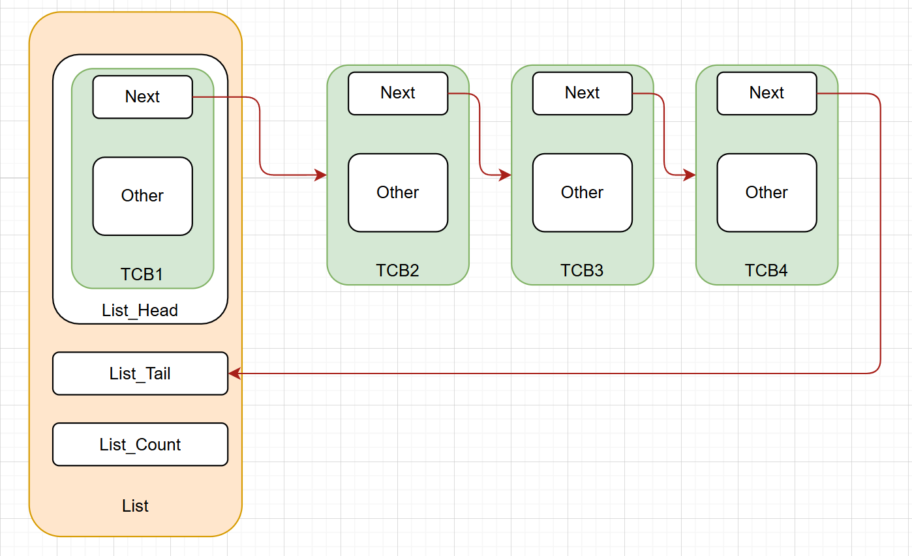

# 1、准备工作

## ARM 架构的 MSP、PSP 双堆栈指针

在 Cortex-M 架构中，**MSP（*Main Stack Pointer*）主栈指针**，和 **PSP（*Process Stack Pointer*）进程栈指针**，是两套独立的栈指针，主要是用来将从 **操作系统的内核调度** 和 **用户的任务私有栈** 分开；可以用来稳步构建多任务系统，比如我们这里想要实现的协程调度器。

在开始之前，还要引入 ARM 架构的一个重要的内容：**线程模式（*Thread Mode*）**、**处理模式（*Hanlder Mode*）**。两者是本质是通过 **权限划分** 和 **功能隔离**，来让调度器内核和用户任务安全共存。

关于权限和栈指针选择的部分，又涉及到了 `CONTROL` 寄存器，所以我们要先讲讲该寄存器。对于 `CONTROL` 寄存器，我们这里只需要关注 `CONTROL[0]` 和 `CONTROL[1]`，如下图所示：


`CONTROL[0]`（*nPRIV*）是设置 **线程模下** 的权限模式的：**当这一位为 0 的时候（默认为 0），在线程模式下是特权模式，为 1 的时候是非特权模式。** 对于在处理模式下，**处理器总是处于权限模式**。

`CONTROL[1]`（*SPSEL*）是设置使用哪个指针的：**当这一位为 0（默认为 0）的时候，线程模式下会操作 MSP 指针，为 1 的时候会操作 PSP 指针**；对于处理器模式下，**这一位永远是 0，并且尝试在写这一位操作的时候，该操作会被忽略。**

---

### 线程模式

线程模式，顾名思义就是一个用来给用户任务使用的一个普通模式，可以配置权限等级，**非权限模式下只能访问自己私有栈和自己的用户内存**。主要用来运行用户的任务；**系统复位之后默认进入这个模式、异常返回后也是默认回到这个模式。** 同时根据上面的论述，该模式下两种栈指针都可以使用，只需要配置相关的寄存器即可。

---

### 处理模式

这个模式主要用于运行 **中断服务函数** 和 **内核调度（PendSV）** 的部分，**当发生中断或者异常的时候，就会进入这个模式**，处理模式下，**强制使用 MSP 指针（为了和用户任务栈区分开来），并且固定为特权模式**，有权访问所有的 CPU 资源。

---

下面这张图可以很清晰的表示上述的关系：


这张图可以展示线程模式下在两种特权模式的切换：


---

## ARM 架构中的通用寄存器与 ARM 汇编基础语法

在 ARM Cortex-M 架构（如 M3/M4/M7）上实现协程调度器，核心依赖与 **上下文切换、堆栈操作、异常处理** 相关的 ARM 汇编语法（Thumb-2 指令集，Cortex-M 强制要求）。所以我们还需要了解一些 ARM 寄存器和我们将要用到的 ARM 汇编语法。

---

### 通用寄存器

和其他的处理器一样，Cortex-M 系列的处理器有很多的寄存器，对于我们想要实现一个协程调度器，我们目前需要先了解常见的通用寄存器。

在 Cortex-M 中，**绝大多数的寄存器都会被组合在一个单元之中**，这个单元就叫做 **寄存器组(*register bank*)**。在 ARM 架构中，如果想要处理一个存储在内存中的一个数据，**需要将该数据从内存中装载到 bank 中的寄存器中，然后再寄存器中处理数据，之后如果有需要的话，又把数据返回到内存里面**。在实际中，当 CPU 处理其他数的时候，一个寄存器组可以短时间暂存很多的变量，而不需要每次使用都更新到系统内存并且重新处理。

在 CortexM3/4 的架构中，寄存器组拥有 16 个寄存器，其中有 13 个寄存器是通用寄存器，其他三个为特殊功能寄存器，如下图所示：


---

#### R0 — R12

对于 R0 到 R12 这 13 个寄存器，我们称之为 **通用寄存器（*general purpose registers*）**。同时，对于前 8 个寄存器(R0 — R7)，又称之为 **低位寄存器（*low registers*）**，之后的五个就叫做 **高位寄存器（*high registers*）**。由于指令集的空间有限，大多数 16 为的指令只能操作低位寄存器；而高位寄存器可以被 32 位的指令和部分的 16 位指令操作，比如 **`MOV`** 指令。值得注意的是：**R0 到 R12 的初始化的值是不确定的。**

---

#### R13 栈顶指针 SP（*Stack Pointer*）

R13 就是栈顶指针，被用来操控栈中的内存，使用 **`PUSH`** 和 **`POP`** 指令。物理上，存在有两个不同的指针 MSP 和 PSP。**当系统重启或者系统处于处理模式的时候，默认使用 MSP 指针**。而 PSP 只能在线程模式下使用；但是同一时间只能存在一种指针。

**MSP 和 PSP 都是 32 位的指针，但是他们的最低的两位始终是 0，并且对于这两位的写操作会被忽略。** 在 CortexM 中，`PUSH` 和 `POP` 都是一个 32 位的，并且传输操作中的地址必须对其 32 位的边界。

大多数不适用操作系统的时候，我们不会使用到 PSP 指针；这种场景下完全可以只依赖 MSP 指针。在我们的预期中，每一个协程任务都需要有一个自己的任务栈，需要与内核隔离开，所以我们要引入 PSP 指针。

---

#### R14 链接指针 LR （*Link Register*）

R14 作为链接指针，通常用于存储在调用函数或者子线程之后的返回地址（**注意不是返回值的地址！是调用完函数之后程序需要回到的地址**）。在一个函数或者子线程的调用结束之后，程序会返回到调用函数的位置然后通过将 LR 的值装在到 PC 中来回到程序的执行；当我们调用一个函数或者子线程之后，**LR 的值会自动立刻更新**。**如果涉及到在函数中调用另一个函数，则需要先将 LR 的值存储到栈中，然后再次更新，以此来避免当前的 LR 的值丢失**。

即使大多数时候，CortexM 的返回地址都是偶数，LR 的第 0 位也是可以读写的。比如一些调用操作要求 LR 的第 0 位设置为 1 来指示 **Thumb（ARM 的一种指令集）** 的状态。

---

#### R15 程序计数器 PC （*Promgram Counter*）

PC 是可以读写的：**读取到的值代表当前指令的地址再加上 4**，这是由于 ARM 采用了三级流水线模式：**取值—译码—执行**；当处理器正在 **执行** 地址 A 的指令的时候，就已经完成了对地址 A+2 处的指令的 **译码**，并且正在 **读取** 地址 A+4 处的指令，所以为了让 PC 指针永远指向下一条要读取的指令的地址，PC 的值会被设置为当前指向的指令的地址+指令长度：

- **对于 32 位的 ARM 指令，每条指令占用 4 个字节，所以 PC = 当前执行指令的地址+4**
- **对于 16 位的 Thumb 指令，每条指令占用 2 个字节，所以 PC = 当前执行指令的地址+2**

对 PC 指针进行写操作就是让程序跳转到某个地方。

由于指令必须对齐 **半字（*Half-Word* 16 位）** 或 **全字（*Word* 32 位）**，所以 PC 指针的最低位必须是 0，但是有时候执行一些跳转操作的时候，我们需要手动将该位置 1 来指示 Thumb 的状态；否则，可能会触发一个错误。但是对于使用 C/C++来编写代码的时候，编译器会自动帮我们处理这个过程。

---

#### 寄存器的命名

在多数的 ARM 汇编工具中，我们可以使用下表的名字来代表一个寄存器：


---

### ARM 汇编

协程调度的本质是 “保存 / 恢复任务的寄存器状态”，需熟练操作通用寄存器、特殊功能寄存器（如 `MSP/PSP`、`CONTROL`、`xPSR`）。

---

#### 通用寄存器的访问（R0-R12、LR、PC）

对于通用寄存器，我们可以直接使用寄存器的名称来临时存储数据、参数传递（**遵循 ARM AAPCS 规范：R0-R3 传前 4 个参数，R4-R11 需手动保存**），比如下面这个例子就是将当前任务保存到栈中：

```armasm
STMDB R0!, {R4-R11}  ; 将 R4-R11 寄存器值压入 R0 指向的栈（R0 是 PSP 指针）
LDMIA R0!, {R4-R11}  ; 从 R0 指向的栈中弹出值，恢复到 R4-R11 寄存器
```

---

#### 特殊功能寄存器的访问：`MRS`/`MSR`

Cortex-M 的特殊寄存器（如 MSP、PSP、CONTROL、xPSR）无法通过普通指令访问，必须使用 **`MRS`（读特殊寄存器）** 和 **`MSR`（写特殊寄存器）**，这是调度器操作堆栈指针和处理器模式的核心。

| 指令          | 功能                                      | 例子                                                         |
| ------------- | ----------------------------------------- | ------------------------------------------------------------ |
| `MRS Rd, SFR` | 将特殊寄存器（SFR）的值读入通用寄存器 Rd  | `MRS R0, PSP` // 读取当前 PSP（进程栈指针）的值到 R0，用于保存任务栈顶到 TCB |
| `MSR SFR, Rs` | 将通用寄存器 Rs 的值写入特殊寄存器（SFR） | `MSR PSP, R0` // 将 R0（新任务的栈顶指针）写入 PSP，为恢复任务上下文做准备 |

**常见的特殊寄存器：**

- `PSP`：进程栈指针（用户私有栈）
- `MSP`：主栈指针 （内核 / 中断栈）
- `CONTROL`：控制寄存器（配置线程模式权限、栈指针选择）
- `xPSR`：程序状态寄存器（标记 Thumb 模式、中断状态等）

示例

```armasm
MOV R0, #0x02        ; CONTROL[1] = 1（线程模式使用 PSP）
MSR CONTROL, R0      ; 将 R0 的值写入 CONTROL 寄存器
ISB                  ; 指令同步屏障，确保配置立即生效（Cortex-M 必需）
```

---

#### 栈操作指令

协程的上下文保存在任务私有栈中，而 Cortex-M 采用 **满递减栈（Full Descending Stack）**（栈顶指向最后一个已压入的数据，栈向低地址增长），需使用配套的栈操作指令。

---

##### 1.单个寄存器的访问压栈/出栈：`PUSH`/`POP`

用于操作少量的寄存器，语法更简洁：

- **`PUSH {寄存器列表}`：压栈 等价于 `STMDB SP!,{寄存器列表}`**
- **`POP {寄存器列表}`：出栈等价于 `LDMIA SP!, {寄存器列表}`**

**示例**：

```armasm
PUSH {LR}  ; 将 LR（返回地址）压入当前栈（处理模式下为 MSP，线程模式下为 PSP）
; ... 执行核心逻辑 ...
POP {LR}   ; 恢复 LR，准备函数返回
BX LR      ; 跳回调用者
```

---

##### 2. 多寄存器压栈 / 出栈：`STMDB`/`LDMIA`

这是上下文保存 / 恢复的 “主力指令”，一次性操作多个寄存器（如 R4-R11），效率远高于单寄存器指令。

- **`STMDB Rd!, {寄存器列表}`**：
  - **`STM`（*Store Multiple*）：多寄存器存储——压栈**
  - **`DB`（*Decrement Before*）：每次压栈前都将栈指针 `Rd` 减去 4（其实就是指向下一个内存中的位置）**
  - **`!`（*Write Back*）: 操作之后更新栈指针(`Rd`)到栈中**

示例（保存 R4-R11 到 PSP 指向的任务栈）：

```armasm
MRS R0, PSP          ; R0 = 当前任务的栈指针（PSP）
STMDB R0!, {R4-R11}  ; 压栈 R4-R11到PSP指向的内存，栈指针 R0 自动递减（每次减4，共减 8*4=32）
; !R0 将最后一次存储操作之后的地址写回R0 让R0始终指向最新的栈顶位置
STR R0, [R1]         ; 将更新后的栈指针（新栈顶）保存到 TCB 的 SP 成员
```


- **`LDMIA Rd!, {寄存器列表}`**：
  - **`LDM`（*Load Multiple*）：多寄存器加载——出栈**；
  - **`IA`（*Increment After*）：出栈后将栈指针（`Rd`）加 4；**
  - **`!`（*Write-Back*）：操作后更新栈指针（`Rd`）为新地址。**

示例（从新任务的栈中恢复 R4-R11）：

```armasm
LDR R0, [R1]         ; R0 = 新任务 TCB 中的栈顶指针（SP）
LDMIA R0!, {R4-R11}  ; 出栈 R4-R11，栈指针 R0 自动递增
; !R0 将最后一次存储操作之后的地址写回R0 让R0始终指向最新的栈顶位置
MSR PSP, R0          ; 将新栈指针写入 PSP，完成栈切换
```

---

#### 异常处理与返回指令

协程调度器依赖 `PendSV` 异常实现任务切换，需掌握异常处理的汇编语法，尤其是 **异常返回（`EXC_RETURN`）** 机制。

---

##### 1.触发 PendSV 异常：操作 SCB-> ICSR 寄存器

**PendSV 是 Cortex-M 专为任务调度设计的异常，需通过软件触发（写入 `SCB->ICSR` 寄存器的 `PENDSVSET` 位）**。
汇编中需先获取 `SCB->ICSR` 的地址（Cortex-M 外设地址固定，如 0xE000ED04），再通过 `STR` 指令置位。

示例（触发 PendSV 异常，请求任务调度）：

```armasm
LDR R0, =0xE000ED04   ; R0 = SCB->ICSR 寄存器地址（固定值）
LDR R1, =0x10000000   ; R1 = 0x10000000（PENDSVSET 位，bit28）
STR R1, [R0]          ; 置位 PENDSVSET，触发 PendSV 异常
```

---

##### 2.异常返回：BX 与 EXC_RETURN 特殊值

异常处理完成后（如上下文切换），需通过 **`BX` 指令 + `EXC_RETURN` 特殊值** 触发硬件自动恢复上下文，这是协程调度的 “最后一步魔法”。

`EXC_RETURN` 特殊值：Cortex-M 定义的特殊返回值，高 28 位为 `0xF`，低 4 位编码返回后的模式和栈指针选择。**协程调度中最常用的是 `0xFFFFFFFD`，代表着返回线程模式，启用 PSP 恢复上下文（很重要！）**

`BX寄存器` 指令：普通用法是 “跳转到寄存器指向的地址”，但如果寄存器值是 `EXC_RETURN`，会触发 **异常返回序列**（硬件自动完成以下操作）：

1. **从当前栈（PSP）中弹出硬件保存的寄存器（xPSR、PC、LR、R12、R0-R3）；**
2. **自动切换处理器模式（从处理模式切回线程模式）；**
3. **自动切换栈指针（从 MSP 切回 PSP）。**

示例（PendSV 异常处理完成后，返回线程模式运行新任务）：

```armasm
LDR LR, =0xFFFFFFFD  ; 将 EXC_RETURN 值加载到 LR 寄存器
BX LR                ; 触发异常返回，硬件自动恢复上下文并切换到线程模式
```

---

#### 内存访问

协程调度器需操作任务的 TCB（控制块，如保存 / 读取栈指针 `SP`、任务状态等），**需通过汇编指令访问内存（TCB 本质是内存中的结构体）**。

最常用的就是 **加载（LDR）、存储指令（STR）**:

- **`LDR Rd, [Rn, #offset]`：从 `Rn + offset` 指向的内存地址，读取 32 位数据到 `Rd` 寄存器中**
- **`STR Rs,[Rn, #offset]`：将 `Rs` 中的 32 位数据，写入 `Rn + offset` 指向的内存地址**

示例（保存当前任务的栈指针到 TCB，恢复新任务的栈指针从 TCB）：

```armasm
; 1. 保存当前任务的 SP 到 TCB（R1 是当前 TCB 指针）
MRS R0, PSP          ; R0 = 当前任务的栈指针（PSP）
STR R0, [R1]         ; 将 R0 写入 TCB 的 SP 成员（偏移量 0）

; 2. 从新任务 TCB 读取 SP（R0 是新任务 TCB 指针）
LDR R0, [R0]         ; R0 = 新任务的 SP 成员（偏移量 0）
MSR PSP, R0          ; 将新 SP 写入 PSP 寄存器，完成栈切换
```

---

#### 其他指令

##### 1.空操作：`NOP`

对于部分需要对齐的指令或延时的时候，就可以调用 `NOP`。

示例（指令地址 4 字节对齐）：

```armasm
ALIGN 4       ; 汇编器伪指令，确保后续指令地址是 4 的倍数
PendSV_Handler:
NOP           ; 可选，用于填充对齐
MRS R0, PSP   ; 开始处理上下文
```

##### 2.跳转指令 `BX`/`BL`

- `BX Rn`：跳转到 `Rn` 指向的地址，同时根据 `Rn` 的最低位切换指令集（Cortex-M 仅用 Thumb，最低位需为 1）；
- `BL 标签`：跳转到 “标签” 处，并将返回地址存入 `LR`（用于调用 C 函数，如调度器的 `EK_Schedule`）。

---

## 在C语言中如何使用汇编

有了上述的知识之后，我们就需要考虑：我们的协程调度器，总体肯定是使用C语言编写，但是如何在C语言中使用这些汇编代码呢？

对于使用GCC的场景来说，GCC是支持直接在C中嵌入一段ARM汇编的：

```c
void Function(void)
{
    // 内联汇编格式
    asm volatile (
        "汇编指令1 \n\t"
        "汇编指令2 \n\t"
        // ... 更多指令
        : 输出操作数列表（C变量 → 汇编寄存器）
        : 输入操作数列表（汇编寄存器 → C变量）
        : 被修改的寄存器列表（通知编译器这些寄存器值已变）
    );
}
```

**注意，这里的`volatile`关键字是不能舍弃的，因为有可能编译器优化会修改这里的效果**！

下面的例子：

```c
#include <stdint.h>

// 读取 PSP 寄存器（进程栈指针）
uint32_t read_psp(void) {
    uint32_t psp_val;
    asm volatile (
        "MRS %0, PSP \n\t"  // 将 PSP 的值读入 %0 代表的寄存器
        : "=r" (psp_val)    // 输出：psp_val 接收结果（= 表示只写）
        :                   // 无输入
        :                   // 无被修改的其他寄存器
    );
    return psp_val;
}

// 配置 CONTROL 寄存器（线程模式使用 PSP + 非特权模式）
void configure_control(void) {
    asm volatile (
        "MOV R0, #0x03 \n\t"    // R0 = 0x03（CONTROL[1]=1 用 PSP，CONTROL[0]=1 非特权）
        "MSR CONTROL, R0 \n\t"  // 将 R0 的值写入 CONTROL 寄存器
        "ISB \n\t"              // 指令同步屏障，确保配置生效
        : 
        : 
        : "r0"                  // 通知编译器 R0 的值已被修改
    );
}
```

---

# 2、相关数据结构

注意，里面有一些适用于嵌入式的通用函数和数据类型，都来源于我和左岚的的开源项目——**[EmbeddedKit](https://github.com/zuoliangyu/EmbeddedKit)**。

后面将会直接使用，不再提及

## 任务控制块

```c
#ifndef __KERNAL_H
#define __KERNAL_H

#include "../EK_Config.h"

#ifdef __cplusplus
extern "C"
{
#endif

typedef void (*EK_CoroFunction_t)(void *arg); // 任务入口函数，支持参数

typedef enum
{
    EK_CORO_READY = 0, /*<- 任务就绪*/
    EK_CORO_BLOCKED, /*<- 任务被阻塞*/
    EK_CORO_RUNNING, /*<- 任务运行时*/
    EK_CORO_SUSPENDED /*<- 任务被挂起*/
} EK_CoroState_t;

typedef struct EK_CoroListNode_t
{
    struct EK_CoroListNode_t *CoroNode_Next; /*<- 指向下一个协程节点的指针*/
    void *CoroNode_Owner; /*<- 指向拥有该节点的协程TCB*/
} EK_CoroListNode_t;

typedef struct EK_CoroTCB_t
{
    void *TCB_SP; /*<- 协程的栈顶指针*/
    void *TCB_Arg; /*<- 协程入口函数的参数*/
    void *TCB_StackBase; /*<- 协程栈的起始地址*/
    uint8_t TCB_Priority; /*<- 协程的优先级*/
    uint32_t TCB_DelayTicks; /*<- 协程延时节拍数*/
    EK_Size_t TCB_StackSize; /*<- 协程栈的大小*/
    EK_CoroState_t TCB_State; /*<- 协程的当前状态*/
    EK_CoroFunction_t TCB_Entry; /*<- 协程的入口函数*/
    EK_CoroListNode_t TCB_Node; /*<- 用于将TCB链入列表的节点*/
} EK_CoroTCB_t;

typedef struct EK_CoroList_t
{
    EK_CoroListNode_t *List_Head; /*<- 链表头指针*/
    void *List_Tail; /*<- 链表尾指针*/
    EK_Size_t List_Count; /*<- 链表中的节点数量*/
} EK_CoroList_t;

#ifdef __cplusplus
}
#endif

#endif

```

我们想要使用两条链表来处理整个任务流转，一条是就绪表、一条是等待表，然后通过下面的图片的样式来连接所有的任务块:


