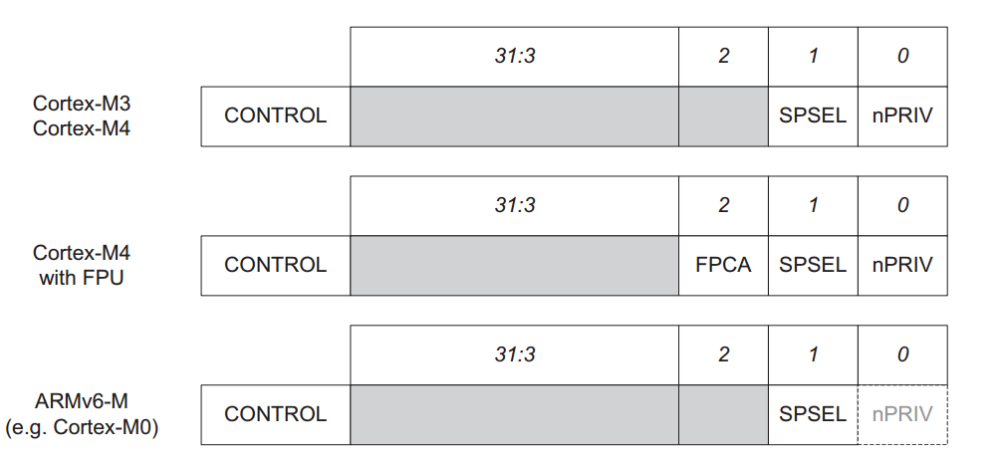
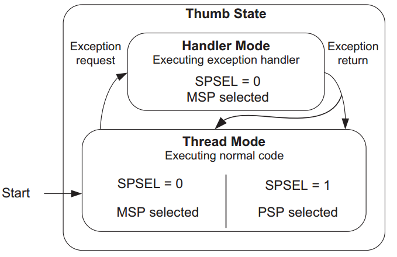
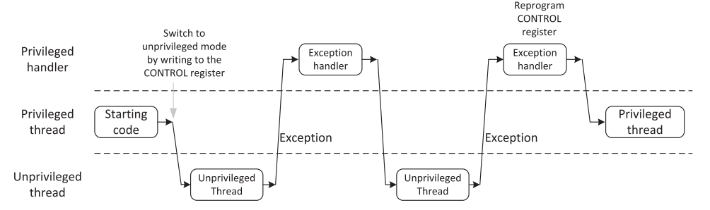
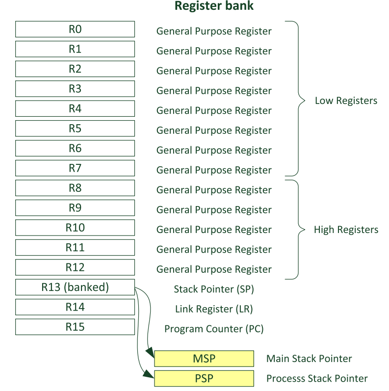
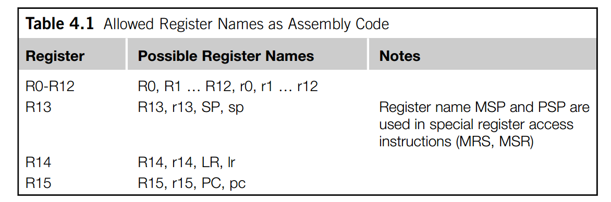

# 1、准备工作

## ARM架构的MSP、PSP双堆栈指针

在Cortex-M架构中，**MSP（*Main Stack Pointer*）主栈指针**，和**PSP（*Process Stack Pointer*）进程栈指针**，是两套独立的栈指针，主要是用来将从**操作系统的内核调度**和**用户的任务私有栈**分开；可以用来稳步构建多任务系统，比如我们这里想要实现的协程调度器。

在开始之前，还要引入ARM架构的一个重要的内容：**线程模式（*Thread Mode*）**、**处理模式（*Hanlder Mode*）**。两者是本质是通过**权限划分**和**功能隔离**，来让调度器内核和用户任务安全共存。

关于权限和栈指针选择的部分，又涉及到了`CONTROL`寄存器，所以我们要先讲讲该寄存器。对于`CONTROL`寄存器，我们这里只需要关注`CONTROL[0]`和`CONTROL[1]`，如下图所示：



`CONTROL[0]`（*nPRIV*）是设置**线程模下**的权限模式的：**当这一位为0的时候（默认为0），在线程模式下是特权模式，为1的时候是非特权模式。**对于在处理模式下，**处理器总是处于权限模式**。

`CONTROL[1]`（*SPSEL*）是设置使用哪个指针的：**当这一位为0（默认为0）的时候，线程模式下会操作MSP指针，为1的时候会操作PSP指针**；对于处理器模式下，**这一位永远是0，并且尝试在写这一位操作的时候，该操作会被忽略。**

---

### 线程模式

线程模式，顾名思义就是一个用来给用户任务使用的一个普通模式，可以配置权限等级，**非权限模式下只能访问自己私有栈和自己的用户内存**。主要用来运行用户的任务；**系统复位之后默认进入这个模式、异常返回后也是默认回到这个模式。**同时根据上面的论述，该模式下两种栈指针都可以使用，只需要配置相关的寄存器即可。

---

### 处理模式

这个模式主要用于运行**中断服务函数**和**内核调度（PendSV）**的部分，**当发生中断或者异常的时候，就会进入这个模式**，处理模式下，**强制使用MSP指针（为了和用户任务栈区分开来），并且固定为特权模式**，有权访问所有的CPU资源。

---

下面这张图可以很清晰的表示上述的关系：



这张图可以展示线程模式下在两种特权模式的切换：



---

## ARM架构中的通用寄存器与ARM汇编基础语法

在 ARM Cortex-M 架构（如 M3/M4/M7）上实现协程调度器，核心依赖与 **上下文切换、堆栈操作、异常处理** 相关的 ARM 汇编语法（Thumb-2 指令集，Cortex-M 强制要求）。所以我们还需要了解一些ARM寄存器和我们将要用到的ARM汇编语法。

---

### 通用寄存器

和其他的处理器一样，Cortex-M系列的处理器有很多的寄存器，对于我们想要实现一个协程调度器，我们目前需要先了解常见的通用寄存器。

在Cortex-M中，**绝大多数的寄存器都会被组合在一个单元之中**，这个单元就叫做**寄存器组(*register bank*)**。在ARM架构中，如果想要处理一个存储在内存中的一个数据，**需要将该数据从内存中装载到bank中的寄存器中，然后再寄存器中处理数据，之后如果有需要的话，又把数据返回到内存里面**。在实际中，当CPU处理其他数的时候，一个寄存器组可以短时间暂存很多的变量，而不需要每次使用都更新到系统内存并且重新处理。

在CortexM3/4的架构中，寄存器组拥有16个寄存器，其中有13个寄存器是通用寄存器，其他三个为特殊功能寄存器，如下图所示：



---

#### R0 — R12

对于R0到R12这13个寄存器，我们称之为**通用寄存器（*general purpose registers*）**。同时，对于前8个寄存器(R0 — R7)，又称之为**低位寄存器（*low registers*）**，之后的五个就叫做**高位寄存器（*high registers*）**。由于指令集的空间有限，大多数16为的指令只能操作低位寄存器；而高位寄存器可以被32位的指令和部分的16位指令操作，比如**`MOV`**指令。值得注意的是：**R0到R12的初始化的值是不确定的。**

---

#### R13 栈顶指针 SP（*Stack Pointer*）

R13就是栈顶指针，被用来操控栈中的内存，使用**`PUSH`**和**`POP`**指令。物理上，存在有两个不同的指针MSP和PSP。**当系统重启或者系统处于处理模式的时候，默认使用MSP指针**。而PSP只能在线程模式下使用；但是同一时间只能存在一种指针。

**MSP和PSP都是32位的指针，但是他们的最低的两位始终是0，并且对于这两位的写操作会被忽略。**在CortexM中，`PUSH`和`POP`都是一个32位的，并且传输操作中的地址必须对其32位的边界。

大多数不适用操作系统的时候，我们不会使用到PSP指针；这种场景下完全可以只依赖MSP指针。在我们的预期中，每一个协程任务都需要有一个自己的任务栈，需要与内核隔离开，所以我们要引入PSP指针。

---

#### R14 链接指针 LR （*Link Register*）

R14作为链接指针，通常用于存储在调用函数或者子线程之后的返回地址（**注意不是返回值的地址！是调用完函数之后程序需要回到的地址**）。在一个函数或者子线程的调用结束之后，程序会返回到调用函数的位置然后通过将LR的值装在到PC中来回到程序的执行；当我们调用一个函数或者子线程之后，**LR的值会自动立刻更新**。**如果涉及到在函数中调用另一个函数，则需要先将LR的值存储到栈中，然后再次更新，以此来避免当前的LR的值丢失**。

即使大多数时候，CortexM的返回地址都是偶数，LR的第0位也是可以读写的。比如一些调用操作要求LR的第0位设置为1来指示 **Thumb（ARM的一种指令集）**的状态。

---

#### R15 程序计数器 PC （*Promgram Counter*）

PC是可以读写的：**读取到的值代表当前指令的地址再加上4**，这是由于ARM采用了三级流水线模式：**取值—译码—执行**；当处理器正在**执行**地址A的指令的时候，就已经完成了对地址A+2处的指令的**译码**，并且正在**读取**地址A+4处的指令，所以为了让PC指针永远指向下一条要读取的指令的地址，PC的值会被设置为当前指向的指令的地址+指令长度：

- **对于32位的ARM指令，每条指令占用4个字节，所以PC=当前执行指令的地址+4**
- **对于16位的Thumb指令，每条指令占用2个字节，所以PC=当前执行指令的地址+2**

对PC指针进行写操作就是让程序跳转到某个地方。

由于指令必须对齐**半字（*Half-Word* 16位）**或 **全字（*Word* 32位）**，所以PC指针的最低位必须是0，但是有时候执行一些跳转操作的时候，我们需要手动将该位置1来指示Thumb的状态；否则，可能会触发一个错误。但是对于使用C/C++来编写代码的时候，编译器会自动帮我们处理这个过程。

---

#### 寄存器的命名

在多数的ARM汇编工具中，我们可以使用下表的名字来代表一个寄存器：



---

### ARM汇编

协程调度的本质是 “保存 / 恢复任务的寄存器状态”，需熟练操作通用寄存器、特殊功能寄存器（如 `MSP/PSP`、`CONTROL`、`xPSR`）。

---

#### 通用寄存器的访问（R0-R12、LR、PC）

对于通用寄存器，我们可以直接使用寄存器的名称来临时存储数据、参数传递（**遵循 ARM AAPCS 规范：R0-R3 传前 4 个参数，R4-R11 需手动保存**），比如下面这个例子就是将当前任务保存到栈中：

```armasm
STMDB R0!, {R4-R11}  ; 将 R4-R11 寄存器值压入 R0 指向的栈（R0 是 PSP 指针）
LDMIA R0!, {R4-R11}  ; 从 R0 指向的栈中弹出值，恢复到 R4-R11 寄存器
```

---

#### 特殊功能寄存器的访问：`MRS`/`MSR`

Cortex-M 的特殊寄存器（如 MSP、PSP、CONTROL、xPSR）无法通过普通指令访问，必须使用 **`MRS`（读特殊寄存器）** 和 **`MSR`（写特殊寄存器）**，这是调度器操作堆栈指针和处理器模式的核心。

| 指令          | 功能                                      | 例子                                                         |
| ------------- | ----------------------------------------- | ------------------------------------------------------------ |
| `MRS Rd, SFR` | 将特殊寄存器（SFR）的值读入通用寄存器 Rd  | `MRS R0, PSP` // 读取当前 PSP（进程栈指针）的值到 R0，用于保存任务栈顶到 TCB |
| `MSR SFR, Rs` | 将通用寄存器 Rs 的值写入特殊寄存器（SFR） | `MSR PSP, R0` // 将 R0（新任务的栈顶指针）写入 PSP，为恢复任务上下文做准备 |

**常见的特殊寄存器：**

- `PSP`：进程栈指针（用户私有栈）
- `MSP`：主栈指针 （内核 / 中断栈）
- `CONTROL`：控制寄存器（配置线程模式权限、栈指针选择）
- `xPSR`：程序状态寄存器（标记 Thumb 模式、中断状态等）

示例

```armasm
MOV R0, #0x02        ; CONTROL[1] = 1（线程模式使用 PSP）
MSR CONTROL, R0      ; 将 R0 的值写入 CONTROL 寄存器
ISB                  ; 指令同步屏障，确保配置立即生效（Cortex-M 必需）
```

---

#### 栈操作指令

协程的上下文保存在任务私有栈中，而 Cortex-M 采用 **满递减栈（Full Descending Stack）**（栈顶指向最后一个已压入的数据，栈向低地址增长），需使用配套的栈操作指令。

##### 1. 多寄存器压栈 / 出栈：`STMDB/LDMIA`

这是上下文保存 / 恢复的 “主力指令”，一次性操作多个寄存器（如 R4-R11），效率远高于单寄存器指令。

- **`STMDB Rd!, {寄存器列表}`**：
  - **`STM`（*Store Multiple*）：多寄存器存储——压栈**
  - **`DB`（*Decrement Before*）：每次压栈前都将栈指针`Rd`减去4（其实就是指向下一个内存中的位置）**
  - **`!`（*Write Back*）:操作之后更新栈指针(`Rd`)到栈中**

示例（保存 R4-R11 到 PSP 指向的任务栈）：

```armasm
MRS R0, PSP          ; R0 = 当前任务的栈指针（PSP）
STMDB R0!, {R4-R11}  ; 压栈 R4-R11到PSP指向的内存，栈指针 R0 自动递减（每次减4，共减 8*4=32）
				     ; !R0 将最后一次存储操作之后的地址写回R0 让R0始终指向最新的栈顶位置
STR R0, [R1]         ; 将更新后的栈指针（新栈顶）保存到 TCB 的 SP 成员
```


- **`LDMIA Rd!, {寄存器列表}`**：
  - **`LDM`（*Load Multiple*）：多寄存器加载——出栈**；
  - **`IA`（*Increment After*）：出栈后将栈指针（`Rd`）加 4；**
  - **`!`（*Write-Back*）：操作后更新栈指针（`Rd`）为新地址。**

示例（从新任务的栈中恢复 R4-R11）：

```armasm
LDR R0, [R1]         ; R0 = 新任务 TCB 中的栈顶指针（SP）
LDMIA R0!, {R4-R11}  ; 出栈 R4-R11，栈指针 R0 自动递增
					 ; !R0 将最后一次存储操作之后的地址写回R0 让R0始终指向最新的栈顶位置
MSR PSP, R0          ; 将新栈指针写入 PSP，完成栈切换
```

