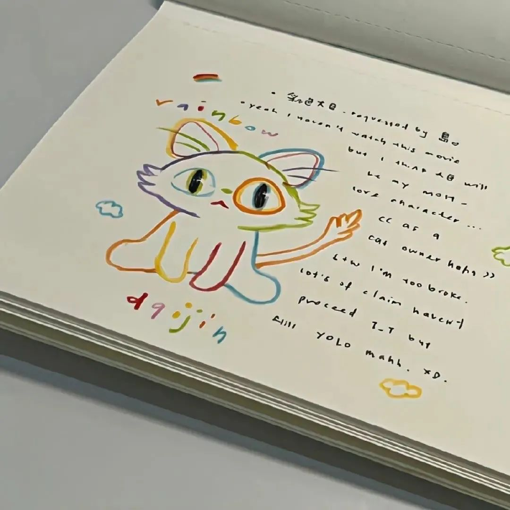

# 1. 我在很平常的一天放弃了一个很重要的人

我动了离开你的念头，不是因为你不好，也不是因为不爱了，只是你对我的态度，让我觉得你的世界并不缺我。其实我可以厚着脸皮在纠缠你，但是没有任何意义，因为和你在一起的时候，我的状态不好会激发我的脆弱焦躁和极度不安，会不断吸引出我人格里最不好的一面，与其和你在一起相互消耗，不如就算了吧，内心期待的东西一点点落空，慢慢就不想要了，重复的话也不想再说了，对不起的事多了也无所谓，当我发现你一点都不理解我的委屈时，我一句话也不想说了，百般委屈涌上心头，话到嘴边，不值一提，不会拆穿你，但是会远离，会不动声色淘汰你，我只做选择，从不教育，你有你的立场，我有我的底线，迷失自我去爱别人挺没意思的，慢热,重感情,不爱解释,总是心软，吃了很多亏还是会相信。我也永远不长记性，但是我选择离开，我不想纠结在没有意义的事情上。伸手要的糖和你主动给的是两个味道。我常常深思熟虑，考虑这份关系，还要不要继续，反复问自己，其实我一点也不后悔遇见你，但是我们终究还是没翻过那座山。我在很平常的一天放弃了一个很重要的人，虽然有点舍不得，但我满心欢喜也该告一段落。

​																					——*《挪威的森林》 春上春树*

# 2. About a cat

I said to the cat:Why do you look so hairy when you lose your hair.But I lost a few hairs and went bald. The cat said If you don't dislike it, then I'll plant my hair on your head. Soon you will be furry, too. The cat asked me which color is suitable. I said: I am afraid only the white on your stomach suits. The cat's belly is stretched out, saying: OK, just take it away. So I just took a little bit and I put it on my head. The cat looked and doubtful to say that does the white means getting old for you guys. I answered: Sure, and I'm already old. All of a sudden, the cat became sad:If only I were a black cat.I smiled and said:Then I'll step on you at night. The cat said that was okay. I just want you to look younger. I said: Fool, even though I'm old, you will grow old faster than I do. The cat got happy suddenly, saying: Really？Then I can see you for the rest of my life.I said yes and The kitten fell asleep happily making a grunting sound.

# 3. 我太爱你了，所以显得笨拙

我太爱你了，所以显得笨拙，我越爱你，越不懂怎么跟你沟通。所谓的理性之爱，你想让我怎么回答呢？我用整个灵魂在爱你，通过你我看见世间万物。如今，少了你，我看到的世间万物都觉得时从你那里窃取过来的。最令我伤心的，不是你松开了我这我的手，而是我感觉到我自己的手，在你手中并不舒服。即便你不松开，我也会松开… …

​																						——*《窄门》安德烈·纪德*

